有关链接：[(3条消息) JVM_虚拟机目录_所得皆惊喜-CSDN博客](https://blog.csdn.net/TZ845195485/article/details/93238857)

**看到230集**

视频链接：[尚硅谷2020最新版宋红康JVM教程更新至中篇(java虚拟机详解，jvm从入门到精通)_哔哩哔哩 (゜-゜)つロ 干杯~-bilibili](https://www.bilibili.com/video/BV1PJ411n7xZ)

官方文档链接：[java (oracle.com)](https://docs.oracle.com/en/java/javase/11/tools/java.html#GUID-3B1CE181-CD30-4178-9602-230B800D4FAE)


==**对象的初始化流程如下：**==

**初始化父类的静态成员**
**初始化父类的静态代码块**
**初始化子类的静态成员**
**初始化子类的静态代码块**
**初始化父类的非静态成员**
**初始化父类的非静态代码块**
**初始化父类的构造方法**
**初始化子类的非静态成员**
**初始化子类的非静态代码块**
**初始化子类的构造方法**
**注：父类及子类的==静态成员和静态代码块==只在程序运行时==加载一次==。**


==准备阶段有静态变量初始化==

==new的对象都是放在堆空间中==

==“堆是线程共享的内存区域”这句话并不完全正确，**因为TLAB是堆内存的一部分，它在读取上确实是线程共享的，但是在内存分配上，是线程独享的**。==

==NewRatio=2，SurvivorRatio=8==

 ==新生代:老年代=1:2 Eden:S0:S1=8:1:1==

==栈管运行，堆管存储==

线程是进程中实施调度和分派的基本单位

获取加载器时为null，表示使用的是引导类加载器

前端编译器是将java代码编译成jvm可以看懂的class文件，而jit怎是将class文件解释成机器能够直接执行的机器码。

JDK8：Class对象存放在堆区，类的元数据存在方法区（元空间），元数据`≠`类的Class对象！Class对象是加载的最终产品，类的方法代码，变量名，方法名，访问权限，返回值等等在方法区（元空间）

递归出现的是SOF，不是OOM，栈出现OOM是因为分配的线程太多了

被声明为 final的类变量的处理方法则不同，每个全局常量在编译的时候就会被分配。

老年代不会被新生代引用，因为老年代的定义就是存活时间比新生代更长

clinit 是跟着类走的 ， init 是跟着对象走的

构造器不能被重写，但可以被重载（重写发生在不同的类，重载发生在相同类中）

每个类有一个虚方法表，使用某方法时直接在这表里查找该方法在哪个类里了。

**在MinorGC时，会把存活的对象复制到to space区域，如果to space区域不够，则利用担保机制进入老年代区域**

程序调用System.gc时可以触发(会建议JVM进行垃圾回收，不代表一定会进行GC)；

Minor GC触发条件：当Eden区满时，触发Minor GC。

Full GC触发条件：

（1）调用System.gc时，系统建议执行Full GC，但是不必然执行

（2）老年代空间不足

（3）方法去空间不足

（4）通过Minor GC后进入老年代的平均大小大于老年代的可用内存

（5）由Eden区、From Space区向To Space区复制时，对象大小大于To Space可用内存，则把该对象转存到老年代，且老年代的可用内存小于该对象大小


==动态对象年龄判断:如果 Survivor区中相同年龄的所有对象大小的总和大于 Survivor空间的一半，年龄大于或等于该年龄的对象可以直接进入老年代，无须等到MaxTenuringthresho1d中要求的年龄==

在创建大对象（对象的空间大于Eden区），该对象可能会直接进入老年代，并且该过程不触发任何GC（如果大对象的空间小于老年代的剩余空间）

内存泄露：不再会被使用的对象的内存不能被回收

程序计数器是指向当前执行位置的


Major GC:老年代垃圾回收

Full GC：栈和方法区的垃圾回收


一个java程序对应一个进程，一个进程对应一个jvm实例，一个jvm实例有一个运行时数据区，

一个进程有多个线程，线程共享堆空间和方法区，每个线程各有一套程序计数器、本地方法栈和虚拟机栈


在冯洛伊曼的计算机模型中，任何程序都需要加载到内存才能和cpu进行交流


当程序主动使用某个类时，如果该类还未被加载到内存中，则JVM会通过加载、连接、初始化3个步骤来对该类进行初始化。如果没有意外，JVM将会连续完成3个步骤，所以有时也把这个3个步骤统称为类加载或类初始化。

​                           

## 一、类加载过程

### **1.加载**  

  加载指的是==将类的class文件读入到内存，并为之创建一个java.lang.Class对象==，也就是说，当程序中使用任何类时，系统都会为之建立一个java.lang.Class对象。

  类的加载由类加载器完成，类加载器通常由JVM提供，这些类加载器也是前面所有程序运行的基础，JVM提供的这些类加载器通常被称为系统类加载器。除此之外，开发者可以通过继承ClassLoader基类来创建自己的类加载器。

  通过使用不同的类加载器，可以从不同来源加载类的二进制数据，通常有如下几种来源。

- 从本地文件系统加载class文件，这是前面绝大部分示例程序的类加载方式。

- 从JAR包加载class文件，这种方式也是很常见的，前面介绍JDBC编程时用到的数据库驱动类就放在JAR文件中，JVM可以从JAR文件中直接加载该class文件。

- 通过网络加载class文件。

- 把一个Java源文件动态编译，并执行加载。

  类加载器通常无须等到“首次使用”该类时才加载该类，Java虚拟机规范允许系统预先加载某些类。
  
  

### 2.链接

  当类被加载之后，系统为之生成一个对应的Class对象，接着将会进入连接阶段，连接阶段负责把类的二进制数据合并到JRE中。类连接又可分为如下3个阶段。

  **1)验证：**验证阶段用于检验被加载的类是否有正确的内部结构，并和其他类协调一致。Java是相对C++语言是安全的语言，例如它有C++不具有的数组越界的检查。这本身就是对自身安全的一种保护。验证阶段是Java非常重要的一个阶段，它会直接的保证应用是否会被恶意入侵的一道重要的防线，越是严谨的验证机制越安全。验证的目的在于确保Class文件的字节流中包含信息符合当前虚拟机要求，不会危害虚拟机自身安全。其主要包括四种验证，文件格式验证，元数据验证，字节码验证，符号引用验证。

  四种验证做进一步说明：

  **文件格式验证：**主要验证字节流是否符合Class文件格式规范，并且能被当前的虚拟机加载处理。例如：主，次版本号是否在当前虚拟机处理的范围之内。常量池中是否有不被支持的常量类型。指向常量的中的索引值是否存在不存在的常量或不符合类型的常量。

  **元数据验证：**对字节码描述的信息进行语义的分析，分析是否符合java的语言语法的规范。

  **字节码验证：**最重要的验证环节，分析数据流和控制，确定语义是合法的，符合逻辑的。主要的针对元数据验证后对方法体的验证。保证类方法在运行时不会有危害出现。

  **符号引用验证：**主要是针对符号引用转换为直接引用的时候，是会延伸到第三解析阶段，主要去确定访问类型等涉及到引用的情况，主要是要保证引用一定会被访问到，不会出现类等无法访问的问题。

  2)**准备：**类准备阶段负责为类的静态变量分配内存，并设置默认初始值。

  3)**解析：**将类的二进制数据中的符号引用替换成直接引用。说明一下：符号引用：符号引用是以一组符号来描述所引用的目标，符号可以是任何的字面形式的字面量，只要不会出现冲突能够定位到就行。布局和内存无关。直接引用：是指向目标的指针，偏移量或者能够直接定位的句柄。该引用是和内存中的布局有关的，并且一定加载进来的。

### 3.初始化

  初始化是为类的静态变量赋予正确的初始值，准备阶段和初始化阶段看似有点矛盾，其实是不矛盾的，如果类中有语句：private static int a = 10，它的执行过程是这样的，首先字节码文件被加载到内存后，先进行链接的验证这一步骤，验证通过后准备阶段，给a分配内存，因为变量a是static的，所以此时a等于int类型的默认初始值0，即a=0,然后到解析（后面在说），到初始化这一步骤时，才把a的真正的值10赋给a,此时a=10。

## 二、类加载时机

1. 创建类的实例，也就是new一个对象
2. 访问某个类或接口的静态变量，或者对该静态变量赋值
3. 调用类的静态方法
4. 反射（Class.forName("com.lyj.load")）
5. 初始化一个类的子类（会首先初始化子类的父类）
6. JVM启动时标明的启动类，即文件名和类名相同的那个类  

   **除此之外，下面几种情形需要特别指出：**

   对于一个final类型的静态变量，如果该变量的值在编译时就可以确定下来，那么这个变量相当于“宏变量”。Java编译器会在编译时直接把这个变量出现的地方替换成它的值，因此即使程序使用该静态变量，也不会导致该类的初始化。反之，如果final类型的静态Field的值不能在编译时确定下来，则必须等到运行时才可以确定该变量的值，如果通过该类来访问它的静态变量，则会导致该类被初始化。

## 三、类加载器

  类加载器负责加载所有的类，其为所有被载入内存中的类生成一个java.lang.Class实例对象。一旦一个类被加载如JVM中，同一个类就不会被再次载入了。正如一个对象有一个唯一的标识一样，一个载入JVM的类也有一个唯一的标识。在Java中，一个类用其全限定类名（包括包名和类名）作为标识；但在JVM中，一个类用其全限定类名和其类加载器作为其唯一标识。例如，如果在pg的包中有一个名为Person的类，被类加载器ClassLoader的实例kl负责加载，则该Person类对应的Class对象在JVM中表示为(Person.pg.kl)。这意味着两个类加载器加载的同名类：（Person.pg.kl）和（Person.pg.kl2）是不同的、它们所加载的类也是完全不同、互不兼容的。

  JVM预定义有三种类加载器，当一个 JVM启动的时候，Java开始使用如下三种类加载器：

 **1)根类加载器**（bootstrap class loader）:它用来加载 Java 的核心类，是用原生代码来实现的，并不继承自 java.lang.ClassLoader（负责加载$JAVA_HOME中jre/lib/rt.jar里所有的class，由C++实现，不是ClassLoader子类）。由于引导类加载器涉及到虚拟机本地实现细节，开发者无法直接获取到启动类加载器的引用，所以不允许直接通过引用进行操作。

下面程序可以获得根类加载器所加载的核心类库,并会看到本机安装的Java环境变量指定的jdk中提供的核心jar包路径：

```java
public class ClassLoaderTest {
	public static void main(String[] args) {
		URL[] urls = sun.misc.Launcher.getBootstrapClassPath().getURLs();
		for(URL url : urls){
			System.out.println(url.toExternalForm());
		}
	}
}
```

运行结果：


 **2)扩展类加载器**（extensions class loader）：它负责加载JRE的扩展目录，lib/ext或者由java.ext.dirs系统属性指定的目录中的JAR包的类。由Java语言实现，父类加载器为null。

 **3)系统类加载器**（system class loader）：被称为系统（也称为应用）类加载器，它负责在JVM启动时加载来自Java命令的-classpath选项、java.class.path系统属性，或者CLASSPATH换将变量所指定的JAR包和类路径。程序可以通过ClassLoader的静态方法getSystemClassLoader()来获取系统类加载器。如果没有特别指定，则用户自定义的类加载器都以此类加载器作为父加载器。由Java语言实现，父类加载器为ExtClassLoader。

类加载器加载Class大致要经过如下8个步骤：

1. 检测此Class是否载入过，即在缓冲区中是否有此Class，如果有直接进入第8步，否则进入第2步。
2. 如果没有父类加载器，则要么Parent是根类加载器，要么本身就是根类加载器，则跳到第4步，如果父类加载器存在，则进入第3步。
3. 请求使用父类加载器去载入目标类，如果载入成功则跳至第8步，否则接着执行第5步。
4. 请求使用根类加载器去载入目标类，如果载入成功则跳至第8步，否则跳至第7步。
5. 当前类加载器尝试寻找Class文件，如果找到则执行第6步，如果找不到则执行第7步。
6. 从文件中载入Class，成功后跳至第8步。
7. 抛出ClassNotFountException异常。
8. 返回对应的java.lang.Class对象。

## 四、类加载机制：

**1.JVM的类加载机制**主要有如下3种。

- 全盘负责：所谓全盘负责，就是当一个类加载器负责加载某个Class时，该Class所依赖和引用其他Class也将由该类加载器负责载入，除非显示使用另外一个类加载器来载入。
- 双亲委派：所谓的双亲委派，则是先让父类加载器试图加载该Class，只有在父类加载器无法加载该类时才尝试从自己的类路径中加载该类。通俗的讲，就是某个特定的类加载器在接到加载类的请求时，首先将加载任务委托给父加载器，依次递归，如果父加载器可以完成类加载任务，就成功返回；只有父加载器无法完成此加载任务时，才自己去加载。
- 缓存机制。缓存机制将会保证所有加载过的Class都会被缓存，当程序中需要使用某个Class时，类加载器先从缓存区中搜寻该Class，只有当缓存区中不存在该Class对象时，系统才会读取该类对应的二进制数据，并将其转换成Class对象，存入缓冲区中。这就是为很么修改了Class后，必须重新启动JVM，程序所做的修改才会生效的原因。

**2.这里说明一下双亲委派机制：**


​    双亲委派机制，其工作原理的是，如果一个类加载器收到了类加载请求，它并不会自己先去加载，而是把这个请求委托给父类的加载器去执行，如果父类加载器还存在其父类加载器，则进一步向上委托，依次递归，请求最终将到达顶层的启动类加载器，如果父类加载器可以完成类加载任务，就成功返回，倘若父类加载器无法完成此加载任务，子加载器才会尝试自己去加载，这就是双亲委派模式，即每个儿子都很懒，每次有活就丢给父亲去干，直到父亲说这件事我也干不了时，儿子自己才想办法去完成。

   双亲委派机制的优势：采用双亲委派模式的是好处是Java类随着它的类加载器一起具备了一种带有优先级的层次关系，通过这种层级关可以避免类的重复加载，当父亲已经加载了该类时，就没有必要子ClassLoader再加载一次。其次是考虑到安全因素，java核心api中定义类型不会被随意替换，假设通过网络传递一个名为java.lang.Integer的类，通过双亲委托模式传递到启动类加载器，而启动类加载器在核心Java API发现这个名字的类，发现该类已被加载，并不会重新加载网络传递的过来的java.lang.Integer，而直接返回已加载过的Integer.class，这样便可以防止核心API库被随意篡改。


第二篇

## 1.1 引导类加载器（Bootstrap ClassLoader）

1.引导类加载器使用C/C++语言实现，在JVM内部
2.用于加载Java核心类库
3.不继承ClassLoader
4.还用于加载扩展类加载器和应用程序类加载器
5.只加载包名为java,javax,sun开头的类


## 1.2 扩展类加载器(Extension ClassLoader)

1.使用java语言编写，JVM自带
2.继承自ClassLoader
3.父类加载器为扩展类加载器
4.从java.ext.dirs指定的路径下加载类库；或者从JDK安装目录的jre/lib/ext目录下加载类库。
5.如果用户自定义的jar包放在jre/lib/ext下，也会自动由扩展类加载器加载


## 1.3 应用程序类加载器(AppClassLoader或者称为系统类加载器)

1.使用jaca语言编写，JVM自带
2.继承自ClassLoader
3.父类加载器为启动类加载器
4.负责加载环境变量classpath或系统属性java.class.path指定的类库
5.java中自己写的类都是由应用程序类加载器加载的
6.可以通过ClassLoader.getSystemClassLoader()方法获取该类加载器


理解BootstrapClassLoader、ExtClassLoader、AppClassLoader的例子：

```java
public class ClassLoaderTest1 {
    public static void main(String[] args) {
        System.out.println("**********启动类加载器**************");
        //获取BootstrapClassLoader能够加载的api的路径
        URL[] urLs = sun.misc.Launcher.getBootstrapClassPath().getURLs();//获取到的是通过引导类加载的类库的路径（输出参考“引导类能够加载的类库路径”）
        for (URL element : urLs) {
            System.out.println(element.toExternalForm());
        }
        //从上面的路径中随意选择一个类,来看看他的类加载器是什么:引导类加载器
        ClassLoader classLoader = Provider.class.getClassLoader();
        System.out.println(classLoader); //输出为null。说明是引导类加载器加载的

        System.out.println("***********扩展类加载器*************");
        String extDirs = System.getProperty("java.ext.dirs");
        for (String path : extDirs.split(";")) {// 输出参考“扩展类能够加载的类库路径”图
            System.out.println(path);
        }

        //从上面的路径中随意选择一个类,来看看他的类加载器是什么:扩展类加载器
        ClassLoader classLoader1 = CurveDB.class.getClassLoader();
        System.out.println(classLoader1);//sun.misc.Launcher$ExtClassLoader@1540e19d

    }
}
123456789101112131415161718192021222324
```

引导类能够加载的类库路径：如下图。主要就是jre/lib/目录下面的jar包。

扩展类能够加载的类库路径：如下图。主要是jre/lib/ext目录以及java.ext.dirs指定的路径下的jar包


## 1.4 用户自定义类加载器（程序员自己写的）

除了上面3种JVM提供的类加载器之外，程序员还可以自己定义类加载器。（简单了解）

自定义加载器实现步骤：


## 双亲委派机制的工作流程：

\1. 当前ClassLoader首先从自己已经加载的类中查询是否此类已经加载，如果已经加载则直接返回原来已经加载的类。

每个类加载器都有自己的加载缓存，当一个类被加载了以后就会放入缓存，等下次加载的时候就可以直接返回了。

\2.  当前classLoader的缓存中没有找到被加载的类的时候，委托父类加载器去加载，父类加载器采用同样的策略，首先查看自己的缓存，然后委托父类的父类去加载，一直到bootstrp ClassLoader.

\3.  当所有的父类加载器都没有加载的时候，再由当前的类加载器加载，并将其放入它自己的缓存中，以便下次有加载请求的时候直接返回。


寄存器：


# JVM_01 总体概述

> 写在最前面：
> 
> 

## ①. 什么是JVM？

1.什么是JVM？

- ①. JVM 是 java虚拟机，是用来执行java字节码(二进制的形式)的虚拟计算机
- ②. jvm是运行在操作系统之上的，与硬件没有任何关系

## ②. Java的跨平台及原理

2.Java的跨平台及原理

- ①. 跨平台：由Java编写的程序可以在不同的操作系统上运行：一次编写，多处运行
- ②. 原理：编译之后的字节码文件和平台无关，需要在不同的操作系统上安装一个对应版本的虚拟机(JVM)

## ③. JVM的分类

3.JVM的分类

- ①. 类加载子系统
- ②. 运行时数据区 [ 我们核心关注这里 的栈、堆、方法区 ]
- ③. 执行引擎(一般都是JIT编译器和解释器共存)
  JIT编译器(主要影响性能)：编译执行； 一般热点数据会进行二次编译，将字节码指令变成机器指令。将机器指令放在方法区缓存
  解释器(负责相应时间)：逐行解释字节码


## ④. 三大商业虚拟机

**`4.` 三大商业虚拟机`（掌握）`**

- ①. Sun HotSpot

1. 提起HotSpot VM，相信所有Java程序员都知道，它是Sun JDK和OpenJDK中所带的虚拟机，也是目前使用范围最广的Java虚拟机
2. 在2006年的JavaOne大会上，Sun公司宣布最终会把Java开源，并在随后的一年，陆续将JDK的各个部分（其中当然也包括了HotSpot VM）在GPL协议下公开了源码， 并在此基础上建立了OpenJDK。这样，HotSpot VM便成为了Sun JDK和OpenJDK两个实现极度接近的JDK项目的共同虚拟机。
3. 在2008年和2009年，Oracle公司分别收购了BEA公司和Sun公司，这样Oracle就同时拥有了两款优秀的Java虚拟机：JRockit VM和HotSpot VM。 Oracle公司宣布在不久的将来（大约应在发布JDK 8的时候）会完成这两款虚拟机的整合工作，使之优势互补。 整合的方式大致上是在HotSpot的基础上，移植JRockit的优秀特性，譬如使用JRockit的垃圾回收器与MissionControl服务， 使用HotSpot的JIT编译器与混合的运行时系统

- ②. BEA JRocket

1. 专注于服务端应用(JRockit内部不包含解析器实现，全部代码都靠即时编译器编译后执行)
2. Jrockit JVM 是世界上最快的jvm3. 2008年被oracle收购

- ③. iBM J9

1. 市场定位与hotspot接近，服务器端，桌面应用，嵌入式等
2. 目前，是影响力的三大商业虚拟机之一


------


# JVM_02 类加载器子系统

## ①. 类的加载(掌握)


## ①. 简述类的加载过程(掌握)

- 当程序要使用某个类时，如果该类还未被加载到内存中，则**系统会通过`类的加载、类的链接、类的初始化`这三个步骤来对类进行初始化。** 如果不出现意外，JVM将会连续完成这三个步骤，所以有时也把这三个步骤统称为类加载或者初始化
  

## ②. 什么是类的加载(Loading)

- 类的加载指的是将类的.class文件中的二进制数据读取到内存中，存放在运行时数据区的方法区中，并创建一个大的Java.lang.Class对象，用来封装方法区内的数据结构

## ③. 链接(Linking)

- ①. 验证：确保Class文件的字节流中包含信息符合当前虚拟机要求，保证被加载类的正确性
- ②. 准备：

1. 为类变量分配内存并且设置该类变量的默认初始化值
2. 不会为实例变量分配初始化

- ③. 解析：
  (将常量池中的符号引号转换为直接引用的过程)

> 解释什么是符号引号和直接引用
> 教室里有个空的位子没坐人，座位上边牌子写着小明的座位（符号引用），后来小明进来坐下去掉牌子（符号引用换成直接引用）


## ④. 初始化(Initialization)

- ①. 为类变量赋予正确的初始化值
- ②. 初始化阶段就是执行类构造器方法< clinit >()的过程
- ③. 类的初始化阶段就是执行类的构造方法(clinit)的过程
  (构造器方法中指令按语句在源文件中出现的顺序执行)
- ④. < clinit > 不同于类的构造器，有静态变量或static{ } 代码块 那么字节码文件就有这个方法
- ⑤. 若该类具有父类，Jvm会保证子类的< clinit >() 执行前，父类的<  clinit >() 已经执行完成
- 虚拟机必须保证一个类的<c1init>（）方法在多线程下被同步加锁


## ②. 类加载器的介绍

- ①. JVM支持两种类型的类加载器,分别为引导类加载器(Bootstrap ClassLoader)和自定义类加载器(User-Defined ClassLoader)
- ②. 从概念上来讲,自定义类加载器一般指的是程序中由开发人员自定义的一类类加载器，但是Java虚拟机规范并没有这么定义,而是将所有派生于抽象类ClassLoader的类加载器都划分为自定义类加载器
- ③. sum.misc.Launcher:它是一个java虚拟机的入口应用
- ④. 无论类加载器的类型如何划分,在程序中我们常见的类加载器始终只有3个,如下所示:


## 1.1 引导类加载器（Bootstrap ClassLoader）

1.引导类加载器使用C/C++语言实现，在JVM内部
2.用于加载Java核心类库
3.不继承ClassLoader
4.还用于加载扩展类加载器和应用程序类加载器
5.只加载包名为java,javax,sun开头的类

- ①. 这个类加载使用C/C++语言实现的，嵌套在JVM内部
- ②. 它用来加载Java的核心类库(JAVA_HOME/jre/lib/rt.jar、resource.jar或sum.boot.class.path路径下的内容)，用于提供JVM自身需要的类
- ③. 并==不继承自java.lang.ClassLoader，没有父加载器==
- ④. 加载扩展类和应用程序类加载器，并指定为他们的父类加载器
- ⑤. 由于安全考虑，Bootstrap启动类加载器==只加载包名为java、javax、sun等开头的类==

## 1.2 扩展类加载器(Extension ClassLoader)

1.使用java语言编写，JVM自带
2.继承自ClassLoader
3.父类加载器为扩展类加载器
4.从java.ext.dirs指定的路径下加载类库；或者从JDK安装目录的jre/lib/ext目录下加载类库。
5.如果用户自定义的jar包放在jre/lib/ext下，也会自动由扩展类加载器加载

- ###### ①. Java语言编写，由==sum.music.Launcher$ExtClassLoader实现==
- ②. 派生于ClassLoader类
- ③.父类加载器为启动类加载器
- ④.从java.ext.dirs系统属性所指定的目录中加载类库，或从JDK的安装目录的jre/lib/ext子目录(扩展目录)下加载类库。如果==用户创建的JAR放在此目录下，也会自动由扩展类加载器加载==


## 1.3 应用程序类加载器(AppClassLoader或者称为系统类加载器)

1.使用jaca语言编写，JVM自带
2.继承自ClassLoader
3.父类加载器为启动类加载器
4.负责加载环境变量classpath或系统属性java.class.path指定的类库
5.java中自己写的类都是由应用程序类加载器加载的
6.可以通过ClassLoader.getSystemClassLoader()方法获取该类加载器

- ①. java语言编写，由==sum.misc.Launcher$AppClassLoader实现==
- ②. 派生于ClassLoader类
- ③. 父类加载器为扩展类加载器
- ④. 它负责加载环境变量classpath或系统属性java.class.path指定路径下的类库
- ⑤.**`该类加载是程序中默认的类加载器`**，一般来说，Java应用的类都是由它来完成加载
- ⑥. 通过ClassLoader#getSystemClassLoader()方法可以获取到该类加载器

理解BootstrapClassLoader、ExtClassLoader、AppClassLoader的例子：

```java
public class ClassLoaderTest1 {
    public static void main(String[] args) {
        System.out.println("**********启动类加载器**************");
        //获取BootstrapClassLoader能够加载的api的路径
        URL[] urLs = sun.misc.Launcher.getBootstrapClassPath().getURLs();//获取到的是通过引导类加载的类库的路径（输出参考“引导类能够加载的类库路径”）
        for (URL element : urLs) {
            System.out.println(element.toExternalForm());
        }
        //从上面的路径中随意选择一个类,来看看他的类加载器是什么:引导类加载器
        ClassLoader classLoader = Provider.class.getClassLoader();
        System.out.println(classLoader); //输出为null。说明是引导类加载器加载的

        System.out.println("***********扩展类加载器*************");
        String extDirs = System.getProperty("java.ext.dirs");
        for (String path : extDirs.split(";")) {// 输出参考“扩展类能够加载的类库路径”图
            System.out.println(path);
        }

        //从上面的路径中随意选择一个类,来看看他的类加载器是什么:扩展类加载器
        ClassLoader classLoader1 = CurveDB.class.getClassLoader();
        System.out.println(classLoader1);//sun.misc.Launcher$ExtClassLoader@1540e19d

    }
}
123456789101112131415161718192021222324
```

引导类能够加载的类库路径：如下图。主要就是jre/lib/目录下面的jar包。

扩展类能够加载的类库路径：如下图。主要是jre/lib/ext目录以及java.ext.dirs指定的路径下的jar包


## 1.4 用户自定义类加载器（程序员自己写的）

除了上面3种JVM提供的类加载器之外，程序员还可以自己定义类加载器。（简单了解）


- 


自定义加载器实现步骤：


## ⑤. 双亲委派机制 (掌握)

- ①. 工作原理


- ②. 优势：
  

## ⑥. 沙箱安全机制 (掌握)


## ⑦. 如何判断两个Class对象是否相同

- ①. 相同必须的两个条件如下：


- ②. JVM必须知道一个类型是由启动加载器加载还是用户类加载器加载的。如果一个类型是又用户类加载器加载的，**`那么JVM会将这个类加载器的一个引用作为类型信息的一部分保存在方法区中。`**

## ⑧. 主动使用和被动使用


------


# JVM_03 运行时数据区 [ 程序计数器+本地方法栈 ]


## ①. 程序计数器

- **①. 作用，是用来存储指向下一条指令的地址，也即将要执行的指令代码。由执行引擎读取下一条指令**
- **②. 特点：①. 是线程私有的 ②. 不会存在内存溢出**
- ③. 注意：在物理上实现程序计数器是在寄存器实现的，整个cpu中最快的一个执行单元
- ④. 它是==唯一一个在java虚拟机规范中没有OOM的区域==

程序计数器是一块较小的内存空间，它的作用可以看作是当前线程所执行的字节码的行号指示器。在虚拟机的概念模型里字节码解释器工作时就是通过改变这个计数器的值来选取下一条需要执行的字节码指令，分支、循环、跳转、异常处理、线程恢复等基础功能都需要依赖这个计数器来完成（书上）

> 解释：
> 
> 

- ⑤. 使用PC寄存器存储字节码指令地址有什么用呢?
  为什么使用PC寄存器记录当前线程的执行地址呢?


- ⑥. PC寄存器为什么设定为线程私有?
  (为了能够准确记录各个线程正在执行的当前字节码指令地址，最好的办法自然是为每一个线程都分配一个PC寄存器)
- ⑦. 关于线程在JVM中的说明：

```handlebars
	1.在Hotspot JVM里,每个线程都与操作系统的本地线程直接映射
	解释:当一个Java线程准备好执行以后,此时一个操作系统的本地线程也同时创建.Java线程执行终
止后,本地线程也会被回收
	2.操作系统负责所有线程的安排调度到任何一个可用的CPU上。一旦本地线程初始化完毕,它就会调
用Java线程中的run方法
12345
```

## ②. 本地方法栈

- ①. Native Interface本地接口
  
- ②. 本地方法栈(Native Method Stack)
  (它的具体做法是Native Method Stack中登记native方法，在Execution Engine 执行时加载本地方法库)
- ③. native方法的举例: Object类中的clone wait notify hashCode 等 Unsafe类都是native方法


------


# JVM_03 运行时数据区 [ 虚拟机栈 ]

## ①. 什么是 Java virtual machine?

- **①. 栈的概述
  每创建一个线程就会创建一个Java栈，每一个Java栈中都会有很多栈帧(局部变量表 | 操作数栈 | 动态链接 | 方法返回地址 | 一些附加信息) `掌握`**

> 解释：
> (1). 虚拟机栈（Java Virtual Machine Stacks）和线程是紧密联系的，==每创建一个线程时就会对应创建一个Java栈，所以Java栈也是"线程私有"的内存区域，这个栈中又会对应包含多个栈帧，每调用一个方法时就会往栈中创建并压入一个栈帧，栈帧是用来存储方法数据和部分过程结果的数据结构==，每一个方法从调用到最终返回结果的过程，就对应一个栈帧从入栈到出栈的过程 **`[先进后出]`**
> (2). 栈帧中有如下部分组成：
> (3). 栈的其他介绍
> 

- **②. 存放于栈中的东西如下 `[掌握]`**
  **`(8种基本类型的变量+对象的引用变量+实例方法都是在函数的栈内存中分配[局部变量])`**
  
- **③. 栈内存溢出(StackOverflowError) `-Xss`参数**

  ````
  package com.xuan;
  /**
   * 默认Linux/x64 (64-bit): 1024 KB
   * macOS (64-bit): 1024 KB
   * Oracle Solaris/x64 (64-bit): 1024 KB
   *
   * 设置 -Xss256k时，count=2454
   */
  public class StackError {
      private static int n = 1 ;
      public static void main(String[] args) {
          System.out.println(n);
          n++;
          main(args);//Exception in thread "main" java.lang.StackOverflowError
                     //at com.xuan.StackError.main(StackError.java:5)
      }
  }
  
  ````

  

  

1. 栈帧过多导致栈内存溢出(方法的递归调用,没设置正确停止条件)
2. 栈帧过大(栈帧大小>栈内存)

```java
	    Exception in thread "main" java.lang.StackOverflowError
		//sayHello（）发生了递归
		public class DemoT {
		    public static void main(String[] args) {
		        sayHello();
		    }
		    
		    public static void sayHello(){
		        sayHello();
		    }
		}
1234567891011
```


==方法的结束方式：==①正常结束，以 return为代表②方法执行中出现未捕获处理的异常，以抛出异常的方式结束

## ②. 局部变量表(LocalVariables) 掌握

- **①. `定义为一个数字数组，主要用于存储方法参数和定义在方法体内的局部变量`**(这些数据类型包括各种基本数据类型、对象引用(reference)以及return Address类型)
- ②. 由于局部变量是建立在线程的栈上，是线程私有数据，因此不存在数据安全问题
- ==**③. 局部变量表所需容量大小是在编译期确定下来的。**==(并保存在方法Code属性的maximum local variables数据项中，在方法运行期间不会改变局部变量表的大小的)
- 局部变量表的大小直接影响栈帧的大小

```java
//使用javap -v 类.class 或者使用jclasslib
public class LocalVariableTest {
    public static void main(String[] args) {
        LocalVariableTest test=new LocalVariableTest();
        int num=10;
        test.test1();
    }
    public static void test1(){
        Date date=new Date();
        String name="xiaozhi";
    }
}
123456789101112
```

> jclasslib说明：
> 

- **④. `关于slot的理解(引用数据类型(方法的返回地址)占用1个slot)`**

1. 局部变量表，是基本的==存储单元是slot==(变量槽)
2. 在局部变量表中，==32位以内的类型只占有一个slot(包括引用数据类型)，64位的类型(long和double)占有两个slot==
   byte、short、char在存储前被转换为int,boolean也被转换为int(0表示fasle，非0表示true)
   long和double则占据两个slot

- ⑤. Jvm会为局部变量表中的每一个slot都分配一个访问索引，通过这个索引即可成功访问到局部变量表中指定的局部变量值

- ⑥. 如果需要访问局部变量表中一个64bit的局部变量值时，只需要使用前一个索引即可(比如:访问long或double类型变量)
  
  
  
- **⑦. `如果当前帧是由构造方法或者实例方法创建，那么该对象引用this将会放在index为0的slot处`**

- 

- 

- 

- 


==局部变量的槽位可以被重用==


变量的分类:按照数据类型分:①基本数据类型②引用数据类型

按照在类中声明的位置分:

①成员变量:在使用前，都经历过默认初始化赋值:

​	类变量: linking的 prepare阶段:给类变量默认赋值-- initial阶段:给类变量显式赋值即静态代码块赋值

​	实例变量:随着对象的创建，会在堆空间中分配实例变量空间，并进行默认赋值

②局部变量:在使用前，必须要进行显式赋值的！否则，编译不通过

​	

## ③. 操作数栈(operand stack) (掌握)（编译后确定栈的深度）

- ①. 每一个独立的栈帧中除了包含局部变量表以外，还包含了一个后进先出的操作数栈，也可以称之为表达式栈

- ②. 操作数栈，在方法执行过程中，根据字节码指令，往栈中写入数据或提取数据，即入栈或出栈

- **③. `如果被调用的方法带有返回值的话，其返回值将会被压入当前栈帧的操作数栈中`**

- **④. `操作数栈，主要用于保存计算机过程的中间结果，同时作为计算过程中变量临时的存储空间`**

  

- ⑤. 操作数栈的具体说明：

  iload_<n>：Load `int` from local variable


> 解释：
> 


## ④. 动态链接（Dynamic Linking）


- ①. 运行时常量池位于方法区，字节码中的常量池结构如下：
  
- ②.为什么需要常量池呢？
  (常量池的作用，就是为了提供一些符号和常量，便于指令的识别。下面提供一张测试类的运行时字节码文件格式)
  
- ③. 每一个栈帧内部都包含一个指向运行时常量池Constant pool或该栈帧所属方法的引用。包含这个引用的目的就是为了支持当前方法的代码能够实现动态链接。比如invokedynamic指令
- ④. 在Java源文件被编译成字节码文件中时，所有的变量和方法引用都作为符号引用（symbolic Refenrence）保存在class字节码文件（javap反编译查看）的常量池里。比如：描述一个方法调用了另外的其他方法时，就是通过常量池中指向方法的符号引用来表示的，那么 **`动态链接的作用就是为了将这些符号引用（#）最终转换为调用方法的直接引用`。**

## ⑤. 方法的调用：(小插曲)难点

- ①. 静态链接(早期绑定)：当一个 字节码文件被装载进JVM内部时，如果被调用的目标方法在编译期可知，且运行期保持不变时。这种情况下==将调用方法的符号引用转换为直接引用==的过程称之为静态链接(invokestatic | invokespecial)

- ②. 动态链接(晚期绑定)：如果被调用的方法在编译期无法被确定下来，也就是说，只能够在程序运行期将调用方法的符号引用转换为直接引用，由于这种引用转换过程具备动态性，因此也就被称之为动态链接。**`体现了多态`**(invokevirtual | invokeinterface)

- ③. **`非虚方法：`** 如果方法在编译器就确定了具体的调用版本，这个版本在运行时是不可变的。这样的方法称为非虚方法
  **`(静态方法、私有方法、final方法、实例构造器（实例已经确定，this()表示本类的构造器）、父类方法（super调用）都是非虚方法)`**
  
- ④. 其他所有体现多态特性的方法称为虚方法

- ⑤. 如下指令要重点掌握

  普通调用指令：
  	1.invokestatic：调用静态方法，解析阶段确定唯一方法版本；
  	2.invokespecial:调用<init>方法、私有及父类方法，解析阶段确定唯一方法版本；
  	3.invokevirtual:调用所有虚方法；
  	4.invokeinterface：调用接口方法；
  	动态调用指令（Java7新增）：
  	5.invokedynamic：动态解析出需要调用的方法，然后执行 .
  	==前四条指令固化在虚拟机内部，方法的调用执行不可人为干预==，而invokedynamic指令则支持由
  用户确定方法版本。
      其中invokestatic指令和invokespecial指令调用的方法称为非虚方法

      其中invokevirtual（final修饰的除外，JVM会把final方法调用也归为invokevirtual指

  令，但要注意final方法调用不是虚方法）、invokeinterface指令调用的方法称称为虚方法。

```handlebars
/**
 * 解析调用中非虚方法、虚方法的测试
 */
class Father {
    public Father(){
        System.out.println("Father默认构造器");
    }

    public static void showStatic(String s){
        System.out.println("Father show static"+s);
    }

    public final void showFinal(){
        System.out.println("Father show final");
    }

    public void showCommon(){
        System.out.println("Father show common");
    }

}

public class Son extends Father{
    public Son(){
        super();
    }

    public Son(int age){
        this();
    }

    public static void main(String[] args) {
        Son son = new Son();
        son.show();
    }

    //不是重写的父类方法，因为静态方法不能被重写
    public static void showStatic(String s){
        System.out.println("Son show static"+s);
    }

    private void showPrivate(String s){
        System.out.println("Son show private"+s);
    }

    public void show(){
        //invokestatic
        showStatic(" 大头儿子");
        //invokestatic
        super.showStatic(" 大头儿子");
        //invokespecial
        showPrivate(" hello!");
        //invokespecial
        super.showCommon();
        //invokevirtual 因为此方法声明有final 不能被子类重写，所以也认为该方法是非虚方法
        showFinal();
        //虚方法如下
        //invokevirtual
        showCommon();//没有显式加super，被认为是虚方法，因为子类可能重写showCommon
        info();

        MethodInterface in = null;
        //invokeinterface  不确定接口实现类是哪一个 需要重写
        in.methodA();

    }

    public void info(){

    }

}

interface MethodInterface {
    void methodA();
}
```

## ⑥. 关于invokedynamic指令

- ①. JVM字节码指令集一直比较稳定，一直到java7才增加了一个invokedynamic指令，这是Java为了实现【动态类型语言】支持而做的一种改进
- ②. ==动态类型语言和静态类型语言两者的区别就在于对类型的检查是在编译期还是在运行期==，满足前者就是静态类型语言，反之则是动态类型语言。
- ③. Java是静态类型语言（尽管lambda表达式为其增加了动态特性），js，python是动态类型语言

```java
Java:String info = "小智";//静态语言

JS:var name = "小智“；var name = 10;//动态语言

Pythom: info = 130;//更加彻底的动态语言
```

## ⑦. 方法返回地址（Return Address）

> 理解如下话：
> **`(pc寄存器每执行一条指令都会被改变`
> `而返回地址在调用call之前一直是上一条call后面的地址，不改变)`**

- ①. 存放调用该方法的PC寄存器的值
- ②. 执行引擎遇到任意一个方法返回的字节码指令（return），会有返回值传递给上层的方法调用者，简称正常完成出口；
- PC寄存器存储的是下一条字节码的指令地址,也就是即将要执行的指令,由执行引擎进行读取
- 本质上，方法的退出就是当前栈帧出栈的过程。此时，需要恢复上层方法的局部变量表、操作数栈、将返回值压入调用者栈帧的操作数栈、设置PC寄存器值等，让调用者方法继续执行下去。
- 正常完成出口和异常完成出口的区别在于:通过异常完成出口退出的不会给他的上层调用者产生任何的返回值。

```handlebars
    1.一个方法在正常调用完成之后究竟需要使用哪一个返回指令还需要根据方法返回值的实际数据类型而定
    2.在字节码指令中，返回指令包含ireturn（当返回值是boolena、byte、char、short和int类型时使用）、lreturn、freturn、dreturn以及areturn(引用类型的)
    3.另外还有一个return指令供声明为void的方法、实例初始化方法、类和接口的初始化方法使用
```


- ③. 在方法执行的过程中遇到了异常（Exception），并且这个异常没有在方法内进行处理，也就是只要在本方法的异常表中没有搜素到匹配的异常处理器，就会导致方法退出，简称异常完成出口


------


# JVM_03 运行时数据区[ 堆 ]


## ①. 堆的概述

**`1>.` 堆的概述(共享|垃圾回收)**

- ①. 一个JVM实例只存在一个堆内存,堆也是Java内存管理的核心区域

- ②. **`Java堆区在JVM启动的时候即被创建,其空间大小也是确定的。是Jvm管理最大的一块内存空间`**

- ③. 堆可以在物理上不连续的内存空间中,但在逻辑上是连续的（这里涉及到对象实例在堆内存中的存储方式，物理内存连续的采用指针碰撞，不连续的采用动态列表）

- ④. **`所有的线程共享Java堆,在这里还可以划分线程私有的缓冲区(Thread Local Allocation Buffer,TLAB)`**

- ⑤. **`在方法结束后,堆中的对象不会马上被移除,仅仅在垃圾收集的时候才有被移除 (注意：一个进程就是一个JVM实例,一个进程中包含多个线程)`**

  在方法结束后，堆中的对象不会马上被移除，仅仅在垃圾收集的时候才会被移除

**一个java程序对应一个进程,一个进程对应一个jvm实例**

**一个jvm实例中只有一个运行时数据区，一个运行时数据区只有一个方法区和堆**

**一个进程中的多个线程需要共享同一个方法区,堆空间**

**每一个线程拥有独立的一套程序计数器,本地方法栈,虚拟机栈**


## ②. 堆的内存结构

**`2>.` 堆的内存结构**

- ①. 现在垃圾收集器大部分都基于分带收集理论设计的,堆空间细分为：
- 


jdk7和jdk8的堆空间发生变化

- ②. jdk1.7 堆中的结构


- ③. jdk 1.8 堆中的结构
  

## ③. 堆空间大小的设置

3>.堆空间大小的设置

- ①. Java堆区用于存储Java对象实例,那么堆的大小在JVM启动时就已经设定好了,大家可以通过选项"-Xmx 和 -Xms"来设置
- ###### ②. -Xms(==物理内存的1/64==):表示堆区的起始内存，等价于==-XX:InitialHeapSize==
- ③. -Xmx(==物理内存的1/4==):则用于表示堆区的最大内存,等价于==-XX:MaxHeapSize==
- ④. **`通常会将-Xms和-Xmx两个参数配置相同的值,其目的是为了能够在java垃圾回收机制清理完堆区后不需要重新分隔计算堆区的大小,从而提升性能`**
- 案列演示

```java
package com.xiaozhi.heap;

import java.util.concurrent.TimeUnit;

/**
 * -Xms:600m
 * -Xmx:600m
 * 查看设置的参数：
 * 方式一(cmd中)：jps  / jstat -gc 进程id
 * 方式二(XX:+PrintGCDetails)
 */
public class HeapDemo1 {
    public static void main(String[] args)throws Exception {
        //返回Java虚拟机中的堆内存总量
        long initialMemory = Runtime.getRuntime().totalMemory()/1024/1024;
        //返回Java虚拟机试图使用的最大堆内存量
        long maxMemory = Runtime.getRuntime().maxMemory()/1024/1024;
        System.out.println("-Xms："+initialMemory+"M");
        System.out.println("-Xmx："+maxMemory+"M");
        //TimeUnit.SECONDS.sleep(1000000);
    }
}
```


==PSYoungGen=eden+from或eden+to==


## ④. 新生代与老年代参数设置

4>.新生代与老年代参数设置

- ①. 配置新生代与老年代在堆结构占比
  默认：-XX:NewRatio=2,表示==新生代占1,老年代占2,==新生代占整个堆的1/3
  可以修改-XX:NewRatio=4,表示新生代占1,老年代占4,新生代占整个堆的1/5

````
-XX:NewRatio=ratio
Sets the ratio between young and old generation sizes. By default, this option is set to 2. The following example shows how to set the young-to-old ratio to 1:
-XX:NewRatio=1

````


- 

- ②. -XX:SurvivorRatio调整这个空间比例(Eden空间和另外两个Survivor空间缺省所占的比例是8：1：1)

- ③. -Xmn:设置新生代最大内存大小

- ④. 几乎所有的Java对象都是在Eden区被new出来的,觉大部分的Java对象的销毁都在新生代进行的

  

  ==设置新生区中的Eden区和 Survivor的比例==

  

  

  

## ⑤. 复制算法

**`5>.` 复制算法`重点`**

- ①. 一般过程(图解)
  

阈值默认为15，可以设置阈值大小：


==对于每次执行完后的S0和S1区中，谁为空则谁为to区，另一个为from区，to区代表下一次GC 时候Eden对象往to区放==

from区满时候不会触发GC，只有Eden区满才会触发GC

**在MinorGC时，会把存活的对象复制到to space区域，如果to space区域不够，则利用担保机制进入老年代区域**

Minor GC触发条件：当Eden区满时，触发Minor GC。

Full GC触发条件：

（1）调用System.gc时，系统建议执行Full GC，但是不必然执行

（2）老年代空间不足

（3）方法去空间不足

（4）通过Minor GC后进入老年代的平均大小大于老年代的可用内存

（5）由Eden区、From Space区向To Space区复制时，对象大小大于To Space可用内存，则把该对象转存到老年代，且老年代的可用内存小于该对象大小

S0和S1的大小是1:1的，大部分对象（80%）在Eden区是朝生夕死

针对幸存者s0，s1区的总结:复制之后有交换，谁空谁是to

关于垃圾回收:频繁在新生区收集，很少在养老区收集，几乎不在永久区/元空间收集。

- ②. 过大对象
  
- **③. 复制算法详解 `掌握`**
  (伊甸园满了，就会触发gc(minor gc)，而gc就会把标识为垃圾的对象干掉，不是垃圾的对象就要转移到幸存区，把伊甸园让出来给新的对象用)


> 过程：
> 

## ⑥. Minor GC | Major GC | Full GC

**`6>.` Minor GC | Major GC | Full GC**

- ①. YONG GC（minor GC）：

1. 只针对新生代区域的GC,指发生在新生代的垃圾收集动作，因为大多数Java对象存活率都不高，所以Minor GC非常频繁，一般回收速度也比较快
2. 当Eden代满,会触发minor GC ,Survivor 满不会引发GC
3. ###### ==minor gc 会引发STW,暂停其他用户线程,等垃圾回收结束,用户线程才能恢复==

- ②. Major GC：

1. major GC 是回收老年代的垃圾；
2. major gc 的速度一般比Minor gc 慢10倍以上,STW时间更长

- ③. Full GC：

1. full GC 就会出现所谓的STW（stop the world）现象，即所有的进程都挂起等待清理垃圾
2. full GC是回收老年代和年轻代的垃圾
3. full gc 是开发调优中尽量避免的,这样暂时时间会短一些

- ④. 全局GC（major GC or Full GC）：
  (指发生在老年代的垃圾收集动作，出现了Major GC，经常会伴随至少一次的Minor GC（但并不是绝对的）。Major GC的速度一般要比Minor GC慢上10倍以上)
  
  
  
  ==from区和to区也不一定相等：当开启内存分配自适应时，二者不等==
  
  
  
  	
  
  ------
  
  

````java
package com.xuan.java;
import java.util.ArrayList;
import java.util.List;
public class GCTest {
    public static void main(String[] args) {
        int i = 0;
        try {
            List<String> list = new ArrayList<>();
            String a = "xuan";
            while (true) {
                list.add(a);
                a = a + a;
                i++;
            }
        } catch (Throwable a) {
            a.printStackTrace();
            System.out.println("遍历次数" + i);
        }
    }
}

````

该程序的配置：==-Xms9m -Xmx9m -XX:+PrintGCDetails==


输出：

==老年代不断增加==

[PSYoungGen: 1992K->504K(2560K)] ==1992K->816K(9728K)==  该部分为==堆区的大小==

[PSYoungGen: 2228K->488K(2560K)]==2540K->1704K(9728K)==

[PSYoungGen: 1608K->0K(2560K)] [==ParOldGen: 6336K->4699K(7168K)==] 该部分为==老年代的大小==

[PSYoungGen: 64K->0K(2560K)] [==ParOldGen: 6747K->4707K(7168K)==]

[PSYoungGen: 92K->64K(2560K)] ==6848K->6819K(9728K)==

````
[GC (Allocation Failure) [PSYoungGen: 1992K->504K(2560K)] 1992K->816K(9728K), 0.0022892 secs] [Times: user=0.00 sys=0.00, real=0.00 secs] 
[GC (Allocation Failure) [PSYoungGen: 2228K->488K(2560K)] 2540K->1704K(9728K), 0.0017082 secs] [Times: user=0.00 sys=0.00, real=0.00 secs] 
[Full GC (Ergonomics) [PSYoungGen: 1608K->0K(2560K)] [ParOldGen: 6336K->4699K(7168K)] 7944K->4699K(9728K), [Metaspace: 3211K->3211K(1056768K)], 0.0091385 secs] [Times: user=0.02 sys=0.00, real=0.01 secs] 
[GC (Allocation Failure) [PSYoungGen: 59K->64K(2560K)] 6807K->6811K(9728K), 0.0008252 secs] [Times: user=0.00 sys=0.00, real=0.00 secs] 
[Full GC (Ergonomics) [PSYoungGen: 64K->0K(2560K)] [ParOldGen: 6747K->4707K(7168K)] 6811K->4707K(9728K), [Metaspace: 3214K->3214K(1056768K)], 0.0042132 secs] [Times: user=0.00 sys=0.00, real=0.00 secs] 
[GC (Allocation Failure) [PSYoungGen: 92K->64K(2560K)] 6848K->6819K(9728K), 0.0014907 secs] [Times: user=0.00 sys=0.00, real=0.00 secs] 
[Full GC (Ergonomics) [PSYoungGen: 64K->0K(2560K)] [ParOldGen: 6755K->6764K(7168K)] 6819K->6764K(9728K), [Metaspace: 3215K->3215K(1056768K)], 0.0093570 secs] [Times: user=0.00 sys=0.00, real=0.01 secs] 
[GC (Allocation Failure) [PSYoungGen: 0K->0K(2560K)] 6764K->6764K(9728K), 0.0004157 secs] [Times: user=0.00 sys=0.00, real=0.00 secs] 
[Full GC (Allocation Failure) [PSYoungGen: 0K->0K(2560K)] [ParOldGen: 6764K->6746K(7168K)] 6764K->6746K(9728K), [Metaspace: 3215K->3215K(1056768K)], 0.0087097 secs] [Times: user=0.03 sys=0.00, real=0.01 secs] 
遍历次数18
Heap
 PSYoungGen      total 2560K, used 93K [0x00000000ffd00000, 0x0000000100000000, 0x0000000100000000)
  eden space 2048K, 4% used [0x00000000ffd00000,0x00000000ffd17538,0x00000000fff00000)
  from space 512K, 0% used [0x00000000fff00000,0x00000000fff00000,0x00000000fff80000)
  to   space 512K, 0% used [0x00000000fff80000,0x00000000fff80000,0x0000000100000000)
 ParOldGen       total 7168K, used 6746K [0x00000000ff600000, 0x00000000ffd00000, 0x00000000ffd00000)
  object space 7168K, 94% used [0x00000000ff600000,0x00000000ffc96900,0x00000000ffd00000)
 Metaspace       used 3285K, capacity 4496K, committed 4864K, reserved 1056768K
  class space    used 356K, capacity 388K, committed 512K, reserved 1048576K
java.lang.OutOfMemoryError: Java heap space
	at java.util.Arrays.copyOf(Arrays.java:3332)
	at java.lang.AbstractStringBuilder.ensureCapacityInternal(AbstractStringBuilder.java:124)
	at java.lang.AbstractStringBuilder.append(AbstractStringBuilder.java:448)
	at java.lang.StringBuilder.append(StringBuilder.java:136)
	at com.xuan.java.GCTest.main(GCTest.java:14)
````

------


## ⑦. 针对不同年龄阶段的对象分配

7>.针对不同年龄阶段的对象分配原则如下所示：


内存分配策略：

````java
package com.xuan.java;

//配置为：-Xms60m -Xmx60m  -XX:SurvivorRatio=8 -XX:+PrintGCDetails
public class YoungOldAreaTest {
    public static void main(String[] args) {
        byte[] buffer = new byte[1024 * 1024 * 20];
    }
}
````

配置：

输出：

```
com.xuan.java.YoungOldAreaTest
Heap
 PSYoungGen      total 18432K, used 2654K [0x00000000fec00000, 0x0000000100000000, 0x0000000100000000)
  eden space 16384K, 16% used [0x00000000fec00000,0x00000000fee97bf0,0x00000000ffc00000)
  from space 2048K, 0% used [0x00000000ffe00000,0x00000000ffe00000,0x0000000100000000)
  to   space 2048K, 0% used [0x00000000ffc00000,0x00000000ffc00000,0x00000000ffe00000)
 ParOldGen       total 40960K, used 20480K [0x00000000fc400000, 0x00000000fec00000, 0x00000000fec00000)
  object space 40960K, 50% used [0x00000000fc400000,0x00000000fd800010,0x00000000fec00000)
 Metaspace       used 3304K, capacity 4496K, committed 4864K, reserved 1056768K
  class space    used 359K, capacity 388K, committed 512K, reserved 1048576K
```


## ⑧. TLAB(Thread Local Allocation Buffer)

**`8>.` TLAB(Thread Local Allocation Buffer) `掌握`**

- ①. **`从内存模型而不是垃圾收集的角度,对Eden区域继续进行划分,JVM为每个线程分配了一个私有缓存区域,它包含在Eden空间内`**

- ②. **`尽管不是所有的对象实例都能够在TLAB中成功分配内存,但JVM确实是将TLAB作为内存分配的首选`**

- ③. 默认情况下,TLAB空间的内存非常小,仅占有整个Eden空间的1%,当然可通过选项"-XX:TLABWasteTargePercent"设置TLAB空间所占用Eden空间的百分比大小

- ④. 一旦对象在TLAB空间分配内存失败时,JVM就会尝试着通过使用加锁机制确保数据操作的原子性,从而直接在Eden空间中分配内存

- 图解：
  
  
  
  
  
  TLAB中的对象并不是私有的，这个技术只是为了解决在对给对象分配内存的时候，不需要加锁，普通的EDEN区分配是需要加锁的
  
  TLAB在EDEN中，是可以被其它所有线程访问的，GC的时候也会被回收
  
  至于为什么内存分配需要加锁，很简单，因为多线程可能竞争一块内存空间，而那一块内存只能分配给一个对象，加锁是乐观锁了,CAS+失败重试，提高性能，由此可见TLAB对性能提高更大

## ⑨. 堆空间参数总结

**`9>.` 堆空间参数总结**

- ①. **`-XX:+PrintFlagsInitial :`** 查看所有的参数的默认初始值
- ②. **`-XX:+PrintFlagsFinal ：`** 查看所有的参数的最终值（可能会存在修改(:表示修改了)，不再是初始值）
- ③. 具体查看某个参数的指令：
   ==jps  //查看当前运行中的进程==
   ==jinfo -flag SurvivorRatio 进程id==
- ④. **`-Xms`**：初始堆空间内存 （默认为物理内存的1/64）
- ⑤. **`-Xmx`**：最大堆空间内存（默认为物理内存的1/4）
- ⑥. -Xmn：设置新生代的大小。(初始值及最大值)
- ⑦. -XX:NewRatio：配置新生代与老年代在堆结构的占比
  (默认：-XX:NewRatio=2,表示新生代占1,老年代占2,新生代占整个堆的1/3
  可以修改-XX:NewRatio=4,表示新生代占1,老年代占4,新生代占整个堆的1/5)


- ⑧. -XX:SurvivorRatio：设置新生代中Eden和S0/S1空间的比例
  (Eden空间和另外两个Survivor空间缺省所占的比例是8：1：1)
- ⑨. -XX:MaxTenuringThreshold：设置新生代垃圾的最大年龄
- ⑩. **`-XX:+PrintGCDetails`**：输出详细的GC处理日志
  (如下这两种方式是简单的打印
  打印gc简要信息：① -XX:+PrintGC ② -verbose:gc)
- ⑩①. -XX:HandlePromotionFailure：是否设置空间分配担保
  (JDK6之后,只要老年代的连续空间大于新生代对象总大小或者历次晋升的平均大小就会进行Minor GC,否则将进行Full GC)


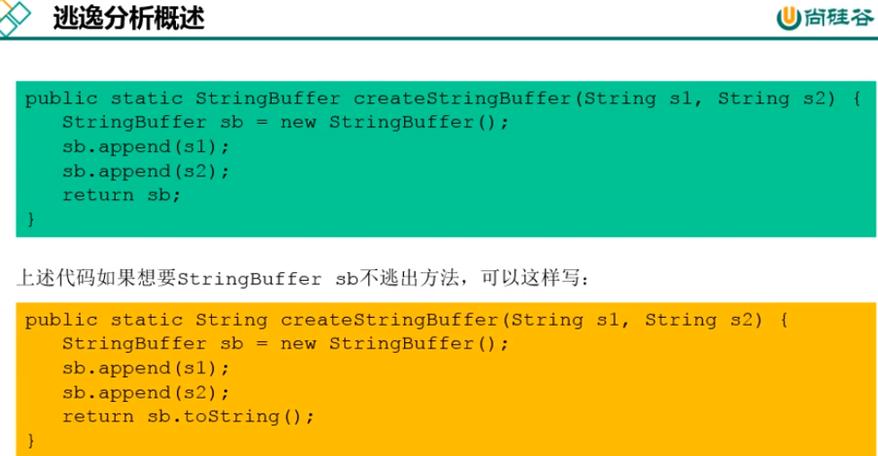

==逃逸分析：如何快速的判断是否发生了逃逸分析，就看new的对象是否有可能在方法外被调用。==

````java
package com.xuan.java2;

public class EscapeAnalysis {
    public EscapeAnalysis obj;

    //方法返回 EscapeAnalysis对象，发生逸
    public EscapeAnalysis getInstance() {
        return obj == null ? new EscapeAnalysis() : obj;
    }

    //为成员属性赋值，发生逃途
    public void setObj() {
        this.obj = new EscapeAnalysis();
    }

    //对象的作用域仅在当前方法中有效，没有发生逃逸
    public void useEscapAnalysis() {
        EscapeAnalysis e = new EscapeAnalysis();
    }
    //Y引用成员变量的值，发生逃逸
    public void useEscapeAnalysis1() {
        EscapeAnalysis e = new EscapeAnalysis();
    }
}

````

------

栈上分配-优化

````java
package com.xuan.java2;

//VM options:配置为：-Xmx1G -Xms1G -XX:-DoEscapeAnalysis -XX:+PrintGCDetails  //减号为不开启逃逸分析，运行时间300ms
//VM options:配置为：-Xmx1G -Xms1G -XX:+DoEscapeAnalysis -XX:+PrintGCDetails  //加好为开启逃逸分析，运行时间:9ms
//VM options:配置为：-Xmx256m -Xms256m -XX:-DoEscapeAnalysis -XX:+PrintGCDetails //发生GC，运行时间：101ms
//VM options:配置为：-Xmx256m -Xms256m -XX:+DoEscapeAnalysis -XX:+PrintGCDetails //不发生GC，运行时间：12ms
public class StackAllocation {
    public static void main(String[] args) {
        long start = System.currentTimeMillis();
        for (int i = 0; i < 10000000; i++) {
            allo();
        }
        //查看执行时间
        long end = System.currentTimeMillis();
        System.out.println("花费时间为：" + (end - start) + "ms");
        try {
            Thread.sleep(1000000);
        } catch (InterruptedException e) {
            e.printStackTrace();
        }
    }

    private static void allo() {
        User user = new User();//未发生逃逸
    }

    static class User {
    }
}

````

==对比开启逃逸分析和不开启逃逸分析：== 

注意：-XX:-DoEscapeAnalysis 减号为不开启逃逸分析，-XX:+DoEscapeAnalysis加号为开启逃逸分析


对比不同堆大小的运行时间：

**VM options:配置为：-Xmx1G -Xms1G -XX:-DoEscapeAnalysis -XX:+PrintGCDetails  //不发生GC，运行时间300ms
VM options:配置为：-Xmx1G -Xms1G -XX:+DoEscapeAnalysis -XX:+PrintGCDetails  //不发生GC，运行时间:9ms
VM options:配置为：-Xmx256m -Xms256m -XX:-DoEscapeAnalysis -XX:+PrintGCDetails //发生GC，运行时间：101ms
VM options:配置为：-Xmx256m -Xms256m -XX:+DoEscapeAnalysis -XX:+PrintGCDetails //不发生GC，运行时间：12ms**

------

代码优化：


代码优化-标量替换：

```java
package com.xuan.java2;

//配置：-Xmx100m -Xms100m -XX:+DoEscapeAnalysis -XX:+PrintGC -XX:-EliminateAllocations //发生GC，花费时间是137ms
//配置：-Xmx100m -Xms100m -XX:+DoEscapeAnalysis -XX:+PrintGC -XX:+EliminateAllocations //不发生GC，花费时间是：15ms
public class ScalarReplace {
    public static class User {
        public int id;
        public String name;
    }

    public static void alloc() {
        User u = new User();
        u.id = 5;
        u.name = "www.xuan.com";
    }

    public static void main(String[] args) {
        long start = System.currentTimeMillis();
        for (int i = 0; i < 10000000; i++) {
            alloc();
        }
        long end = System.currentTimeMillis();
        System.out.println("花费时间是：" + (end - start) + "ms");
    }
}
```

配置：-Xmx100m -Xms100m -XX:+DoEscapeAnalysis -XX:+PrintGC -XX:+EliminateAllocations //不发生GC，花费时间是：15ms

配置：-Xmx100m -Xms100m -XX:+DoEscapeAnalysis -XX:+PrintGC -XX:-EliminateAllocations //发生GC，花费时间是137ms

输出：

```
[GC (Allocation Failure)  25600K->720K(98304K), 0.0184666 secs]
[GC (Allocation Failure)  26320K->736K(98304K), 0.0009676 secs]
[GC (Allocation Failure)  26336K->704K(98304K), 0.0008299 secs]
[GC (Allocation Failure)  26304K->704K(98304K), 0.0008885 secs]
[GC (Allocation Failure)  26304K->720K(98304K), 0.0008318 secs]
[GC (Allocation Failure)  26320K->704K(101376K), 0.0010699 secs]
[GC (Allocation Failure)  32448K->652K(101376K), 0.0038234 secs]
[GC (Allocation Failure)  32396K->652K(101376K), 0.0009436 secs]
花费时间是：137ms
```

关于逃逸分析的论文在1999年就已经发表了，但直到JDK1.6才有实现，而且这项技术到如今也并不是十分成熟的。

其根本原因就是==无法保证逃逸分析的性能消耗一定能高于他的消耗。虽然经过逃逸分析可以做标量替换、栈上分配、和锁消除。但是逃逸分析自身也是需要进行一系列复杂的分析的，这其实也是一个相对耗时的过程==

一个极端的例子，就是经过逃逸分析之后，发现没有一个对象是不逃逸的。那这个逃逸分析的过程就白白浪费掉了.

虽然这项技术并不十分成熟，但是它也是==即时编译器优化技术中一个十分重要的手段==

注意到有一些观点，认为通过逃逸分析，JVM会在栈上分配那些不会逃逸的对象，这在理论上是可行的，但是取决于JVM设计者的选择。据我所知， Oracle Hotspot JVM中并未这么做，这一点在逃逸分析相关的文档里已经说明，所以可以明确所有的对象实例都是创建在堆上。

目前很多书籍还是基于JDK7以前的版本，JDK已经发生了很大变化， intern字符串的缓存和静态变量曾经都被分配在永久代上，而永久代已经被元数据区取代。但是，intern字符串缓存和静态变量并不是被转移到元数据区，而是直接在堆上分配，所以

这一点同样符合前面一点的结论:==对象实例都是分配在堆上==


# JVM_03 运行时数据区 [ 方法区]


## ①. 方法区的概述

**`1>.` 方法区的概述**

- ①. 方法区在JVM启动的时候被创建,并且它的实际的物理内存空间和Java堆区一样都可以是不连续的 | 关闭Jvm就会释放这个区域的内存
- ②. 方法区时逻辑上是堆的一个组成部分,但是在不同虚拟机里头实现是不一样的，最典型的就是永久代(PermGen space)和元空间(Metaspace)
  (注意：方法区时一种规范，而永久代和元空间是它的一种实现方式)
- **③. 方法区的大小决定了系统可以保存多少个类,如果系统定义了太多的类,导致方法区溢出,虚拟机同样会抛出内存溢出错误：(java.lang.OutOfMemoryError:==PermGen space==（jdk7）、java.lang.OutOfMemoryError:==Metaspace==（jdk8）) `掌握`**

1. 加载大量的第三方的jar包
2. tomcat部署的工程过多(30-50个)
3. 大量动态的生成反射类


- ④. 对于HotspotJVM而言,方法区还有一个别名叫非堆(Non-heap),目的就是要和堆分开,方法区可以看成一块独立于Java堆的内存空间


## ②. 方法区的内部结构

**`2>.` 方法区的内部结构**

- **①. 深入理解Java虚拟机》书中对方法区存储内容描述如下：它用于存储已被虚拟机加载的类型信息、常量、静态变量、即时编译器编译后的代码缓存等 `掌握`**
  
- ②. 类型信息(对每个加载的类型（ 类class、接口interface、枚举enum、注解annotation），JVM必 .须在方法区中存储以下类型信息：)

1. 这个类型的完整有效名称（全名=包名.类名）
2. 这个类型直接父类的完整有效名（对于interface或是java. lang.Object，都没有父类）
3. 这个类型的修饰符（public， abstract， final的某个子集）
4. 这个类型直接接口的一个有序列表

- ③. 域信息（成员变量）

1. JVM必须在方法区中保存类型的所有域的相关信息以及域的声明顺序。
2. 域的相关信息包括：域名称、 域类型、域修饰符（public， private， protected， static， final， volatile， transient的某个子集）

- ④. 方法信息：JVM必须保存所有方法的以下信息，同域信息一样包括声明顺序

1. 方法名称
2. 方法的返回类型（或void）
3. 方法参数的数量和类型（按顺序）
4. 方法的修饰符（public， private， protected， static， final，synchronized， native ， abstract的一个子集）
5. 方法的字节码（bytecodes）、操作数栈、局部变量表及大小（ abstract和native 方法除外）
6. 异常表（ abstract和native方法除外）
   每个异常处理的开始位置、结束位置、代码处理在程序计数器中的偏移地址、被捕获的异常类的常量池索引

- **⑤. non-final的类变量**
  (Order.class字节码文件，右键Open in Teminal打开控制台，使用javap -v -p Order.class > tst.txt 将字节码文件反编译并输出为txt文件,可以看到被声明为static final的常量number在编译的时候就被赋值了，这不同于没有被final修饰的static变量count是在类加载的准备阶段被赋值为默认的初始化值,在初始化的时候赋予正确的初始化值

```java
 public static int count;
    descriptor: I
    flags: ACC_PUBLIC, ACC_STATIC

  public static final int number;
    descriptor: I
    flags: ACC_PUBLIC, ACC_STATIC, ACC_FINAL
    ConstantValue: int 2
12345678
```

**`以下代码不会报空指针异常`**

```java
public class MethodAreaTest {
    public static void main(String[] args) {
        Order order = null;
        order.hello();
        System.out.println(order.count);
    }
}

class Order {
    public static int count = 1;//编译时没有被初始化
    public static final int number = 2;//编译时就会被初始化


    public static void hello() {
        System.out.println("hello!");
    }
}
//输出：hello!
//	 1
```

## ③. 方法区的演进细节

**`3>.` 方法区的演进细节 `面试常问`**

- ①. Jdk 1.6 及之前：有永久代，静态变量、字符串常量池1.6在方法区
- ②. Jdk 1.7 ：有永久代，但已经逐步 " 去永久代 "，字符串常量池、静态变量移除,保存在堆中
- ③. jdk 1.8 及之后： 无永久代，常量池1.8在元空间。但静态变量、字符串常量池仍在堆中
  
- **④. 为什么要用元空间取代永久代 `掌握`**

1. 因为永久代设置空间大小是很难确定的
   (①. 永久代参数设置过小,在某些场景下,如果动态加载的类过多,容易产生Perm区的OOM,比如某个实际Web工程中,因为功能点比较多,在运行过程中,要不断动态加载很多类,经常出现致命错误
   ②. 永久代参数设置过大,导致空间浪费
   ③. 默认情况下,元空间的大小受本地内存限制)
   
2. 对永久代进行调优是很困难的
   (方法区的垃圾收集主要回收两部分：常量池中废弃的常量和不再使用的类型,而不再使用的类或类的加载器回收比较复杂,full gc 的时间长)
   
   

- **⑤. StringTable为什么要调整 `掌握`**

1. jdk7中将StringTable放到了堆空间中。因为永久代的回收效率很低,在full gc的时候才能触发。而full gc是老年代的空间不足、永久代不足才会触发
2. 这就导致StringTable回收效率不高,而我们开发中会有大量的字符串被创建,回收效率低,导致永久代内存不足,放到堆里,能及时回收内存

## ④. 设置方法区大小

**`4>.` 设置方法区大小**

- ①. ==jdk7==及以前:

1. ==-XX:PermSize=100m==(默认值是20.75M)
2. ==-XX:MaxPermSize=100m==(32位机器默认是64M,64位机器模式是82M)
3. 图解：
   

- ②. ==jdk1.8==及以后

1. ==-XX:MetaspaceSize=100m==(windows下,默认约等于21M)

2. ==-XX:MaxMetaspaceSize=100m==(默认是-1,即没有限制)

   

   

   ````
   C:\Users\longxuan>jps
   10368
   16048 Jps
   13476 Launcher
   16180 RemoteMavenServer36
   11656 Main
   12492 MethodAreaTest
   
   C:\Users\longxuan>jinfo -flag MetaspaceSize 12492
   -XX:MetaspaceSize=104857600
   ````

   104857600/1024/1024=100m

   

   OOM举例：

   ```java
   package com.xuan;
   
   import jdk.internal.org.objectweb.asm.ClassWriter;
   import jdk.internal.org.objectweb.asm.Opcodes;
   //配置：-XX:MaxMetaspaceSize=10m -XX:MetaspaceSize=10m
   public class OOMTest extends ClassLoader {
       public static void main(String[] args) {
           int j = 0;
           try {
               OOMTest test = new OOMTest();
               for (int i = 0; i < 10000; i++) {
                   //创建 classWriter对象，用于生成类的二进制字节码
                   ClassWriter classWriter = new ClassWriter(0);
                   //指明版本号，修符，类名，包名，父类，接口
                   classWriter.visit(Opcodes.V1_8, Opcodes.ACC_PUBLIC, "Class" + i, null, "java/lang/Object", null);
                   byte[] code = classWriter.toByteArray();
                   //类的加载
                   test.defineClass("Class" + i, code, 0, code.length);//class对象
                   j++;
               }
           } finally {
               System.out.println(j);
           }
       }
   }
   ```

输出:

````
3331
Exception in thread "main" java.lang.OutOfMemoryError: Compressed class space
	at java.lang.ClassLoader.defineClass1(Native Method)
	at java.lang.ClassLoader.defineClass(ClassLoader.java:756)
	at java.lang.ClassLoader.defineClass(ClassLoader.java:635)
	at com.xuan.OOMTest.main(OOMTest.java:18)

````

OOM的解决：


## ⑤. 常量池的理解


**`5>.` 常量池的理解**

- **①. 常量池，可以看做是一张表，虚拟机指令根据这张常量表找到要执行的类名，方法名，参数类型、字面量等信息 `掌握`**

```java
Constant pool:
   #1 = Methodref          #7.#23         // java/lang/Object."<init>":()V
   #2 = Methodref          #24.#25        // com/xiaozhi/heap/Order.hello:()V
   #3 = Fieldref           #26.#27        // java/lang/System.out:Ljava/io/PrintStream;
   #4 = Fieldref           #24.#28        // com/xiaozhi/heap/Order.count:I
   #5 = Methodref          #29.#30        // java/io/PrintStream.println:(I)V
123456
```

- ②. 一个有效的字节码文件中除了包含类的版本信息、字段、方法以及接口等描述信息外，还包含一项信息那就是常量池表（Constant Poo1 Table），包括各种字面量和对类型域和方法的符号引用。
- ③. 个 java 源文件中的类、接口，编译后产生一个字节码文件。而 Java 中的字节码需要数据支持，通常这种数据会很大以至于不能直接存到字节码里，换另一种方式，可以存到常量池这个字节码包含了指向常量池的引用。在动态链接的时候会用到运行时常量池
- ④. 比如如下代码，虽然只有 194 字节，但是里面却使用了 string、System、Printstream 及 Object 等结构。这里代码量其实已经很小了。如果代码多，引用到的结构会更多！

```java
	Public class Simpleclass {
	public void sayhelloo() {
	    System.out.Println (hello) }
	}
1234
```

## ⑥. 运行时常量池

**`6>.` 运行时常量池 `掌握`**

- **①. 运行时常量池，常量池是 `\*.class` 文件中的，当该类被加载，它的常量池信息就会放入运行时常量池，并把里面的符号地址变为真实地址**

- ②. 运行时常量池（ Runtime Constant Pool）是方法区的一部分。

- ③. 常量池表（Constant Pool Table）是Class文件的一部分，用于存放编译期生成的各种字面量与符号引用，这部分内容将在类加载后存放到方法区的运行时常量池中。

- ④. 运行时常量池中包含多种不同的常量，**包括编译期就已经明确的数值字面量，也包括到运行期解析后才能够获得的方法或者字段引用**。此时不再是常量池中的符号地址了，这里换为真实地址。
  **(方法区内常量池之中主要存放的两大类常量：字面量和符号引用。
  字面量比较接近Java语言层次的常量概念，如文本字符串、被声明为final的常量值等。
  而符号引用则属于编译原理方面的概念，包括下面三类常量：
  1、类和接口的全限定名
  2、字段的名称和描述符
  3、方法的名称和描述符) `掌握`**
  
  

## ⑦. 如何证明静态变量存在哪

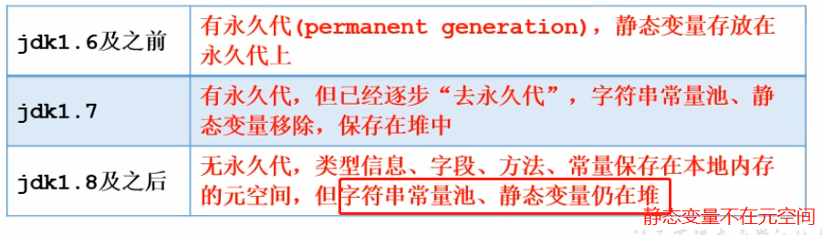


7>.如何证明静态变量存在哪

```java
/**
 * 《深入理解Java虚拟机》中的案例：
 * staticObj、instanceObj、localObj存放在哪里？
 */
public class StaticObjTest {
    static class Test {
        static ObjectHolder staticObj = new ObjectHolder();
        ObjectHolder instanceObj = new ObjectHolder();

        void foo() {
            ObjectHolder localObj = new ObjectHolder();
            System.out.println("done");
        }
    }

    private static class ObjectHolder {
    }

    public static void main(String[] args) {
        Test test = new StaticObjTest.Test();
        test.foo();
    }
}
1234567891011121314151617181920212223
```

- staticObj随着Test的类型信息存放在方法区，instance0bj 随着Test的对象实例存放在Java堆，localobject则是存放在foo（）方法栈帧的局部变量表中

```handlebars
hsdb>scanoops 0x00007f32c7800000 0x00007f32c7b50000 JHSDB_ _TestCase$Obj ectHolder
0x00007f32c7a7c458 JHSDB_ TestCase$Obj ectHolder
0x00007f32c7a7c480 JHSDB_ TestCase$Obj ectHolder
0x00007f32c7a7c490 JHSDB_ TestCase$Obj ectHolder
1234
```

- 测试发现：三个对象的数据在内存中的地址都落在Eden区范围内，所以结论：只要是对象实例必然会在Java堆中分配
- 接着，找到了一个引用该staticObj对象的地方，是在一个java. lang . Class的实例里，并且给出了这个实例的地址，通过Inspector查看该对象实例，可以清楚看到这确实是一个
  java.lang.Class类型的对象实例，里面有一个名为staticObj的实例字段：
  
- 从《Java 虛拟机规范》所定义的概念模型来看，所有 Class 相关的信息都应该存放在方法区之中，但方法区该如何实现，《Java 虚拟机规范》并未做出规定，这就成了一件允许不同虚拟机自己灵活把握的事情。JDK7 及其以后版本的 Hotspot 虚拟机选择==把静态变量与类型在 Java 语言一端的映射 Class 对象存放在一起，存储于Java 堆之中==，从我们的实验中也明确验证了这一点.

## ⑧. 方法区的垃圾回收

**`8>.` 方法区的垃圾回收**

> 前言：
> (1).有些人认为方法区（如Hotspot，虚拟机中的元空间或者永久代）是没有垃圾收集行为的，其实不然。《Java 虚拟机规范》对方法区的约束是非常宽松的，提到过可以不要求虚拟机在方法区中实现垃圾收集。事实上也确实有未实现或未能完整实现方法区类型卸载的收集器存在（如 JDK11 时期的 ZGC 收集器就不支持类卸载）
> (2). 一般来说这个区域的回收效果比较难令人满意，尤其是类型的卸载，条件相当苛刻。但是这部分区域的回收有时又确实是必要的。以前 Sun 公司的 Bug 列表中，曾出现过的若干个严重的 Bug 就是由于低版本的 Hotspot 虚拟机对此区域未完全回收而导致内存泄漏。

- **①. 方法区的垃圾收集主要回收两部分内容：`常量池中废奔的常量和不再使用的类型`**
- **②. 先来说说方法区内常量池之中主要存放的两大类常量：==字面量和符号引用==。 字面量比较接近Java语言层次的常量概念，如文本字符串、被声明为final的常量值等。而符号引用则属于编译原理方面的概念，包括下面三类常量：**

1. 类和接口的全限定名
2. 字段的名称和描述符
3. 方法的名称和描述符

- ③. HotSpot虚拟机对常量池的回收策略是很明确的，只要常量池中的常量没有被任何地方引用，就可以被回收。回收废弃常量与回收Java堆中的对象非常类似。
- ④. 判定一个常量是否“废弃”还是相对简单，而要判定一个类型是否属于“==不再被使用的类==”的条件就比较苛刻了。需要同时满足下面三个条件：

1. 该类所有的实例都已经被回收，也就是Java堆中不存在该类及其任何派生子类的实例。
2. 加载该类的类加载器已经被回收，这个条件除非是经过精心设计的可替换类加载器的场景，如OSGi、JSP的重加载等，否则通常是很难达成的
3. 该类对应的java.lang.Class对象没有在任何地方被引用，无法在任何地方通过反射访问该类的方法

- ⑤. Java虛拟机被允许对满足上述三个条件的无用类进行回收，这里说的仅仅是“被允许”，而并不是和对象一样，没有引用了就必然会回收。关于是否要对类型进行回收，HotSpot虚拟机提供了一Xnoclassgc 参数进行控制，还可以使用一verbose：class以及一XX： +TraceClass一Loading、一XX：+TraceClassUnLoading查 看类加载和卸载信息
- ⑥. 在大量使用反射、动态代理、CGLib等字节码框架，动态生成JSP以及oSGi这类频繁自定义类加载器的场景中，通常都需要Java虚拟机具备类型卸载的能力，以保证不会对方法区造成过大的内存压力


------

# JVM_04 对象的实例化+内存布局+访问定位+直接内存

> 前言：
> (1).new 最常见的方式 | 变形1 ： Xxx的静态方法 | 变形2 ： XxBuilder/XxoxFactory的静态方法
> (2).Class的newInstance（）：反射的方式，只能调用空参的构造器，权限必须是public
> (3).Constructor的newInstance（Xxx）：反射的方式，可以调用空参、带参的构造器，权限没有要求
> (4).使用clone（） ：不调用任何构造器，当前类需要实现Cloneable接口，实现clone（）
> (5).使用反序列化：从文件中、从网络中获取一个对象的二进制流
> (6).第三方库Objenesis


## ①. 对象的实例化(六个步骤)

**`1>.` 对象的实例化 `掌握`**

- **①. 判断对象对应的类是否加载、链接、初始化**
  (虚拟机遇到一条new指令，首先去检查这个指令的参数能否在Metaspace的常量池中定位到一个类的符号引用，并且检查这个符号引用代表的类是否已经被加载、解析和初始化。（ 即判断类元信息是否存在）。如果没有，那么在双亲委派模式下，使用当前类加载器以ClassLoader+包名+类名为Key进行查找对应的.class文件。如果没有找到文件，则抛出==ClassNotFoundException异常==，如果找到，则进行类加载，并生成对应的Class类对象)
- **②. `为对象分配内存`：首先计算对象占用空间大小，接着在堆中划分一块内存给新对象。 如果实例成员变量是引用变量，仅分配引用变量空间即可，即4个字节大小**
  (byte、int、float、引用数据类型4个字节大小 | double、long 占八个字节)

1. 如果内存规整，使用指针碰撞
   如果内存是规整的，那么虚拟机将采用的是指针碰撞法（BumpThePointer）来为对象分配内存。意思是所有用过的内存在一边，空闲的内存在另外一边，中间放着一个指针作为分界点的指示器，分配内存就仅仅是把指针向空闲那边挪动一段与对象大小相等的距离罢了。如果垃圾收集器选择的是Serial、ParNew这种基于压缩算法的，虚拟机采用这种分配方式。一般使用带有compact （整理）过程的收集器时，使用指针碰撞。
   
   
   
2. 如果内存不规整，虚拟机需要维护一个列表，使用空闲列表分配(CMS)
   如果内存不是规整的，已使用的内存和未使用的内存相互交错，那么虛拟机将采用的是空闲列表法来为对象分配内存。意思是虚拟机维护了一个列表，记录上哪些内存块是可用的，再分配的时候从列表中找到一块足够大的空间划分给对象实例，并更新列表上的内容。这种分配方式成为“空闲列表（Free List）

3. 说明：选择哪种分配方式由Java堆是否规整决定，而Java堆是否规整又由所采用的垃圾收集器是否带有压缩整理功能决定。

- **③. 处理并发安全问题**
  (在分配内存空间时，另外一个问题是及时保证new对象时候的线程安全性：创建对象是非常频繁的操作，虚拟机需要解决并发问题。虚拟机采用 了两种方式解决并发问题：)

1. CAS （ Compare And Swap ）失败重试、区域加锁：保证指针更新操作的原子性
2. TLAB把内存分配的动作按照线程划分在不同的空间之中进行，即每个线程在Java堆中预先分配一小块内存，称为本地线程分配缓冲区，（TLAB ，Thread Local
   Allocation Buffer） 虚拟机是否使用TLAB，可以通过一XX：+/一UseTLAB参数来 设定

- **④. 初始化分配到的空间:赋予默认的初始化值；比如int=0| boolean=false(默认的值)**
- **⑤. 设置对象的对象头**：将对象的所属类（即类的元数据信息）、对象的HashCode和对象的GC信息、锁信息等数据存储在对象的对象头中。这个过程的具体设置方式取决于JVM实现。
- **⑥. 执行init方法进行初始化(进行赋值的处理)**
  (在Java程序的视角看来，初始化才正式开始。初始化成员变量，执行实例化代码块，调用类的构造方法，并把堆内对象的首地址赋值给引用变量。
  因此一般来说（由字节码中是否跟随有invokespecial指令所决定），new指令之 后会接着就是执行方法，把对象按照程序员的意愿进行初始化，这样一个真正可用的对象才算完全创建出来。)


- ⑦. 代码展示

```java
	/**
	 * 测试对象实例化的过程
	 *  ① 加载类元信息 - ② 为对象分配内存 - ③ 处理并发问题  - ④ 属性的默认初始化（零值初始化）
	 *  - ⑤ 设置对象头的信息 - ⑥ 属性的显式初始化、代码块中初始化、构造器中初始化
	 *
	 *  给对象的属性赋值的操作：
	 *  ① 属性的默认初始化 - ② 显式初始化 / ③ 代码块中初始化 - ④ 构造器中初始化
	 * 
	 */
	public class Customer{
	    int id = 1001;
	    String name;
	    Account acct;
	
	    {
	        name = "匿名客户";
	    }
	    public Customer(){
	        acct = new Account();
	    }
	
	}
	
	class Account{
	
	}
1234567891011121314151617181920212223242526
```

## ②. 对象的内存布局

**`2>.` 对象的内存布局**

### ①. 对象头（Header）


- **对象头包含两部分：(栈中的地址值就是一个哈希值) `掌握`**

1. **`运行时元数据`** (哈希值（ HashCode ）、GC分代年龄、锁状态标志、线程持有的锁、偏向线程ID、偏向时间戳)
2. **`类型指针`**：指向类元数据的InstanceKlass，确定该对象所属的类型
3. 说明：如果是数组，还需记录数组的长度

### ②. 实例数据（Instance Data）

- 说明：它是对象真正存储的有效信息，包括程序代码中定义的各种类型的字段（包括从父类继承下来的和本身拥有的字段） 规则：

1. 相同宽度的字段总被分配在一起
2. 父类中定义的变量会出现在子类之前
3. 如果CompactFields参数为true（默认为true），子类的窄变量可能插入到父类变量的空隙

### ③. 对齐填充（Padding）

- ①. 不是必须的，也没特别含义，仅仅起到占位符作用
- ②. 解释如下图：


### ④. 总结

- ①. 代码演示

````java
package com.xuan;

//① 加载类元信息 - ② 为对象分配内存 - ③ 处理并发问题  - ④ 属性的默认初始化（零值初始化）
// - ⑤ 设置对象头的信息 - ⑥ 属性的显式初始化、代码块中初始化、构造器中初始化
public class Customer {
    int id = 1001;
    String name;
    Account acct;
    {
        name = "匿名客户";
    }
    public Customer() {
        acct = new Account();
    }
}
class Account { }
````


```java
public class CustomerTest {
    public static void main(String[] args) {
        Customer cust = new Customer();
    }
}
12345
```

- ②. 图解👆代码
  

## ③. 对象的访问定位

**`3>.` 对象的访问定位**

> 前言：
> JVM是如何通过栈帧中的对象引|用访问到其内部的对象实例的呢？-> 定位,通过栈上reference访问

- ①. 句柄访问
  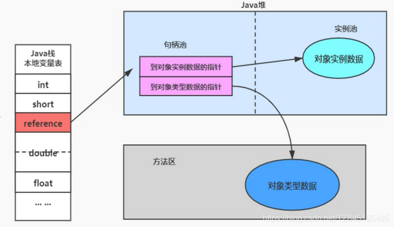
- ②. 直接指针(HotSpot采用)
  

## ④. 直接内存(Direct Memory)

**4>.直接内存(Direct Memory) `了解`**

- ①. 不是虚拟机运行时数据区的一部分，也不是《Java虚拟机规范》中定义的内存区域
- ②. 直接内存是Java堆外的、直接向系统申请的内存区间
- ③. 代码演示：

```java
/**
 *  IO                  NIO (New IO / Non-Blocking IO)
 *  byte[] / char[]     Buffer
 *  Stream              Channel
 *
 * 查看直接内存的占用与释放
 */
public class BufferTest {
    private static final int BUFFER = 1024 * 1024 * 1024;//1GB

    public static void main(String[] args){
        //直接分配本地内存空间
        ByteBuffer byteBuffer = ByteBuffer.allocateDirect(BUFFER);
        System.out.println("直接内存分配完毕，请求指示！");

        Scanner scanner = new Scanner(System.in);
        scanner.next();

        System.out.println("直接内存开始释放！");
        byteBuffer = null;
        System.gc();
        scanner.next();
    }
}
```

- ④. 来源于NIO，通过存在堆中的DirectByteBuffer操作Native内存


- ⑤. 通常，访问直接内存的速度会优于Java堆。即读写性能高
- **⑥. 直接内存大小可以通过MaxDirectMemorySize设置，如果不指定，默认与堆的最大值一Xmx参数值一致**
- **⑦. 简单理解： java process memory = java heap + native memory**
  

直接内存可能导致 OutofMemoryError异常

由于直接内存在Java堆外，因此它的大小不会直接受限于-Xmx指定的最大堆大小，但是系统内存是有限的，Java堆和直接内存的总和依然受限于操作系统能给出的最大内存。

缺点:分配回收成本较高,不受JVM内存回收管理

直接内存大小可以通过 MaxDirectMemorysize设置

如果不指定，默认与堆的最大值-xnx参数值一致

------

# JVM_04 字符串常量池(详解intern( ))

## ①. String的基本特性

1>.String的基本特性

- ①. String：字符串，使用一对""引起来表示。

1. String sl = “hello”；//字面量的定义方式
2. String s2 = new String（“hello”）

- ②. String声明为final的,不可被继承
- ③. String实现了Serializable接口：表示字符串是支持序列化的。 实现了Comparable接口：表示String可以比较大小
- **④. String在jdk8及以前内部定义了==final char[]==,value用于存储字符串数据。jdk9时改为==byte[ ]==**

```java
	public final class String implements 
	java.io.Serializable， Comparable<String>,CharSequence {
	@Stable
	private final byte[] value；
	}
12345
```

- ⑤. String：代表不可变的字符序列。简称：不可变性。
- ⑥. 通过字面量的方式（区别于new）给一个字符串赋值，此时的字符串值声明在字符串常量池中
- **⑦. 字符串常量池中是不会存储相同内容的字符串的**

1. String的String Pool 是一个固定大小的Hashtable，默认值大小长度是1009。如果放进StringPool的String非常多， 就会造成Hash冲突严重，从而导致链表会很长，而链表长了后直接会造成的影响就是当调用String. intern时性能会大幅下降。

2. 使用 - XX:StringTableSize可设置StringTable的长度

3. 在jdk6中StringTable是固定的，就是1009的长度，所以如果常量池中的字符串过多就会导致效率下降很快。StringTableSize设 置没有要求

4. 在jdk7中，StringTable的长度默认值是60013

5. jdk8开始,1009是StringTable长度==可设置的最小值==,默认值为60013

   ````
   JDK8
   C:\Users\longxuan>jinfo -flag StringTableSize 14176
   -XX:StringTableSize=60013
   ````

   

## ②. String的内存分配

2>.String的内存分配

- ①. 常量池就类似一个Java系统级别提供的缓存。8种基本数据类型的常量池都是系统协调的，String类型的常量池比较特殊。它的主要使用方法有两种：

1. 直接使用双引号声明出来的String对象会直接存储在常量池中(比如： String info = “abc” )
2. 如果不是用双引号声明的String对象，可以使用String提供的intern（）方法


- ②.String的基本操作
  

```java
	class Memory {
	    public static void main(String[] args) {//line 1
	        int i = 1;//line 2
	        Object obj = new Object();//line 3
	        Memory mem = new Memory();//line 4
	        mem.foo(obj);//line 5
	    }//line 9
	
	    private void foo(Object param) {//line 6
	        String str = param.toString();//line 7
	        System.out.println(str);
	    }//line 8
	}
```


## ③. 字符串拼接操作

**`3>.` 字符串拼接操作**

- **①. 常量与常量的拼接结果在常量池，原理是编译期优化**

- ②. 常量池中不会存在相同内容的常量。

- ③. 只要其中有一个是变量，结果就在堆中
  **`(只有有一个是变量,那么它会在堆中创建一个StringBuilder，调用append( )方法进行添加操作，调用toString( )方法转换为字符串【toString( )方法其实就是:new String( )】)`**
  
  
  
- **④. 如果拼接的结果调用intern（）方法分为两种情况：**

1. JDK1.6，将这个字符串对象尝试放入串池 ①. 如果字符串常量池中有，则并不会放入。返回已有的串池中的对象的地址②. 如果没有,它会在常量池中创建一个对象放入串池中，并返回串池中的对象地址
2. JDK1.7，将这个字符串对象尝试放入串池 ①. 如果字符串常量池中有，则并不会放入。返回已有的串池中的对象的地址②. 如果没有，它不会创建一个对象，如果堆中已经这个字符串，那么会将堆中的引用地址赋给它

如下的   String s1 = "a";   String s2 = "b"; s1 + s2 的执行细节：(变量s是我临时定义的）
        ① StringBuilder s = new StringBuilder();
        ② s.append("a")
        ③ s.append("b")
        ④ s.toString()  --> 约等于 new String("ab")

1. **test3、test4`重点掌握`**

```java
    @Test
    public void test1(){
        String s1 = "a" + "b" + "c";//编译期优化：等同于"abc" 在字节码文件中,s1="abc"
        String s2 = "abc"; //"abc"一定是放在字符串常量池中，将此地址赋给s2
        /*
         * 最终.java编译成.class,再执行.class
         * String s1 = "abc";
         * String s2 = "abc"
         */
        System.out.println(s1 == s2); //true
        System.out.println(s1.equals(s2)); //true
    }

    @Test
    public void test2(){
        String s1 = "javaEE";
        String s2 = "hadoop";

        String s3 = "javaEEhadoop";
        String s4 = "javaEE" + "hadoop";//编译期优化
        //如果拼接符号的前后出现了变量，则相当于在堆空间中new String()，具体的内容为拼接的结果：javaEEhadoop
        String s5 = s1 + "hadoop";
        String s6 = "javaEE" + s2;
        String s7 = s1 + s2;

        System.out.println(s3 == s4);//true
        System.out.println(s3 == s5);//false
        System.out.println(s3 == s6);//false
        System.out.println(s3 == s7);//false
        System.out.println(s5 == s6);//false
        System.out.println(s5 == s7);//false
        System.out.println(s6 == s7);//false
        //intern():判断字符串常量池中是否存在javaEEhadoop值，如果存在，则返回常量池中javaEEhadoop的地址；
        //如果字符串常量池中不存在javaEEhadoop，则在常量池中加载一份javaEEhadoop，并返回次对象的地址。
        String s8 = s6.intern();
        System.out.println(s3 == s8);//true
    }


    @Test
    public void test3(){
        String s1 = "a";
        String s2 = "b";
        String s3 = "ab";
        /*
        如下的s1 + s2 的执行细节：(变量s是我临时定义的）
        ① StringBuilder s = new StringBuilder();
        ② s.append("a")
        ③ s.append("b")
        ④ s.toString()  --> 约等于 new String("ab")

        补充：在jdk5.0之后使用的是StringBuilder,
        在jdk5.0之前使用的是StringBuffer
         */
        String s4 = s1 + s2;//
        System.out.println(s3 == s4);//false
    }

    /*
    1. 字符串拼接操作不一定使用的是StringBuilder!
       如果拼接符号左右两边都是字符串常量或常量引用，则仍然使用编译期优化，即非StringBuilder的方式。
    2. 针对于final修饰类、方法、基本数据类型、引用数据类型的量的结构时，能使用上final的时候建议使用上。
     */
    @Test
    public void test4(){
        final String s1 = "a";
        final String s2 = "b";
        String s3 = "ab";
        String s4 = s1 + s2;
        System.out.println(s3 == s4);//true
    }

    //练习：
    @Test
    public void test5(){
        String s1 = "javaEEhadoop";
        String s2 = "javaEE";
        String s3 = s2 + "hadoop";
        System.out.println(s1 == s3);//false

        final String s4 = "javaEE";//s4:常量
        String s5 = s4 + "hadoop";
        System.out.println(s1 == s5);//true

    }
12345678910111213141516171819202122232425262728293031323334353637383940414243444546
```


## ④. 拼接操作与append的效率对比

4>.拼接操作与append的效率对比

- append效率要比字符串拼接高很多
- 体会执行效率：通过StringBuilder的append()的方式添加字符串的效率要远高于使用String的字符串
   拼接方式！
      详情：① StringBuilder的append()的方式：自始至终中只创建过一个StringBuilder的对象
             使用String的字符串拼接方式：创建过多个StringBuilder和String的对象
           ② 使用String的字符串拼接方式：内存中由于创建了较多的StringBuilder和String的对象，
             内存占用更大；如果进行GC，需要花费额外的时间。

```java
/*   改进的空间：在实际开发中，如果基本确定要前前后后添加的字符串长度不高于某个限定值highLevel
     的情况下,建议使用构造器实例化：
     StringBuilder s = new StringBuilder(highLevel);//new char[highLevel]
     */
    @Test
    public void test6(){

        long start = System.currentTimeMillis();

//        method1(100000);//4014
        method2(100000);//7

        long end = System.currentTimeMillis();

        System.out.println("花费的时间为：" + (end - start));
    }

    public void method1(int highLevel){
        String src = "";
        for(int i = 0;i < highLevel;i++){
            src = src + "a";//每次循环都会创建一个StringBuilder、String
        }
//        System.out.println(src);

    }

    public void method2(int highLevel){
        //只需要创建一个StringBuilder
        StringBuilder src = new StringBuilder();
        for (int i = 0; i < highLevel; i++) {
            src.append("a");
        }
//        System.out.println(src);
    }
```

## ⑤. intern()的使用 (超级重要)

**`5>.` intern()的使用**

 When the intern method is invoked, if the pool already contains a string equal to this {@code String} object as determined by  the {@link #equals(Object)} method, then the string from the pool is  returned. Otherwise, this {@code String} object is added to the   pool and a reference to this {@code String} object is returned.

调用intern方法时，如果池中已经包含一个与{@link}equals（object）}方法确定的{@code string}对象相等的字符串，则返回池中的字符串。否则，这个{@code String}对象被添加到池中，并返回对这个{@code String}对象的引用。

> 前言：
> (1). 如果不是用双引号声明的String对象，可以使用String提供的intern方法： intern方法会从字符串常量池中查询当前字符串是否存在，若不存在就会将当前字符串放入常量池中
> (2). 比如： String myInfo = new String(“I love u”).intern()；
> 也就是说，如果在任意字符串上调用String. intern方法，那么其返回结果所指向的那个类实例，必须和直接以常量形式出现的字符串实例完全相同。因此，下 列表达式的值必定是true：
> （“a” + “b” + “c”）.intern（）== “abc”;
> (3). 通俗点讲，Interned String就是确保字符串在内存里只有一份拷贝，这样可以节约内存空间，加快字符串操作任务的执行速度。注意，这个值会被存放在字符串内部池（String Intern Pool）

### ①. new String(“ab”)会创建几个对象

- **①. new String(“ab”)会创建几个对象 `很重要`**
  (new String(“ab”)会创建几个对象？看字节码，就知道是两个)

1. 一个对象是：new关键字在堆空间创建的
2. 另一个对象是：字符串常量池中的对象"ab"。 字节码指令：ldc
3. 如下图：(常量池中已经有了该对象)
   

### ②. ==new String(“a”) + new String(“b”)创建几个对象==呢？

- **②. new String(“a”) + new String(“b”)呢？ `很重要`**
  (在常量池中是没有ab存在的 [很关键] )

1. 对象1：new StringBuilder()

2. 对象2： new String(“a”)

3. 对象3： 常量池中的"a"

4. 对象4： new String(“b”)

5. 对象5： 常量池中的"b"
   
   
6. 深入剖析： StringBuilder的toString(): 对象6 ：new String(“ab”)

7. **`注意：`强调一下，toString()的调用，在字符串常量池中，没有生成"ab" `没有ldc指令`**

   


### ③. 关于String.intern( )的面试题

- ③. 关于String.intern( )的面试题

```java
/**
 * 如何保证变量s指向的是字符串常量池中的数据呢？
 * 有两种方式：
 * 方式一： String s = "shkstart";//字面量定义的方式
 * 方式二： 调用intern()
 *         String s = new String("shkstart").intern();
 *         String s = new StringBuilder("shkstart").toString().intern();
 *  */
public class StringIntern {
    public static void main(String[] args) {
        String s = new String("1");
        String s1 = s.intern();//调用此方法之前，字符串常量池中已经存在了"1"
        String s2 = "1";
        //s  指向堆空间"1"的内存地址
        //s1 指向字符串常量池中"1"的内存地址
        //s2 指向字符串常量池已存在的"1"的内存地址  所以 s1==s2
        System.out.println(s == s2);//jdk6：false   jdk7/8：false
        System.out.println(s1 == s2);//jdk6: true   jdk7/8：true
        System.out.println(System.identityHashCode(s));//491044090
        System.out.println(System.identityHashCode(s1));//644117698
        System.out.println(System.identityHashCode(s2));//644117698

        //s3变量记录的地址为：new String("11")
        String s3 = new String("1") + new String("1");
        //执行完上一行代码以后，字符串常量池中，是否存在"11"呢？答案：不存在！！

        //在字符串常量池中生成"11"。如何理解：jdk6:创建了一个新的对象"11",也就有新的地址。
        //jdk7:此时常量中并没有创建"11",而是创建一个指向堆空间中new String("11")的地址
        s3.intern();
        //s4变量记录的地址：使用的是上一行代码代码执行时，在常量池中生成的"11"的地址
        String s4 = "11";
        System.out.println(s3 == s4);//jdk6：false  jdk7/8：true
    }
}
```


==new String==

```java 
public class StringIntern1 {
    public static void main(String[] args) {
    	//s3变量记录的地址为：new String("11")
        String s3 = new String("1") + new String("1");
        //执行完上一行代码以后，字符串常量池中，是否存在"11"呢？答案：不存在！！

        //在字符串常量池中生成"11"。如何理解：jdk6:创建了一个新的对象"11",也就有新的地址。
        //jdk7:此时常量中并没有创建"11",而是创建一个指向堆空间中new String("11")的地址
        s3.intern();
        //s4变量记录的地址：使用的是上一行代码代码执行时，在常量池中生成的"11"的地址
        String s4 = "11";
        System.out.println(s3 == s4);//jdk6：false  jdk7/8：true  
        }
}
```


```java
public class StringIntern1 {
    public static void main(String[] args) {
        //StringIntern.java中练习的拓展：
        String s3 = new String("1") + new String("1");//new String("11")
        //执行完上一行代码以后，字符串常量池中，是否存在"11"呢？答案：不存在！！
        String s4 = "11";//在字符串常量池中生成对象"11"
        String s5 = s3.intern();//由于字符串常量池已经有"11",即s2的地址就是s11的地址
        System.out.println(s3 == s4);//false
        System.out.println(s5 == s4);//true
    }
}
```

### ④. 总结String的intern（）的使用

- **④. 如果拼接的结果调用intern（）方法分为两种情况：**

1. JDK1.6，将这个字符串对象尝试放入串池 ①. 如果字符串常量池中有，则并不会放入。返回已有的串池中的对象的地址②. 如果没有,它会在常量池中创建一个对象放入串池中，并返回串池中的对象地址

2. JDK1.7，将这个字符串对象尝试放入串池 ①. 如果字符串常量池中有，则并不会放入。返回已有的串池中的对象的地址②. 如果没有，它不会创建一个对象，如果堆中已经这个字符串，那么会将堆中的引用地址赋给它

   

```java
public class StringExer1 {
    public static void main(String[] args) {
        //String x = "ab";
        String s = new String("a") + new String("b");//new String("ab")
        //在上一行代码执行完以后，字符串常量池中并没有"ab"

        String s2 = s.intern();//jdk6中：在串池中创建一个字符串"ab"
                               //jdk8中：串池中没有创建字符串"ab",而是创建一个引用，指向new String("ab")，将此引用返回

        System.out.println(s2 == "ab");//jdk6:true  jdk8:true
        System.out.println(s == "ab");//jdk6:false  jdk8:true
    }
}

```

> intern题目：
> 
> 

注意：

**String s = new String("ab");//在字符串常量池创建"ab"常量
String s1 = new String("a") + new String("b");//在字符串常量池不创建"ab"常量**

```java
package com.xuan;

public class newStringTest3 {
    public static void main(String[] args) {
        String s = new String("ab");//在字符串常量池创建"ab"常量
        String s1 = new String("a") + new String("b");//在字符串常量池不创建"ab"常量
        System.out.println(s == s1);//false
        System.out.println(s == "ab");//false
    }
}
```

## ⑥. intern()效率测试

6>.intern()效率测试

- 大的网站平台，需要内存中存储大量的字符串。比如社交网站，很多人都存储：北京市、海淀区等信息。这时候如果字符串都调用 intern（）方法，就会明显降低内存的大小。

```java
/**
 * 使用intern()测试执行效率：空间使用上
 *
 * 结论：对于程序中大量存在存在的字符串，尤其其中存在很多重复字符串时，使用intern()可以节省内存空间。
 *
 */
public class StringIntern2 {
    static final int MAX_COUNT = 1000 * 10000;
    static final String[] arr = new String[MAX_COUNT];

    public static void main(String[] args) {
        Integer[] data = new Integer[]{1,2,3,4,5,6,7,8,9,10};

        long start = System.currentTimeMillis();
        for (int i = 0; i < MAX_COUNT; i++) {
//            arr[i] = new String(String.valueOf(data[i % data.length]));
            arr[i] = new String(String.valueOf(data[i % data.length])).intern();//输出：花费的时间为：5006

        }
        long end = System.currentTimeMillis();
        System.out.println("花费的时间为：" + (end - start));

        try {
            Thread.sleep(1000000);
        } catch (InterruptedException e) {
            e.printStackTrace();
        }
        System.gc();
    }
}
```

效率测试：运行： arr[i] = new String(String.valueOf(data[i % data.length]));时:


运行：arr[i] = new String(String.valueOf(data[i % data.length])).intern();时：


## ⑦. StrtingTable的垃圾回收(了解)

7>.StrtingTable的垃圾回收

```java
/**
 * String的垃圾回收:
 * -Xms15m -Xmx15m -XX:+PrintStringTableStatistics -XX:+PrintGCDetails
 *
 */
public class StringGCTest {
    public static void main(String[] args) {
//        for (int j = 0; j < 100; j++) {
//            String.valueOf(j).intern();
//        }
        //发生垃圾回收行为
        for (int j = 0; j < 100000; j++) {
            String.valueOf(j).intern();
        }
    }
}
```


------

# JVM_05 执行引擎（Execution Engine）

> **总结写在最前面：**
> 

## ①. 执行引擎概述

**`1>.` 执行引擎概述**

- ①. 执行引擎是Java虚拟机的核心组成部分之一
- ②. JVM的主要任务是负责装载字节码到其内部，但字节码并不能够直接运行在操作系统之上，因为字节码指令并非等价于本地机器指令，它内部包含的仅仅只是一些能够被JVM锁识别的字节码指令、符号表和其他辅助信息
- ③. 那么，如果想让一个Java程序运行起来、`执行引擎的任务就是将字节码指令解释/编译为对应平台上的本地机器指令才可以`。简单来说，JVM中的执行引擎充当了将高级语言翻译为机器语言的译者
- ④. 执行引擎的工作过程 (从外观上来看，所有的Java虚拟机的执行引擎输入、输出都是一致的：输入的是字节码二进制流，处理过程是字节码解析执行的等效过程，输出的是执行结果)

1. 执行引擎在执行的过程中究竟需要执行什么样的字节码指令完全依赖于PC寄存器
2. 每当执行完一项指令操作后，PC寄存器就会更新下一条需要被执行的指令地址
3. 当然方法在执行的过程中，执行引擎有可能会通过存储在局部变量表中的对象引用准确定位到存储在Java堆区中的对象实例信息，以及通过对象头中的元数据指针定位到目标对象的类型信息。


## ②. Java代码编译和执行过程

**`2>.` Java代码编译和执行过程**

- ①. 大部分的程序代码转换成物理机的目标代码或虚拟机能执行的指令集之前，都需要经过下面图中的各个步骤：


- ②. 什么是解释器（ Interpreter），什么是JIT编译器？**`掌握`**

1. 解释器：当Java虚拟机启动时会根据预定义的规范对字节码采用逐行解释的方式执行，将每条字节码文件中的内容“翻译”为对应平台的本地机器指令执行
2. JIT （Just In Time Compiler）编译器（即时编译器）：就是虚拟机将源代码直接编译成和本地机器平台相关的机器语言

- ③. 为什么说Java是半编译半解释型语言？ 如下图要记住

1. JDK1.0时代，将Java语言定位为“解释执行”还是比较准确的。再后来，Java也发展出可以直接生成本地代码的编译器
2. 现在JVM在执行Java代码的时候，通常都会将解释执行与编译执行二者结合起来进行。
   

## ③. 机器码、指令、汇编语言

3>.机器码、指令、汇编语言

- **①. 机器码：各种==用二进制编码方式表示的指令，叫做机器指令码==。开始，人们就用它采编写程序，这就是机器语言(0 | 1 组成的)**

1. 机器语言虽然能够被计算机理解和接受，但和人们的语言差别太大，不易被人们理解和记忆，并且用它编程容易出差错
2. 用它编写的程序一经输入计算机，CPU直接读取运行，因此和其他语言编的程序相比，执行速度最快
3. 机器指令与CPU紧密相关，所以不同种类的CPU所对应的机器指令也就不同。

- **②. 指令就是把机器码中特定的0和1序列，简化成对应的指令（一般为英文简写，如mov，inc等），可读性稍好**
  (由于不同的硬件平台，执行同一个操作，对应的机器码可能不同，所以不同的硬件平台的同一种指令（比如mov），对应的机器码也可能不同)
- ③. 指令集

1. 不同的硬件平台，各自支持的指令，是有差别的。因此每个平台所支持的指令，称之为对应平台的指令集
2. 如常见的 (x86指令集，对应的是x86架构的平台 | ARM指令集，对应的是ARM架构的平台 )

- ④. 汇编语言

1. 在汇编语言中，用助记符（Mnemonics）代替机器指令的操作码，用地址符号（Symbol）或标号（Label）代替指令或操作数的地址
2. 在不同的硬件平台，汇编语言对应着不同的机器语言指令集，通过汇编过程转换成机器指令
   (由于计算机只认识指令码，所以用汇编语言编写的程序还必须翻译成机器指令码，计算机才能识别和执行)

- ⑤. 高级语言(如下图需要记住)

1. 为了使计算机用户编程序更容易些，后来就出现了各种高级计算机语言。高级语言比机器语言、汇编语言更接近人的语言
2. 当计算机执行高级语言编写的程序时，仍然需要把程序解释和编译成机器的指令码。完成这个过程的程序就叫做解释程序或编译程序


## ④. 解释器

**`4>.` 解释器 `掌握`**

- ①.JVM设计者们的初衷仅仅只是单纯地为了满足Java程序实现跨平台特性，因此避免采用静态编译的方式直接生成本地机器指令，从而诞生了实现解释器在运行时采用逐行解释字节码执行程序的想法。
  
- **②. 解释器真正意义上所承担的角色就是`一个运行时“翻译者”`，将字节码文件中的内容“翻译”为对应平台的本地机器指令执行**
- ③. 当一条字节码指令被解释执行完成后，接着再根据PC寄存器中记录的下一条需要被执行的字节码指令执行解释操作
- ④. 在Java的发展历史里，一共有两套解释执行器，即古老的字节码解释器、现在普遍使用的模板解释器。
  
- ⑤. 现状：(了解)

1. 由于解释器在设计和实现上非常简单，因此除了Java语言之外，还有许多高级语言同样也是基于解释器执行的，比如Python、 Perl、Ruby等。但是在今天，基于解释器执行已经沦落为低效的代名词，并且时常被一些C/C+ +程序员所调侃
2. 为了解决这个问题，JVM平台支持一种叫作即时编译的技术。即时编译的目的是避免函数被解释执行，而是将整个函数体编译成为机器码，每次函数执行时，只执行编译后的机器码即可，这种方式可以使执行效率大幅度提升
3. 不过无论如何，基于解释器的执行模式仍然为中间语言的发展做出了不可磨灭的贡献

## ⑤. JIT编译器

**`5>.` JIT编译器 `掌握`**

- **①. HostSpot JVM的执行方式：当虛拟机启动的时候，解释器可以首先发挥作用，而不必等待即时编译器全部编译完成再执行，这样可以省去许多不必要的编译时间。并且随着程序运行时间的推移，即时编译器逐渐发挥作用，==根据热点探测功能，将有价值的字节码编译为本地机器指令==，以换取更高的程序执行效率。**
- ②. HotSpot VM 为何解释器与JIT编译器共存？ ①是结论,②是解释：

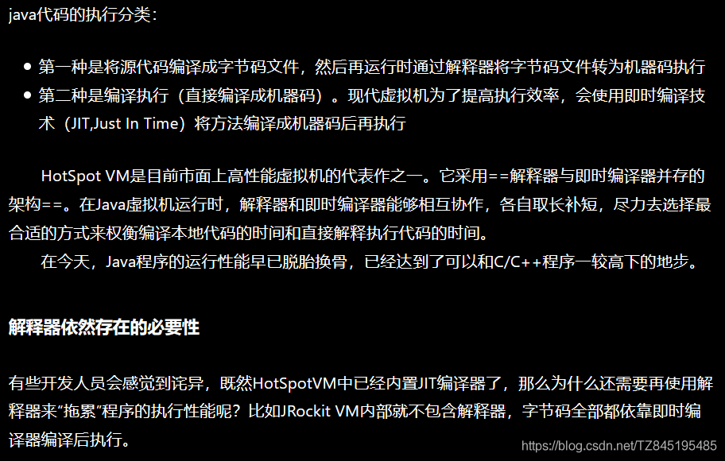


- ③. 目前HotSpot VM所采用的热点探测方式是基于计数器的热点探测(采用基于计数器的热点探测，HotSpot VM将会为每一个 方法都建立2个不同类型的计数器，分别为方法调用计数器（Invocation Counter） 和回边计数器（BackEdge Counter） )

1. 方法调用计数器用于统计方法的调用次数
2. 回边计数器则用于统计循环体执行的循环次数

- ④. 方法调用计数器
  
- ⑤. 回边计数器

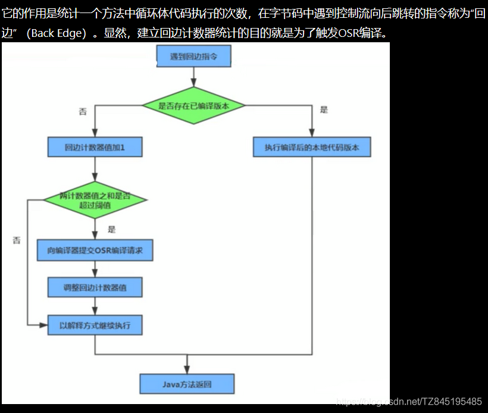

- ⑥. 热度衰减
  

## ⑥. HotSpot VM 可以设置程序执行方式

**`6>.` HotSpot VM 可以设置程序执行方式**

- ①. 缺省情况下HotSpot VM是采用解释器与即时编译器并存的架构，当然开发人员可以根据具体的应用场景，通过命令显式地为Java虚拟机指定在运行时到底是完全采用解释器执行，还是完全采用即时编译器执行。如下所示：
  

````
C:\Users\longxuan>java -version
java version "1.8.0_271"
Java(TM) SE Runtime Environment (build 1.8.0_271-b09)
Java HotSpot(TM) 64-Bit Server VM (build 25.271-b09, mixed mode)

C:\Users\longxuan>java -Xint -version
java version "1.8.0_271"
Java(TM) SE Runtime Environment (build 1.8.0_271-b09)
Java HotSpot(TM) 64-Bit Server VM (build 25.271-b09, interpreted mode)

C:\Users\longxuan>java -Xcomp -version
java version "1.8.0_271"
Java(TM) SE Runtime Environment (build 1.8.0_271-b09)
Java HotSpot(TM) 64-Bit Server VM (build 25.271-b09, compiled mode)

C:\Users\longxuan>java -Xmixed -version
java version "1.8.0_271"
Java(TM) SE Runtime Environment (build 1.8.0_271-b09)
Java HotSpot(TM) 64-Bit Server VM (build 25.271-b09, mixed mode)
````


- ②. -Xint： 完全采用解释器模式执行程序；
- ③. -Xcomp： 完全采用即时编译器模式执行程序。如果即时编译出现问题，解释器会介入执行
- ④. -Xmixed：采用解释器+即时编译器的混合模式共同执行程序。


## ⑦. HotSpot VM 中的JIT分类

**`7>.` HotSpot VM 中的JIT分类**

- ①. 在HotSpot VM中内嵌有两个JIT编译器，分别为Client Compiler和Server
  Compiler，但大多数情况下我们简称为C1编译器和C2编译器。开发人员可以通过如下命.令显式指定Java虚拟机在运行时到底使用哪一种即时编译器，如下所示：
  
- ②. 分层编译（Tiered Compilation）策略：程序解释执行（不开启性能监控）可以触发C1编译，将字节码编译成机器码，可以进行简单优化，也可以加上性能监控，C2编译会根据性能监控信息进行激进优化。
- **③. 总结：**

1. 一般来讲，JIT编译出来的机器码性能比解释器高。
2. C2编译器启动时长比C1编译器慢，系统稳定执行以后，C2编译器执行速度远远快于C1编译器。

## ⑧. Graal编译器与AOT编译器

8>.Graal编译器与AOT编译器

- ①. Graal编译器
  
- ②. AOT编译器(静态提前编译器)
  


------

# JVM 垃圾回收概述


什么是垃圾（ Garbage）呢？

垃圾是指在运行程序中没有任何指针指向的对象，这个对象就是需要被回收的垃圾

如果不及时对内存中的垃圾进行清理，那么，这些垃圾对象所占的内存空间会一直保留到应用程序结束，被保留的空间无法被其他对象使用。甚至可能导致内存溢出

为什公需要GC？

对于高级语言来说，一个基本认知是如果不进行垃圾回收，内存迟早都会被消耗完，因为不断地分配内存空间而不进行回收，就好像不停地生产生活垃圾而从来不打扫一样

除了释放没用的对象，垃圾回收也可以清除内存里的记录碎片。碎片整理将所占用的堆内存移到堆的一端，以便JM将整理出的内存分配给新的对象

随着应用程序所应付的业务越来越庞大、复杂，用户越来越多，没有GC就不能保证应用程序的正常进行。而经常造成STW的GC又跟不上实际的需求，所以才会不断地尝试对GC进行优化


垃圾回收器可以对年轻代回收，也可以对老年代回收，甚至是全堆和方法区的回收。

Java堆是垃圾收集器的工作重点。

从次数上讲:

频繁收集 Young区

较少收集Old区

基本不动Perm区（或元空间）

------

# JVM_06 垃圾回收相关算法 [ 一 ]

> 前言：
> (1). 判断对象存活的两种方式(引用计数算法、枚举根节点做可达性分析)
> (2).标记阶段(引用计数法、枚举根节点做可达性分析)
> (3).清除阶段(复制算法、标记清除算法、标记整理(压缩)算法、分代收集、增量收集算法、分区算法)

## ①. 引用计数法

- ①. 原理：**假设有一个对象A，任何一个对象对A的引用，那么对象A的引用计数器+1，当引用失败时，对象A的引用计数器就-1，如果对象A的计数器的值为0，就说明对象A没有引用了，可以被回收**

- 优点：实现简单，垃圾对象便于辨识;判定效率高，回收没有延迟性。

- ②. 最大的缺陷：无法解决==循环引用==的问题，gc永远都清除不了（这也是引用计数法被淘汰的原因）

  

  

- ③. 代码展示：

```java
/**
 * -XX:+PrintGCDetails
 * 证明：java使用的不是引用计数算法
 */
public class RefCountGC {
    //这个成员属性唯一的作用就是占用一点内存
    private byte[] bigSize = new byte[5 * 1024 * 1024];//5MB

    Object reference = null;

    public static void main(String[] args) {
        RefCountGC obj1 = new RefCountGC();
        RefCountGC obj2 = new RefCountGC();

        obj1.reference = obj2;
        obj2.reference = obj1;

        obj1 = null;
        obj2 = null;
        //显式的执行垃圾回收行为
        //这里发生GC，obj1和obj2能否被回收？
        System.gc();

        try {
            Thread.sleep(1000000);
        } catch (InterruptedException e) {
            e.printStackTrace();
        }
    }
}
```


- ④. 注意：Java使用的不是引用计数法(Java之所以没有使用引用计数法,是由于不能解决循环引用问题) | (Python使用了是引用计数法)
- **⑥. Python如何解决循环引用( 扩展了解 )**

1. 手动解决：很好理解,就是在合适的时机,解除引用关系
2. 使用弱引用weakref，weakref是Python提供的标准库,旨在解决循环引用(只要发生了回收,弱引用都会被回收)

## ②. 枚举根节点做可达性分析

- **①. 基本思路是通过一系列名为"GC Roots"的对象(集合)作为起点，从这个被称为GC ROOTs 的对象开始向下搜索，如果一个对象到GC Roots没有任何引用链相连时，则说明此对象是不可达对象（被回收），否则就是可达对象 `[掌握]`**
  
- ###### **②. 在java中，可作为==GC Roots==的对象有：`[掌握]`**

(1).==虚拟机栈（栈帧中的本地变量表）中的引用对象==(比如各个线程被调用的方法中使用到的参数、局部变量等)
(2)==.本地方法栈中JNI（即一般来说native方法）中引用的对象==[ 线程中的start方法 ]
(3).==方法区中的静态属性引用的对象==
(4).==方法区中常量引用的对象==
	
(5).==所有被synchronized持有的对象==
(6).Java虚拟机内部的引用(基本数据类型对应的Class对象,一些常驻的异常对象[如NullPointerException、OutofMemoryError],系统类加载器)
(7).反映java虚拟机内部情况的JMXBean、JVMTI中注册的回调、本地代码缓存等
(8).注意：除了这些固定的GC Roots集合之外,根据用户所选用的垃圾收集器以及当前回收的内存区域

不同,还可以有其他对象临时加入,共同构架完成整GC Roots 集合。比如: 分代收集和局部回收(面试加分项)

- **③. 关于GCroot对象集合`注意事项`：**
  注意：除了这些固定的GC Roots集合之外,==根据用户所选用的垃圾收集器以及当前回收的内存区域不同,还可以有其他对象临时加入,共同构架完成整GC Roots 集合。比如: 分代收集和局部回收(面试加分项)==
  解释：如果只针对java堆中的某一区域进行垃圾回收(比如: 典型的只针对新生代),必须考虑到内存区域是虚拟机自己的实现细节,更不是孤立封闭的,这个区域的对象完全有可能被其他区域的对象所引用时候就需要一并将关联的区域对象也加入到GC Roots 集合中考虑,才能保证可达性分析的准确性
- ④. 小技巧：由于Root采用栈方式存放变量和指针，所以==如果一个指针，它保存了堆内存里面的对象，但是自己又不存放在堆内存里面，那它就是一个Root==
  
- ⑤. 优势：

1. 相对于引用计数法而言,可达性分析算法不仅同样具备实现简单和执行高效 等特点,更重要的是该算法可以有效解决在引用计数算法中循环引用的问题,防止内存泄漏的发生
2. 相较于引用计数算法,这里的可达性分析就是Java、C#选择的。这种类型的垃圾收集通常也叫做追踪性垃圾收集

- ⑥. 可达性分析算法的 **`注意事项：`** 如果要使用可达性分析算法来判断内存是否可回收，那么分析工作必须在 一个能保障一致性的快照中进行。这点不满足的话分析结果的准确性就无法保证。这点也是导致GC进行时必须“StopTheWorld"的一个重要原因。 (即使是号称（几乎）不会发生停顿的CMS收集器中，枚举根节点时也是必须要停顿的)

## ③. finalization机制

### ①. finalization机制说明

1>.finalization机制说明

- **①. finalize( ) 方法允许在子类中被重写,用于对象被回收时进行资源释放。通常在这个方法中进行一些资源释放和清理的工作,比如关闭文件、套接字和数据库连接等(记住)**
- ②. 当垃圾回收器发现没有引用指向一个对象,即：垃圾收集此对象之前,总会先调用这个对象的finalize( )方法
- ③. Java语言提提供了对象终止(finalization)机制来允许开发人员提供对象被销毁之前的自定义逻辑

### ②. 不主动调用某个对象的finalize( ) 方法

2>.永远不要主动调用某个对象的finalize( ) 方法,应该交给垃圾回收机制调用,理由包括下面三点：

- ①. 在finalize( )时可能会导致对象复活
- ②. finalize( )方法执行时间是没有保障的,它完全由GC线程决定,极端情况下,若不发生GC,则finalize( ) 方法将没有执行机会
- ③. 一个糟糕的finalize( )会严重影响GC的性能
- ④. 由于finalize( )方法的存在,虚拟机中的对象一般处于三种可能的状态

### ③. finalize( )方法中虚拟机的状态

**`3>.` finalize( )方法中虚拟机的状态`[掌握]`**

- 如果从所有的根节点都无法访问到某个对象,说明对象已经不再使用了。一般来说,此对象需要被回收，但事实上,也并非是"非死不可"的,这时候它们暂时处于"缓刑"阶段。一个无法触及的对象肯能在某一个条件下"复活"自己,如果这样,那么对它的回收就是不合理的。为此,定义虚拟机中的对象可能有三种状态。如下：(掌握)
- ①.==可触及的==：从根节点开始,可以到达这个对象
- ②. ==可复活的==：对象的所有引用都被释放,但是对象有可能在finalize( )中复活
- ③. ==不可触及的==： 对象的finalize( )被调用,并且没有复活,那么就会进入不可触及状态。不可触及的对象不可能被复活,因为finalize( )**只会被调用一次**
- 以上3种状态中,是由于finalize( )方法的存在,进行的区分。只有对象不可触及才可以被回收

### ④. 判断一个对象是否可以进行回收(理解)

4>.判断一个对象是否可以进行回收(理解)

- 以上3种状态中，是由于finalize（）方法的存在，进行的区分。只有在对象不可触及时才可以被回收。 判定是否可以回收具体过程 判定一个对象objA是否可回收，至少要经历两次标记过程：
  

### ⑤. 代码演示

5>.代码演示

```java
/**
 * 测试Object类中finalize()方法，即对象的finalization机制。
 *
 */
public class CanReliveObj {
    public static CanReliveObj obj;//类变量，属于 GC Root


    //此方法只能被调用一次
    @Override
    protected void finalize() throws Throwable {
        super.finalize();
        System.out.println("调用当前类重写的finalize()方法");
        obj = this;//当前待回收的对象在finalize()方法中与引用链上的一个对象obj建立了联系
    }


    public static void main(String[] args) {
        try {
            obj = new CanReliveObj();
            // 对象第一次成功拯救自己
            obj = null;
            System.gc();//调用垃圾回收器
            System.out.println("第1次 gc");
            // 因为Finalizer线程优先级很低，暂停2秒，以等待它
            Thread.sleep(2000);
            if (obj == null) {
                System.out.println("obj is dead");
            } else {
                System.out.println("obj is still alive");
            }
            System.out.println("第2次 gc");
            // 下面这段代码与上面的完全相同，但是这次自救却失败了
            obj = null;
            System.gc();
            // 因为Finalizer线程优先级很低，暂停2秒，以等待它
            Thread.sleep(2000);
            if (obj == null) {
                System.out.println("obj is dead");
            } else {
                System.out.println("obj is still alive");
            }
        } catch (InterruptedException e) {
            e.printStackTrace();
        }
    }
}
```

###### ==MAT的使用==


## ④. 复制算法(Copying)

- ①. 核心思想：将活着的内存空间分为两块，每次只使用其中一块，在垃圾回收时将正在.使用的内存中的存活对象复制到未被使用的内存块中，之后清除正在使用的内存块中的所有对象，交换两个内存的角色，最后完成垃圾回收。
- ②. 描述(**`重点掌握`**)
  
- ③. 一般过程(图解)
  
- **④. 优缺点：`掌握`**

1. 优点:①.没有标记和清除过程，实现简单，运行高效 ②. 不会产生内存碎片，且对象完整不丢
2. 缺点:①. 浪费了10%的空间 ②. 对于G1这种分拆成为大量region的GC，复制而不是移动，意味着GC需要维护region之间对象引用关系，不管是内存占用或者时间开销也不小。
3. 注意：复制算法需要复制的存活对象数量并不会太大，或者说非常低才行。因为新生代中的对象一般都是朝生夕死的,在新生代中使用复制算法是非常好的

- **⑤. 注意：`是当伊甸园区满后，会触发minjor gc，进行垃圾的回收`**

## ⑤. 标记清除算法(Mark一Sweep)

- ①. 标记一清除算法（Mark一Sweep）是一种非常基础和常见的垃圾收集算法，该算法被J . McCarthy等人在1960年提出并并应用于Lisp语言。

  当堆中的有效内存空间（ available memory）被耗尽的时候，就会停止整个程序（也被称为 stop the wor1a），然后进行两项工作，第一项则是标记，第二项则是清除。

- **②. `标记：` Collector(垃圾回收器)从引用根节点开始遍历，==标记所有被引用的对象==（不是垃圾对象）。一般是在对象的Header中记录为可达对象**

- **③. `清除：` Collector(垃圾回收器)对堆内存从头到尾进行线性的遍历，如果发现某个对象在其Header中没有标记为可达对象，则将其回收。**

- ④. 图解：
  
  
- **⑤. 优缺点：`[ 掌握 ]`**

1. 优:不需要额外的空间
2. 缺点:①.两次扫描，耗时严重 ②.清理出来的空闲内存不连续,会产生内存碎片,需要维护一个空闲列表 ③.效率低(经历了两次遍历)

- ⑥. 注意:这里所谓的清除并不是真的置空，而是把需要清除的对象地址保存在空闲 的地址列表里。下次有新对象需要加载时，判断垃圾的位置空间是否够，如果够，就存放。

## ⑥. 标记整理(压缩)算法(Mark-Compact)

- ①. 背景：

1. 复制算法的高效性是建立在存活对象少、垃圾对象多的前提下的。这种情况在新生代经常发生，但是在老年代，更常见的情况是大部分对象都是存活对象。如果依然使用复制算法，由于存活对象较多，复制的成本也将很高。因此，基于老年代垃圾回收的特性，需要使用其他的算法。
2. 标记一清除算法的确可以应用在老年代中，但是该算法不仅执行效率低下，而且在执行完内存回收后还会产生内存碎片，所以JVM的设计者需要在此基础之上进行改进。标记一压缩（Mark一Compact） 算法由此诞生
3. 1970年前后，G. L. Steele 、C. J. Chene和D.S. Wise 等研究者发布标记一压缩算法。在许多现代的垃圾收集器中，人们都使用了标记一压缩算法或其改进版本。

- ②. 执行过程：**`[掌握]`**

1. 第一阶段和标记一清除算法一样，从根节点开始标记所有被引用对象.
2. 第二阶段将所有的存活对象压缩到内存的一端，按顺序排放。
3. 最后，清理边界外所有的空间。
4. 可以看到，标记的存活对象将会被整理，按照内存地址依次排列，而未被标记的内存会被清理掉。如此一来，当我们需要给新对象分配内存时，JVM只需要持有一个内存的起始地址即可，这比维护一个空闲列表显然少了许多开销。

- ③. 图解：
  
- ④. 指针碰撞
  (如果内存空间以规整和有序的方式分布，即已用和未用的内存都各自一边，彼此之间维系着一个记录下一次分配起始点的标记指针，当为新对象分配内存时，只需要通过修改指针的偏移量将新对象分配在第一个空闲内存位置上，这种分配方式就叫做指针碰撞（Bump the Pointer）)
- **⑤. 优缺点 `[掌握]`**

1. 优点：①. 消除了标记一清除算法当中，内存区域分散的缺点，我们需要给新对象分配内存时，JVM只 需要持有一个内存的起始地址即可②. 消除了复制算法当中，内存减半的高额代价
2. 缺点：①. 从效率.上来说，标记一整理算法要低于复制算法。②. 移动对象的同时，如果对象被其他对象引用，则还需要调整引用的地址。移动过程中，需要全程暂停用户应用程序。即： STW

## ⑦. 分代收集

> 写在最前面：
> ( 分代算法是针对对象的不同特征，而使用合适的算法，这里面并没有实际上的新算法产生。与其说分代搜集算法是第五个算法，不如说它是对前三个算法的实际应用，在新生代使用复制算法eden在8分空间，survivor在两个1分，只浪费10%的空闲空间。老年代使用标记清除/标记压缩算法清除)

- ①. 没有最好的算法,只有更合适的算法
- ②. 分代算法是针对对象的不同特征，而使用合适的算法，这里面并没有实际上的新算法产生。与其说分代搜集算法是第五个算法，不如说它是对前三个算法的实际应用，在新生代使用复制算法eden在8分空间，survivor在两个1分，只浪费10%的空闲空间。老年代使用标记清除/标记压缩算法清除
- **③. 新生代(Young Gen)**

1. 新生代特点：区域相对老年代较小，对象生命周期短、存活率低，回收频繁。
2. 这种情况复制算法的回收整理，速度是最快的。复制算法的效率只和当前存活对象大小有关，因此很适用于年轻代的回收。而复制算法内存利用率不高的问题，通过hotspot中的两个survivor的设计得到缓解

- **④. 老年代（Tenured Gen）**

1. 老年代特点：区域较大，对象生命周期长、存活率高，回收不及年轻代频繁。
2. 这种情况存在大量存活率高的对象，复制算法明显变得不合适。一般是由标记一清除或者是标记一清除与标记一整理的混合实现。
   

## ⑧. 增量收集算法(了解)

- ①. 上述现有的算法，在垃圾回收过程中，应用软件将处于一种stop the World的状态。在Stop the World状态下，应用程序所有的线程都会挂起，暂停一切正常的工作，等待垃圾回收的完成。如果垃圾回收时间过长，应用程序会被挂起很久，将严重影响用户体验或者系统的稳定性。为了解决这个问题，即对实时垃圾收集算法的研究直接导致了增量收集（Incremental Collecting） 算法的诞生
- ②. 基本思想(理解)

1. 如果一次性将所有的垃圾进行处理，需要造成系统长时间的停顿，那么就可以让垃圾收集线程和应用程序线程交替执行。每次，**垃圾收集线程只收集一小片区域的内存空间，接着切换到应用程序线程。依次反复，直到垃圾收集完成**
2. 总的来说，增量收集算法的基础仍是传统的标记一清除和复制算法。增量收集算法通过**对线程间冲突的妥善处理，允许垃圾收集线程以分阶段的方式完成标记、清理或复制工作**

- ③. 缺点：
  (使用这种方式，由于在垃圾回收过程中，间断性地还执行了应用程序代码，所以能减少系统的停顿时间。但是，因为线程切换和上下文转换的消耗，会使得垃圾回收的总体成本上升，造成系统吞吐量的下降。)
  - 

## ⑨. 分区算法(了解)

- ①. 一般来说，在相同条件下，堆空间越大，一次GC时所需要的时间就越长，有关GC产生的停顿也越长。为了更好地控制GC产生的停顿时间，将一块大的内存区域分割成多个小块，根据目标的停顿时间，每次合理地回收若干个小区间，而不是整个堆空间，从而减少一次GC所产生的停顿。
- ②. 分代算法将按照对象的生命周期长短划分成两个部分，分区算法将整个堆空间划分成连续的不同小区间
- ③. 每一个小区间都独立使用，独立回收。这种算法的好处是可以控制一次回收多少个小区间。


⑩JProfiler分析OOM


------

# JVM_06 垃圾回收相关概念[ 二 ]

## ①. System.gc()的理解

- ①. 在默认情况下，通过System.gc( )或者Runtime . getRuntime( ).gc( )的调用，会==显式触发Full GC==,同时对老年代和新生代进行回收，尝试释放被丢弃对象占用的内存。
- ②. 然而System.gc（）调用附带一个免责声明，无法保证对垃圾收集器的调用(无法保证马上触发GC)。[不保证一定会发生垃圾收集,只是给jvm发出提示]
- ③. JVM实现者可以通过system.gc( )调用来决定JVM的GC行为。而一般情况下，垃圾回收应该是自动进行的，无须手动触发，否则就太过于麻烦了。在一些特殊情况下，如我们正在编写一个性能基准，我们可以在运行之间调用System.gc( )
- ④. 以下代码,如果注掉System.runFinalization( ); 那么控制台不保证一定打印,证明了System.gc( )无法保证GC一定执行

```java
public class SystemGCTest {
    public static void main(String[] args) {
        new SystemGCTest();
        System.gc();//提醒jvm的垃圾回收器执行gc,但是不确定是否马上执行gc
        //与Runtime.getRuntime().gc();的作用一样。
        System.runFinalization();//强制调用使用引用的对象的finalize()方法
    }

    @Override
    protected void finalize() throws Throwable {
        super.finalize();
        System.out.println("SystemGCTest 重写了finalize()");
    }
}
```

- ⑤. 手动gc理解不可达对象的回收行为

```java
public class LocalVarGC {
    public void localvarGC1() {
        byte[] buffer = new byte[10 * 1024 * 1024];//10MB
        System.gc();
        //输出: 不会被回收, FullGC时被放入老年代
        //[GC (System.gc()) [PSYoungGen: 14174K->10736K(76288K)] 14174K->10788K(251392K), 0.0089741 secs] [Times: user=0.01 sys=0.00, real=0.01 secs]
        //[Full GC (System.gc()) [PSYoungGen: 10736K->0K(76288K)] [ParOldGen: 52K->10649K(175104K)] 10788K->10649K(251392K), [Metaspace: 3253K->3253K(1056768K)], 0.0074098 secs] [Times: user=0.01 sys=0.02, real=0.01 secs]
    }

    public void localvarGC2() {
        byte[] buffer = new byte[10 * 1024 * 1024];
        buffer = null;
        System.gc();
        //输出: 正常被回收
        //[GC (System.gc()) [PSYoungGen: 14174K->544K(76288K)] 14174K->552K(251392K), 0.0011742 secs] [Times: user=0.00 sys=0.00, real=0.00 secs]
        //[Full GC (System.gc()) [PSYoungGen: 544K->0K(76288K)] [ParOldGen: 8K->410K(175104K)] 552K->410K(251392K), [Metaspace: 3277K->3277K(1056768K)], 0.0054702 secs] [Times: user=0.01 sys=0.00, real=0.01 secs]

    }

    public void localvarGC3() {
        {
            byte[] buffer = new byte[10 * 1024 * 1024];
        }
        System.gc();
        //输出: 不会被回收, FullGC时被放入老年代
        //[GC (System.gc()) [PSYoungGen: 14174K->10736K(76288K)] 14174K->10784K(251392K), 0.0076032 secs] [Times: user=0.02 sys=0.00, real=0.01 secs]
        //[Full GC (System.gc()) [PSYoungGen: 10736K->0K(76288K)] [ParOldGen: 48K->10649K(175104K)] 10784K->10649K(251392K), [Metaspace: 3252K->3252K(1056768K)], 0.0096328 secs] [Times: user=0.01 sys=0.01, real=0.01 secs]
    }

    public void localvarGC4() {
        {
            byte[] buffer = new byte[10 * 1024 * 1024];
        }
        int value = 10;
        System.gc();
        //输出: 正常被回收
        //[GC (System.gc()) [PSYoungGen: 14174K->496K(76288K)] 14174K->504K(251392K), 0.0016517 secs] [Times: user=0.01 sys=0.00, real=0.00 secs]
        //[Full GC (System.gc()) [PSYoungGen: 496K->0K(76288K)] [ParOldGen: 8K->410K(175104K)] 504K->410K(251392K), [Metaspace: 3279K->3279K(1056768K)], 0.0055183 secs] [Times: user=0.00 sys=0.00, real=0.01 secs]
    }

    public void localvarGC5() {
        localvarGC1();
        System.gc();
        //输出: 正常被回收
        //[GC (System.gc()) [PSYoungGen: 14174K->10720K(76288K)] 14174K->10744K(251392K), 0.0121568 secs] [Times: user=0.02 sys=0.00, real=0.02 secs]
        //[Full GC (System.gc()) [PSYoungGen: 10720K->0K(76288K)] [ParOldGen: 24K->10650K(175104K)] 10744K->10650K(251392K), [Metaspace: 3279K->3279K(1056768K)], 0.0101068 secs] [Times: user=0.01 sys=0.02, real=0.01 secs]
        //[GC (System.gc()) [PSYoungGen: 0K->0K(76288K)] 10650K->10650K(251392K), 0.0005717 secs] [Times: user=0.00 sys=0.00, real=0.00 secs]
        //[Full GC (System.gc()) [PSYoungGen: 0K->0K(76288K)] [ParOldGen: 10650K->410K(175104K)] 10650K->410K(251392K), [Metaspace: 3279K->3279K(1056768K)], 0.0045963 secs] [Times: user=0.01 sys=0.00, real=0.00 secs]
    }

    public static void main(String[] args) {
        LocalVarGC local = new LocalVarGC();
        local.localvarGC5();
    }
}
```

## ②. 内存溢出(out of Memory)

- ①. javadoc中对OutOfMemoryError的解释是,没有空闲内存，并且垃圾收集器也无法提供更多内存
- **②. 说明Java虚拟机的堆内存不够。`原因有二`：**

1. ==Java虚拟机的堆内存设置不够==(比如：可能存在内存泄漏问题；也很有可能就是堆的大小不合理，比如我们要处理比较可观的数据量，但是没有显式指定JVM堆大小或者指定数值偏小。我们可以通过参数一Xms、一Xmx来调整)
2. ==代码中创建了大量大对象,并且长时间不能被垃圾收集器收集==（存在被引用）

- ③. 这里面隐含着一层意思是，在抛出0utOfMemoryError之前，通常垃圾收集器会被触发，尽其所能去清理出空间。

1. 例如：在引用机制分析中，涉及到JVM会去尝试回收软引用指向的对象等。
2. 在java.nio.BIts.reserveMemory（）方法中，我们能清楚的看到，System.gc（）会被调用，以清理空间。

- **④. 当然，也不是在任何情况下垃圾收集器都会被触发的**
  (比如，我们去分配一一个超大对象，类似一个超大数组**超过堆的最大值**，JVM可以判断出垃圾收集并不能解决这个问题，所以直接拋出OutOfMemoryError)

## ③. 内存泄漏(Memory Leak)

- **①. 也称作“存储渗漏”。严格来说，只有==对象不会再被程序用到了，但是GC又不能回收他们的情况==，才叫内存泄漏。**
- **②. 但实际情况很多时候一些不太好的实践（或疏忽）会导致对象的生命周期变得很长甚至导致OOM，也可以叫做宽泛意义上的“内存泄漏**
- ③. 尽管内存泄漏并不会立刻引起程序崩溃，但是一旦发生内存泄漏，程序中的可用内存就会被逐步蚕食，直至耗尽所有内存，最终出现0utOfMemory异常，导致程序崩溃。
- **④. 举例**

1. 单例模式(单例的生命周期和应用程序是一样长的，所以单例程序中，如果持有对外部对象的引用的话，那么这个外部对象是不能被回收的，则会导致内存泄漏的产生。)

2. 一些提供close的资源未关闭导致内存泄漏 数据库连接（ dataSourse. getConnection（）），网络连接（socket）和io连接必须手动close，否则是不能被回收的。

   

## ④. Stop The World

- **①. Stop一the一World，简称STW，指的是Gc事件发生过程中，会产生应用程序的停顿。==停顿产生时整个应用程序线程都会被暂停，没有任何响应==，有点像卡死的感觉，这个停顿称为STW**
- ②. STW事件和采用哪款GC无关，所有的GC都有这个事件。
- ③. 哪怕是G1也不能完全避免Stop一the一world情况发生，只能说垃圾回收器越来越优秀，回收效率越来越高，尽可能地缩短了暂停时间。
- **④. STW是JVM在后台自动发起和自动完成的。在用户不可见的情况下，把用户正常的工作线程全部停掉**
- **⑤. 开发中不要用System.gc（）；会导致Stop一the一world的发生。**
- **⑥. 什么情况下会导致stop the world `记住`**

1. 可达性分析算法中枚举根节点（GC Roots）会导致所有Java执行线程停顿
2. 进行gc的时候会发生STW现象(调用finalize()方法的时候会暂停用户线程
3. System.gc( ) | 调用finalize( )方法

```java
package com.xuan;

import java.util.ArrayList;
import java.util.List;

public class StopTheWorldDemo {
    public static class WorkThread extends Thread {
        List<byte[]> list = new ArrayList<byte[]>();

        public void run() {
            try {
                while (true) {
                    for (int i = 0; i < 1000; i++) {
                        byte[] buffer = new byte[1024];
                        list.add(buffer);
                    }
                    if (list.size() > 10000) {
                        list.clear();
                        System.gc();//会触发 full gc，进而会出现STW李料
                    }
                }
            } catch (Exception e) {
                e.printStackTrace();
            }
        }
    }

    public static class PrintThread extends Thread {
        public final long startTime = System.currentTimeMillis();

        public void run() {
            try {
                while (true) {
                    long t = System.currentTimeMillis() - startTime;
                    System.out.println(t / 1000 + "." + t % 1000);
                    Thread.sleep(1000);
                }
            } catch (Exception ex) {
                ex.printStackTrace();
            }
        }
    }

    public static void main(String[] args) {
        WorkThread w = new WorkThread();
        PrintThread p = new PrintThread();
        //w.start();
        p.start();
    }
}
//注释：w.start();时，输出以下
//0.4
//1.11
//2.25
//3.43
//4.48
//5.53
//不注释w.start();，输出以下
//0.7
//1.18
//2.49
//3.57
//4.74
//5.91
//6.98
//7.111

```


## ⑤. 多线程中的并行与并发

- ①. 并发(Concurrent)

1. 在操作系统中，是指一个时间段中有几个程序都处于己启动运行到运行完毕之间，且这几个程序都是在同一个处理器_上运行
2. 并发不是真正意义上的“同时进行”，只是CPU把一个时间段划分成几个时间片段（时间区间），然后在这几个时间区间之间来回切换，由于CPU处理的速度非常快，只要时间间隔处理得当，即可让用户感觉是多个应用程序同时在进行
3. 图解：
   

- ②. 并行(Parallel)

1. 当系统有一个以上CPU时，当一个CPU执行一个进程时，另一个CPU可以执行另一个进程，两个进程互不抢占CPU资源，可以同时进行，我们称之为并行（Parallel）
2. 其实决定并行的因素不是CPU的数量，而是CPU的核心数量，比如一个CPU多个核也可以 并行
3. 图解：
   

## ⑥. 垃圾回收的并行、串行、并发


- ①. 并行（Parallel） ：指多条垃圾收集线程并行工作，但此时用户线程仍处于等待状态。如ParNew、 Parallel Scavenge、 Parallel 0ld；
- ②. 串行（Serial）

1. 相较于并行的概念，单线程执行。
2. 如果内存不够，则程序暂停，启动JVM垃圾回收器进行垃圾回收。回收完，再启动程序的线程。
3. 图解：
   

- ③. 并发

1. 指用户线程与垃圾收集线程同时执行（但不一定是并行的，可能会交替执行），垃圾回收线程在执行时不会停顿用户程序的运行
2. 在同一个时间段,用户线程和垃圾回收线程同时执行
3. 图解
   

## ⑦. 安全点(Safepoint)

- ①. 程序执行时并非在所有地方都能停顿下来开始GC，只有在特定的位置才能停顿下来开始GC，这些位置称为 “安全点（Safepoint）”
- ②. Safe Point的选择很重要，如果太少可能导致GC等待的时间太长，如果太频繁可能导致运行时的性能问题。大部分指令的执行时间都非常短暂，通常会根据“是否具有让程序长时间执行的特征”为标准。比如：选择些执行时间较长的指令作为Safe Point， 如方法调用、循环跳转和异常跳转等。
- **③. 如何在GC发生时，检查所有线程都跑到最近的安全点停顿下来呢？`掌握`**

1. 抢先式中断： （目前没有虚拟机采用了） 首先中断所有线程。如果还有线程不在安全点，就恢复线程，让线程跑到安全点。
2. 主动式中断： 设置一个中断标志，各个线程运行到Safe Point的时候主动轮询这个标志，如果中断标志为真，则将自己进行中断挂起。

## ⑧. 安全区域(Safe Region)

- ①. Safepoint机制保证了程序执行时，在不太长的时间内就会遇到可进入GC的Safepoint 。但是，程序“不执行”的时候呢？例如线程处于Sleep 状态或Blocked状态，这时候线程无法响应JVM的中断请求，“走” 到安全点去中断挂起，JVM也不太可能等待线程被唤醒。对于这种情况，就需要安全区域（Safe Region）来解决。
- ②. 安全区域是指在一段代码片段中，对象的引用关系不会发生变化，在这个区域中的任何位置开始GC都是安全的。我们也可以把Safe Region看做是被扩展了的Safepoint。
- ③. 实际执行时:

1. 当线程运行到Safe Region的代码时，首先标识已经进入了Safe Region，如果这段时间内发生GC，JVM会忽略标识为Safe Region状态的线程；
2. 当线程即将离开Safe Region时， 会检查JVM是否已经完成GC，如果完成了，则继续运行，否则线程必须等待直到收到可以安全离开SafeRegion的信号为止；

## ⑨. 引用

- ①. 我们希望能描述这样一类对象： 当内存空间还足够时，则能保留在内存中；如果内存空间在进行垃圾收集后还是很紧张，则可以抛弃这些对象。 -【既偏门又非常高频的面试题】强引用、软引用、弱引用、虚引用有什么区别？具体使用.场景是什么？
- ②. 在JDK 1.2版之后，Java对引用的概念进行了扩充，将引用分为强引用（Strong
  Reference）、软引用（Soft Reference） 、弱引用（Weak Reference） 和虚引用（Phantom Reference） 4种，这4种引用强度依次逐渐减弱
- ③. 除强引用外，其他3种引用均可以在java.lang.ref包中找到它们的身影。如下图，显示了这3种引用类型对应的类，开发人员可以在应用程序中直接使用它们。
  
- ④. Reference子类中只有终结器引用是包内可见的，其他3种引用类型均为public，可以在应用程序中直接使用
- ⑤. 简单介绍下强软弱虚引用

1. 强引用（StrongReference）I ：最传统的“引用”的定义，是指在程序代码之中普遍存在的引用赋值，即类似“0bject obj=new object（ ）”这种引用关系。无论任何情况下，只要**强引用关系还存在，垃圾收集器就永远不会回收掉被引用的对象**。
2. 软引用（SoftReference） ：在系统将要发生内存溢出之前，将会把这些对象列入回收范围之中进行第二次回收。如果这次回收后还没有足够的内存，才会抛出内存溢出异常。== 内存不足即回收==
3. 弱引用（WeakReference） ：被弱引用关联的对象只能生存到下一次垃圾收集之前。当垃圾收集器工作时，无论内存空间是否足够，都会回收掉被弱引用关联的对象。发现即回收
4. 虚引用（PhantomReference） ：一个对象是否有虛引用的存在，完全不会对其生存时 间构成影响，也无法通过虚引用来获得一个对象的实例。为一个对象设置虛引用关联的唯一目的就是**能在这个对象被收集器回收时收到一个系统通知(回收跟踪)**

### ①. 强引用：不回收

- 在Java程序中，最常见的引用类型是强引用（普通系统99%以上都是强引用），也就是我们最常见的普通对象引用，也是默认的引用类型。

- 当在Java语言中使用new操作符创建一个新的对象， 并将其赋值给一个变量的时候，这个变量就成为指向该对象的一个强引用。

- 强引用的对象是可触及的，垃圾收集器就永远不会回收掉被引用的对象。

- 对于一个普通的对象，如果没有其他的引用关系，只要超过了引用的作用域或者显式地将相应（强）引用赋值为null，就是可以当做垃圾被收集了，当然具体回收时机还是要看垃圾收集策略。

- 相对的，软引用、 弱引用和虚引用的对象是软可触及、弱可触及和虛可触及的，在一定条件下，都是可以被回收的。**所以，强引用是造成Java内存泄漏的主要原因之一。**

  ````java
  package com.xuan;
  
  public class StrongReferenceTest {
      public static void main(String[] args) {
          StringBuffer s0 = new StringBuffer("xuan");
          StringBuffer s1 = s0;
          s0 = null;
          System.gc();
          try {
              Thread.sleep(3000);
          } catch (InterruptedException e) {
              e.printStackTrace();
          }
          System.out.println(s1);
      }
  }
  //输出：xuan
  ````

  

### ②. 软引用: ==内存不足即回收==

- ①. 软引用是用来描述一 些还有用，但非必需的对象。只被软引用关联着的对象，在系统将要发生内存溢出异常前，会把这些对象列进回收范围之中进行第二次回收，如果这次回收还没有足够的内存，才会抛出内存溢出异常。
  注意：一次回收是回收强引用中没有引用的对象，**软引用不会导致OOM**
- ②. 软引用通常用来实现内存敏感的缓存。比如：高速缓存就有用到软引用。如果还有空闲内存，就可以暂时保留缓存，当内存不足时清理掉，这样就保证了使用缓存的同时，不会耗尽内存
- ③. 类似弱引用，只不过Java虚拟机会尽量让软引用的存活时间长一些，迫不得.已才清理
- ④. 软引用：
  当内存足够: 不会回收软用的可达对象
  当内存不够时: 会回收软引用的可达对象
- ⑤. 在JDK 1. 2版之后提供了java.lang.ref.SoftReference类来实现软引用。

```handlebars
	Object obj = new object（）； //声明强引用
	SoftReference<0bject> sf = new SoftReference<0bject>（obj）；
	obj = null； //销毁强引用
123
```

- ⑥. 测试代码

```java
/**
 * 软引用的测试：内存不足即回收
 * -Xms10m -Xmx10m -XX:+PrintGCDetails
 */
public class SoftReferenceTest {
    public static class User {
        public User(int id, String name) {
            this.id = id;
            this.name = name;
        }

        public int id;
        public String name;

        @Override
        public String toString() {
            return "[id=" + id + ", name=" + name + "] ";
        }
    }

    public static void main(String[] args) {
        //创建对象，建立软引用
//        SoftReference<User> userSoftRef = new SoftReference<User>(new User(1, "songhk"));
        //上面的一行代码，等价于如下的三行代码
        User u1 = new User(1,"songhk");
        SoftReference<User> userSoftRef = new SoftReference<User>(u1);
        u1 = null;//取消强引用


        //从软引用中重新获得强引用对象
        System.out.println(userSoftRef.get());

        System.gc();
        System.out.println("After GC:");
//        //垃圾回收之后获得软引用中的对象
        System.out.println(userSoftRef.get());//由于堆空间内存足够，所有不会回收软引用的可达对象。
//
        try {
            //让系统认为内存资源紧张、不够
//            byte[] b = new byte[1024 * 1024 * 7];
            byte[] b = new byte[1024 * 7168 - 399 * 1024];//恰好能放下数组又放不下u1的内存分配大小 不会报OOM
        } catch (Throwable e) {
            e.printStackTrace();
        } finally {
            //再次从软引用中获取数据
            System.out.println(userSoftRef.get());//在报OOM之前，垃圾回收器会回收软引用的可达对象。
        }
    }
}
```

### ③. 弱引用: 发现即回收

- **①. 弱引用也是用来描述那些非必需对象，被弱引用关联的对象只能生存到下一次垃圾收集发生为止。在系统GC时，只要发现弱引用，不管系统堆空间使用是否充足，都会回收掉只被弱引用关联的对象**
- ②. 但是，由于垃圾回收器的线程通常优先级很低，因此，并不一 定能很快地发现持有弱引用的对象。在这种情况下，弱引用对象可以存在较长的时间。
- ③. 弱引用和软引用一样，在构造弱引用时，也可以指定一个引用队列，当弱引用对象被回收时，就会加入指定的引用队列，通过这个队列可以跟踪对象的回收情况。
- ④. 软引用、弱引用都非常适合来保存那些可有可无的缓存数据。如果这么做，当系统内存不足时，这些缓存数据会被回收，不会导致内存溢出。而当内存资源充足时，这些缓存数据又可以存在相当长的时间，从而起到加速系统的作用
- ⑤. 在JDK1.2版之后提后了java.lang.ref.WeakReference类来实现弱引用

```java
	Object obj = new object(); //声明强引用
	WeakReference<0bject> sf = new WeakReference<0bject>（obj）；
	obj = null； //销毁强引用
123
```

- ⑥. 面试题：你开发中使用过WeakHashMap吗？

1. 通过查看WeakHashMap源码,可以看到其内部类Entry使用的就是弱引用
2. line 702 -> private static class Entry<K,V> extends WeakReference implements Map.Entry<K,V> {…}

```java
	public class WeakReferenceTest {
	    public static class User {
	        public User(int id, String name) {
	            this.id = id;
	            this.name = name;
	        }
	
	        public int id;
	        public String name;
	
	        @Override
	        public String toString() {
	            return "[id=" + id + ", name=" + name + "] ";
	        }
	    }
	
	    public static void main(String[] args) {
	        //构造了弱引用
	        WeakReference<User> userWeakRef = new WeakReference<User>(new User(1, "songhk"));
	        //从弱引用中重新获取对象
	        System.out.println(userWeakRef.get());
	
	        System.gc();
	        // 不管当前内存空间足够与否，都会回收它的内存
	        System.out.println("After GC:");
	        //重新尝试从弱引用中获取对象
	        System.out.println(userWeakRef.get());
	    }
	}
1234567891011121314151617181920212223242526272829
```

### ④. 虚引用: 对象回收跟踪

- ①. 虚引用(Phantom Reference),也称为“幽灵引用”或者“幻影引用”，是所有引用类型中最弱的一个。
- ②. 为一个对象设置虚引用关联的唯一目的在于跟踪垃圾回收过程。比如：能在这个对象被收集器回收时收到一个系统通知。
- **③. 虚引用必须和引用队列一起使用。虚引用在创建时必须提供一个引用队列作为参数。当垃圾回收器准备回收一个对象时，如果发现它还有虛引用，就会在回收对象后，将这个虚引用加入引用队列，以通知应用程序对象的回收情况 `理解`**
- ④. 由于虚引用可以跟踪对象的回收时间，因此，也可以将一些资源释放操作放置在虛引用中执行和记录‘’
- ⑤. 在JDK 1. 2版之后提供了PhantomReference类来实现虚引用。

```java
	object obj = new object();
	ReferenceQueuephantomQueue = new ReferenceQueue( ) ;
	PhantomReference<object> pf = new PhantomReference<object>(obj, phantomQueue); 
	obj = null;
1234
```

- ⑥. 测试代码

```java
public class PhantomReferenceTest {
    public static PhantomReferenceTest obj;//当前类对象的声明
    static ReferenceQueue<PhantomReferenceTest> phantomQueue = null;//引用队列

    public static class CheckRefQueue extends Thread {
        @Override
        public void run() {
            while (true) {
                if (phantomQueue != null) {
                    PhantomReference<PhantomReferenceTest> objt = null;
                    try {
                        objt = (PhantomReference<PhantomReferenceTest>) phantomQueue.remove();
                    } catch (InterruptedException e) {
                        e.printStackTrace();
                    }
                    if (objt != null) {
                        System.out.println("追踪垃圾回收过程：PhantomReferenceTest实例被GC了");
                    }
                }
            }
        }
    }

    @Override
    protected void finalize() throws Throwable { //finalize()方法只能被调用一次！
        super.finalize();
        System.out.println("调用当前类的finalize()方法");
        obj = this;
    }

    public static void main(String[] args) {
        Thread t = new CheckRefQueue();
        t.setDaemon(true);//设置为守护线程：当程序中没有非守护线程时，守护线程也就执行结束。
        t.start();

        phantomQueue = new ReferenceQueue<PhantomReferenceTest>();
        obj = new PhantomReferenceTest();
        //构造了 PhantomReferenceTest 对象的虚引用，并指定了引用队列
        PhantomReference<PhantomReferenceTest> phantomRef = new PhantomReference<PhantomReferenceTest>(obj, phantomQueue);

        try {
            //不可获取虚引用中的对象
            System.out.println(phantomRef.get());

            //将强引用去除
            obj = null;
            //第一次进行GC,由于对象可复活，GC无法回收该对象
            System.gc();
            Thread.sleep(1000);
            if (obj == null) {
                System.out.println("obj 是 null");
            } else {
                System.out.println("obj 可用");
            }
            System.out.println("第 2 次 gc");
            obj = null;
            System.gc(); //一旦将obj对象回收，就会将此虚引用存放到引用队列中。
            Thread.sleep(1000);
            if (obj == null) {
                System.out.println("obj 是 null");
            } else {
                System.out.println("obj 可用");
            }
        } catch (InterruptedException e) {
            e.printStackTrace();
        }
    }
}
```

输出：
null
调用当前类的finalize()方法
obj 可用
第 2 次 gc
追踪垃圾回收过程：PhantomReferenceTest实例被GC了
obj 是 null

```java
public class PhantomReferenceDemo {
    public static void main(String[] args) {
        Object obj=new Object();
        ReferenceQueue<Object>queue=new ReferenceQueue<>();
        PhantomReference<Object>phantomReference=new PhantomReference<>(obj,queue);

        System.out.println(obj);
        System.out.println(queue.poll());
        //虚引用的get()方法得到的都是null
        System.out.println(phantomReference.get());
        System.out.println("==========");
        obj=null;
        System.gc();
        System.out.println(obj);
        System.out.println(queue.poll());
        //虚引用的get()方法得到的都是null
        System.out.println(phantomReference.get());
        /*
        输出结果：
        java.lang.Object@424c0bc4
        null
        null
        ==========
        null
        java.lang.ref.PhantomReference@3c679bde
        null
        * */
    }
}
```


------

# JVM_06 垃圾收集器[ 三 ]

> 面试遇到面试官问这部分可以这样回答：
> 不同的厂商会考虑使用不同的JVM,不同的JVM会使用不同的垃圾收集器,下面我介绍下主流的垃圾收集器有哪些(主流的7种),下面你就可以展开去说明七种垃圾收集器的每一个细节。
> (1).截止JDK 1.8，一共有7款不同的垃圾收集器。每一款不同的垃圾收集器都有不同的特点，在具体使用的时候，需要根据具体的情况选用不同的垃圾收集器
> (2).不同厂商、不同版本的虚拟机实现差别很大。HotSpot 虚拟机在JDK7/8后所有收集器及组合（连线），如下图：
> 

## ①. 评估GC的性能指标

**`1>.` 评估GC的性能指标 `掌握`**

- **①. `吞吐量`：运行用户代码的时间占总运行时间的比例**
  （总运行时间：程序的运行时间 ➕ 内存回收的时间）
- **②. `暂停时间：`执行垃圾收集时，程序的工作线程被暂停的时间**
- **③. `内存占用`： Java堆区所占的内存大小**
- ④. 垃圾收集开销：吞吐量的补数，垃圾收集所用时间与总运行时间的比例。
- ⑤. 收集频率：相对于应用程序的执行，收集操作发生的频率
  (类似于大学洗衣服,天天洗,每次很快洗完;一周洗,洗很久)
  (手机频率高,垃圾线程所用时间短,吞吐量低)
- ⑥. 说明：

1. 这三者共同构成一个“不可能三角”。三者总体的表现会随着技术进步而越来越好。一款优秀的收集器通常最多同时满足其中的两项。
2. 这三项里，暂停时间的重要性日益凸显。因为随着硬件发展，内存占用 多些越来越能容忍，硬件性能的提升也有助于降低收集器运行时对应用程序的影响，即提高了吞吐量。而内存的扩大，对延迟反而带来负面效果。
3. 简单来说，主要抓住两点：吞吐量、暂停时间

- ⑦. 吞吐量
  
- ⑧. 暂停时间

1. 在设计（或使用） GC算法时，我们必须确定我们的目标： 一个GC算法只可能针对两个目标之一（即只专注于较大吞吐量或最小暂停时间），或.尝试找到一个二者的折衷
2. 现在标准：在最大吞吐量优先的情况下，降低停顿时间。


## ②. 不同的垃圾回收器概述

2>.不同的垃圾回收器概述

- ①. 垃圾收集器发展史
  
- ②. 7款经典的垃圾收集器
  串行回收器：Serial. Serial Old
  并行回收器：ParNew. Parallel Scavenge. Parallel Old
  并发回收器：CMS. G1
- ③. 7款经典的垃圾收集器与垃圾分代之间的关系
  新生代收集器： Serial、 ParNeW、Parallel Scavenge
  老年代收集器： Serial 0ld、 Parallel 0ld、 CMS
  整堆收集器： G1
  
- **④. 垃圾收集器的组合关系 `超级重要`**

1. 两个收集器间有连线，表明它们可以搭配使用：Serial/Serial 01d、Serial/CMS、 ParNew/Serial 01d、ParNew/CMS、Parallel Scavenge/Serial 01d、Parallel Scavenge/Parallel 0ld、G1；
2. 其中Serial 0ld作为CMS 出现"Concurrent Mode Failure"失败的后 备预案。
3. (红色虚线）由于维护和兼容性测试的成本，在JDK 8时将Serial+CMS、ParNew+Serial 01d这两个组合声明为废弃（JEP 173） ，并在JDK 9中完全取消了这些组合的支持（JEP214），即：移除。(绿色虚线）JDK 14中：弃用Parallel Scavenge和Serial0ld GC组合（JEP366 ）(青色虚线）JDK 14中：删除CMS垃圾回收器 （JEP 363）

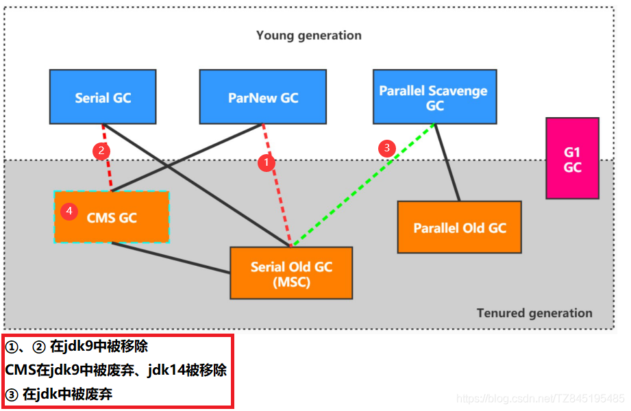

- **⑤. 查看默认的垃圾收集器 `掌握`**

(1). -xx：+PrintCommandLineFlags： 查看命令行相关参数（包含使用的垃圾收集器）

```java
/**
 *  -XX:+PrintCommandLineFlags
 *  -XX:+UseSerialGC:表明新生代使用Serial GC ，同时老年代使用Serial Old GC
 *  -XX:+UseParNewGC：标明新生代使用ParNew GC
 *  -XX:+UseParallelGC:表明新生代使用Parallel GC
 *  -XX:+UseParallelOldGC : 表明老年代使用 Parallel Old GC
 *  说明：二者可以相互激活
 *  -XX:+UseConcMarkSweepGC：表明老年代使用CMS GC。同时，年轻代会触发对ParNew 的使用
 */
public class GCUseTest {
    public static void main(String[] args) {
        ArrayList<byte[]> list = new ArrayList<>();

        while(true){
            byte[] arr = new byte[100];
            list.add(arr);
            try {
                Thread.sleep(10);
            } catch (InterruptedException e) {
                e.printStackTrace();
            }
        }
    }
}
输出:
(-XX:InitialHeapSize=268435456 -XX:MaxHeapSize=4294967296 
-XX:+PrintCommandLineFlags -XX:+UseCompressedClassPointers 
-XX:+UseCompressedOops -XX:+UseParallelGC)
```

(2). 使用命令行指令： jinfo 一flag 相关垃圾回收器参数进程ID
( jinfo -flag UseParallelGC 进程id
jinfo -flag UseParallelOldGC 进程id )

```
C:\Users\longxuan>jps
8672
6820 RemoteMavenServer36
16316 Jps
17036 GCUseTest

C:\Users\longxuan>jinfo -flag UseParallelGC 17036
-XX:+UseParallelGC

C:\Users\longxuan>jinfo -flag UseParallelOldGC 17036
-XX:+UseParallelOldGC
```


## ③. Serial、SerialOld 回收器:串行回收

3>.Serial、SerialOld 回收器:串行回收(了解)

- ①. Serial收集器采用**复制算法、串行回收**和"Stop一 the一World"机制的方式执行内存回收
- ②. Serial 0ld收集器同样也采用了**串行回收 和"Stop the World"机制**，只不过内存回收算法使用的是**标记一压缩算法**
- ③. 单线程回收：使用一个cpu或一条线程去完成垃圾收集工作 | 必须暂停其他所有的工作线程
- ④. 使用 -XX: +UseSerialGC 参数可以指定年轻代和老年代都使用串行收集器
- 等价于新生代用Serial GC，且老年代用Serial 0ld GC
- 对于交互较强的应用而言，这种垃圾收集器是不能接受的。一般在Java web应用程序中是不会采用串行垃圾收集器的。
- 控制台输出：
  -XX:InitialHeapSize=268435456 -XX:MaxHeapSize=4294967296 -XX:+PrintCommandLineFlags -XX:+UseCompressedClassPointers -XX:+UseCompressedOops -XX:+UseSerialGC
  

## ④. ParNew回收器:并行回收

4>. ParNew回收器:并行回收(了解)

- ①. 如果说Serial GC是年轻代中的单线程垃圾收集器，那么ParNew收集器则是Serial收集器的多线程版本
- ②. ParNew收集器除了采用并行回收的方式执行内存回收外，两款垃圾收集器之间几乎没有任何区别。ParNew收集器在年轻代中同样也是采用复制算法、"Stop一 the一World"机制
- ③. 因为除Serial外，目前只有ParNew GC能与CMS收集器配合工作
- ④. 在程序中，开发人员可以通过选项"-XX:+UseParNewGC"手动指定使用.ParNew收集器执行内存回收任务。它表示年轻代使用并行收集器，**`不影响老年代`**
- ⑤. -XX:ParallelGCThreads 限制线程数量，默认开启和CPU数据相同的线程数。
  

## ⑤. Parallel、ParallelOld吞吐量优先

5>.Parallel回收器:吞吐量优先
**(`在Java8中，默认是此垃圾收集器`)**

- ①. HotSpot的年轻代中除了拥有ParNew收集器是基于并行回收的以外， Parallel Scavenge收集器同样也采用了复制算法、并行回收和"Stop the World"机制。
- ②. 那么Parallel收集器的出现是否多此一举？

1. 和ParNew收集器不同，Parallel Scavenge收集 器的目标则是达到一个可控制的吞吐量（Throughput），它也被称为吞吐量优先的垃圾收集器。
2. 自适应调节策略也是Parallel Scavenge 与ParNew一个重要区别。

- ③. 高吞吐量则可以高效率地利用CPU 时间，尽快完成程序的运算任务|，主要适合在后台运算而不需要太多交互的任务。因此，常见在服务器环境中使用。例如，那些执行批量处理、订单处理、工资支付、科学计算的应用程序。
- ④. Parallel收集器在JDK1.6时提供了用于执行老年代垃圾收集的 Parallel 0ld收集器，用来代替老年代的Serial 0ld收集器
- ⑤. Parallel 0ld收集器采用了标记一压缩算法，但同样也是基于并行回收和”Stop一the一World"机制
  
- ⑥. 在程序吞吐量优先的应用场景中，Parallel 收集器和Parallel 0ld收集器的组合，在Server模式下的内存回收性能很不错
- ⑦. 参数配置
  
  

## ⑥. CMS低延迟

**`6>.` CMS低延迟**
(jdk9中被废弃、jdk14中被移除)

### ①. CMS概述

- ①. 在JDK1.5时期， HotSpot推出了一款在强交互应用中几乎可认为有划时代意义的垃圾收集器： CMS （Concurrent 一Mark 一 Sweep）收集器，这款收集器是HotSpot虚拟机中第一款真正意义上的并发收集器，它第一次实现了让垃圾收集线程与用户线程同时工作。
- ②. CMS收集器的关注点是尽可能缩短垃圾收集时用户线程的停顿时间。停顿时 间越短（低延迟）就越适合与用户交互的程序，良好的响应速度能提升用户体验。
- ③. CMS的垃圾 收集算法采用标记一清除算法，并且也 会" stop一the一world"
- ④. 不幸的是，CMS 作为老年代的收集器，却**无法与JDK 1.4.0 中已经存在的新生代收集器Parallel Scavenge配合工作**，所以在JDK 1. 5中使用CMS来收集老年代的时候，新生代只能选择ParNew或者Serial收集器中的一个
- ⑤. 在G1出现之前，CMS使用还是非常广泛的。一直到今天，仍然有很多系统使用CMS GC
  

### ②. CMS过程(原理) 掌握

- **①. `初始标记`（Initial一Mark）仅仅只是标记出和GCRoots能直接关联到的对象,有stw现象**
- **②. `并发标记`（Concurrent一Mark）阶段：从GC Roots的直接关联对象开始遍历整个对象图的过程，这个过程耗时较长但是不需要停顿用户线程，可以与垃圾收集线程一起并发运行**
  (并发标记阶段有三色标记,下文有记录)
- **③. `重新标记`（Remark） 阶段：有些对象可能开始是垃圾,在并发标记阶段,由于用户线程的影响,导致不是垃圾了,这里需要重新标记的是这部分对象,这个阶段的停顿时间通常会比初始标记阶段稍长一些，但也远比并发标记阶段的时间短**
- **④. `并发清除`：此阶段清理删除掉标记阶段判断的已经死亡的对象，释放内存空间。由于不需要移动存活对象，所以这个阶段也是可以与用户线程同时并发的**
  (马士兵老师说并发清除阶段会有浮动垃圾的产生)

初始标记（标记Root），并发标记（对根进行遍历标记），重新标记（确定已标记是否发生改变），并发清理(清理)

- ⑤. 注意：

1. 在CMS回收过程中，还应该确保应用程序用户线程有足够的内存可用。因此，CMS收集器不能像其他收集器那样等到老年代几乎完全被填满了再进行收集，而是当堆内存使用率达到某一阈值时，便开始进行回收，以确保应用程序在CMS工作过程中依然有足够的空间支持应用程序运行。要是CMS运行期间预留的内存无法满足程序需要，就会出现一次“Concurrent Mode Failure”失败，这时虚拟机将启动后备预案：临时启用Serial 0ld收集器来重新进行老年代的垃圾收集，这样停顿时间就很长了。
2. CMS收集器的垃圾收集算法采用的是标记一清除算法，这意味着每次执行完内存回收后，由于被执行内存回收的无用对象所占用的内存空间极有可能是不连续的一些内存块，不可避免地将会产生一些内存碎片。 那么CMS在为新对象分配内存空间时，将无法使用指针碰撞（Bump the Pointer） 技术，而只能够选择空闲列表（Free List） 执行内存分配。
   (在并发标记阶段一开始不是垃圾,最后变成了垃圾)

### ③. CMS优缺点

- ①. 优点：并发收集、低延迟
- ②. CMS的弊端：

1. 会产生内存碎片
2. CMS收集器对CPU资源非常敏感
   (在并发阶段，它虽然不会导致用户停顿，但是会因为占用了一部分线程而导致应用程序变慢，总吞吐量会降低)
3. CMS收集器无法处理浮动垃圾。可能出现"Concurrent Mode Failure" 失败而导致另一次Full GC的产生。在并发标记阶段由于程序的工作线程和垃圾收集线程是同时运行或者交叉运行的，那么在**并发标记阶段如果产生新的垃圾对象，CMS将无法对这些垃圾对象进行标记，最终会导致这些新产生的垃圾对象没有被及时回收**，从而只能在下一次执行GC时释放这些之前未被回收的内存空间

- **③.区分两个注意事项：`掌握`**

1. 并发标记阶段,在遍历GCRoots,用户线程也在执行,若此时遍历过一个对象发现没有引用,但由于用户线程并发执行,这期间可能导致遍历过的这个对象又被其他对象引用,所以才需要重新标记阶段再遍历一次看又没有漏标记的,否则就会导致被重新引用的对象被清理掉
2. 浮动垃圾：在并发标记阶段一开始不是垃圾,最后变成了垃圾
3. 浮动垃圾指的是并发标记和并发清理阶段，用户线程产生的新垃圾

### ④. 参数设置

- ①. -XX：+UseConcMarkSweepGc 手动指定使用CMS收集器执行内存回收任务
  (开启该参数后会自动将一XX： +UseParNewGc打开。即： ParNew （Young区用） +CMS （0ld区用） +Serial 0ld的组合)
- ②. 其他参数
  

### ⑤. CMS三色标记

- ①. 其实三色标记就是我们CMS在扫描过程中对对象的一种定义。那么具体的定义如下：

1. 黑色(black):节点被遍历完成，而且子节点都遍历完成
2. 灰色(gray): 当前正在遍历的节点，而且子节点还没有遍历
3. 白色(white):还没有遍历到的节点，即灰色节点的子节点

- ②. 根据三色扫描算法，如果有下面两种情况发生，则会出现漏扫描的场景：

1. 把一个白对象的引用存到黑对象的字段里,如果这个情况发生，因为标记为黑色的对象认为是扫描完成的，不会再对他进行扫描。只能通过灰色的对象(CMS垃圾收集器)
2. 某个白对象失去了所有能从灰对象到达它的引用路径(直接或间接)(g1垃圾收集器)


- ③. 三色过程：如下图所示，假如说A引入了B，B引用了C，D没有被任何引用。那么首先我们的CMS首先扫描到了A，发现A有引用B，那么我们的CMS会将A标记为黑色，B标记为灰色，然后这时候，通过B又找到了C那么这个时候发现C已经没有任何引用了就会将C标记为黑色。**但是我们的D到目前为止没有被任何引用，记住我这里说的条件！！！**那么D从始至终都没有被扫描，此时就会一直是白色，对于白色的对象来说CMS在执行并发清理的时候就会将此类对象干掉。
- ④. 但是这里有了一个问题：如果我们的扫描过程已经结束这一段了，但是此时此刻我的A突然引用了D类型怎么办，这样一来我们的D只要被GC干掉是不是就会出现问题？也就是说我这里产生了一个漏标的问题。当然，我们的JVM开发人员可不是傻子，这里他们用了一个操作叫做增量更新和写屏障来解决这种问题的。


### ⑥. 增量更新与写屏障

- ①. 所谓增量更新就是在并发标记过程中，把赋值的这种新增的引用，做一个集合存起来。 在重新标记的时候会找到集合里面的引用然后重新去扫描，再把源头标记为灰色。这就是我们的增量更新
- ②. 当然，在把我们新增的引用放到集合的时候，会实现一种写屏障的方式。在对象前后通过一个dirty card queue将引用信息, 存在card中,这个dirty card queue会放在cardtable中,而cardtable是记忆集的具体实现,最终这个引用就会放在记忆集中的
  (写屏障我们可以理解为在赋值操作的前面加一个方法，赋值的后面做一些操作，也可以理解为AOP。具体的C++实现代码如下图：)


### ⑦. 记忆集与卡表

- ①. 在刚刚我们再说写屏障的时候提到了卡表，那么我们现在就来说说卡表是干什么用的。但是在说记忆集与卡表之前，我们要先知道what is 跨带引用~
- ②. 跨带引用：
  所谓跨带引用就是老年代的对象引用了新生代的对象，或者新生代的对象引用了老年代的对象。那对于这种情况我们的GC在进行扫描的时候不可能直接把我们的整个堆都扫描完，那这样效率也太低了。所以这时候就需要开辟了一小块空间，维护这种引用，而不必让GC扫描整个堆区域。
- ③. 记忆集：
  记忆集也叫rememberSet，垃圾收集器在新生代中建立了记忆集这样的数据结构，用来避免把整个老年代加入到GC ROOTS的扫描范围中。对于记忆集来说，我们可以理解为他是一个抽象类，那么具体实现它的方法将由子类去完成。这里我们简单列举一下实现记忆集的三种方式：
  1.字长精度
  2.对象精度
  3.卡精度（卡表）
- ④. 卡表：
  卡表(Card Table)是一种对记忆集的具体实现。主要定义了记忆集的记录精度、与堆内存的映射关系等。卡表中的每一个元素都对应着一块特定大小的内存块，这个内存块我们称之为卡页（card page），当存在跨带引用的时候，它会将卡页标记为dirty。那么JVM对于卡页的维护也是通过写屏障的方式，这也就是为什么刚刚我们跟进写屏障操作到最后会发现它会对卡表进行一系列的操作。

### ⑧. ASTB 和 Incremental Update

- ①. satb 算法认为开始标记的都认为是活的对象，如上图所示,引用B到D 的引用改为B到C时，通过write barrier写屏障技术，会把B到D 的引用推到gc 遍历执行的堆栈上，保证还可以遍历到D对象，相对于d来说，引用从B–>A,SATB 是从源入手解决的，即上面说的第2种情况，
  这也能理解为啥叫satb 了，即认为开始时所有能遍历到的对象都是需要标记的，即都认为是活的。如果我吧b = null,那么d 久是垃圾了， satb算法也还是会把D最终标记为黑色，导致D 在本轮gc 不能回收，成了浮动垃圾
- ②. Incremental Update 算法判断如果一个白色的对象由一个黑色的对象引用，即目的，如上图，D的引用由B–>A,A是目的地址，所以cms 的Incremental Update算法是从目标入手解决的，这是和SATB的第一个区别，发现这种情况时，也是通过write barrier写屏障技术，把黑色的对象重新标记为灰色，让collector 重新来扫描，活着通过mod-union table 来标记，cms 就是这样实现的，这是第二个区别，做法不一样，也是上面讲的防止第一种情况发生


## ⑦.G1回收器 掌握

**(`jdk9默认垃圾收集器`)**

### ①. 为什么名字叫Garbage First

- ①. G1是一个**并行回收器**,它把堆内存分割为很多不相关的区域(region物理上不连续),把堆分为2048个区域,每一个region的大小是1 - 32M不等,必须是2的整数次幂。使用不同的region可以来表示Eden、幸存者0区、幸存者1区、老年代等
- ②. 每次根据允许的收集时间,**优先回收价值最大的Region**(每次回收完以后都有一个空闲的region，在后台维护一个优先列表)
- ③. 由于这种方式的侧重点在于回收垃圾最大量的区间（Region），所以我们给G1一个名字：垃圾优先（Garbage First）

### ②. 特点

- ①. 并行和并发

1. 并行性： G1在回收期间，可以有多个Gc线程同时工作，有效利用多核计算能力。此时用户线程STW
2. 并发性： G1拥有与应用程序交替执行的能力，部分工作可以和应用程序同时执行，因此，一般来说，不会在整个回收阶段发生完全阻塞应用程序的情况

- ②. 分代收集
- ③. 空间整合
  (G1将内存划分为一个个的region。 内存的回收是以region作为基本单位的.**Region之间是复制算法**，但**整体上实际可看作是标记一压缩（Mark一Compact）算法**，两种算法都**可以避免内存碎片**。这种特性有利于程序长时间运行，分配大对象时不会因为无法找到连续内存空间而提前触发下一次GC。尤其是当Java堆非常大的时候，G1的优势更加明显)
- ④. 可预测的停顿时间模型（即：软实时soft real一time）
  (可以通过参数-XX:MaxGCPauseMillis进行设置)

### ③. 参数设置

- ①. **`-XX:+UseG1GC`** 手动指定使用G1收集器执行内存回收任务，jdk8需要手动指定
- ②. **`-XX:G1HeapRegionSize`** 设置每个Region的大小。值是2的幂，范围是1MB 到32MB之间，目标是根据最小的Java堆大小划分出约2048个区域。默认是堆内存的1/2000
- ③. **`-XX：MaxGCPauseMillis`** 设置期望达到的最大GC停顿时间指标（JVM会尽力实现，但不保证达到）。默认值是200ms
  (如果这个值设置很小,如20ms,那么它收集的region会少,这样长时间后,堆内存会满。产生FullGC,FullGC会出现STW,反而影响用户体验)
- ④. -XX：ParallelGCThread 设置stw.GC线程数的值。最多设置为8
- ⑤. -XX：ConcGCThreads 设置并发标记的线程数。将n设置为并行垃圾回收线程数（ParallelGCThreads）的1/4左右
- ⑥. -XX：InitiatingHeapOccupancyPercent 设置触发并发GC周期的Java堆占用率阈值。超过此值，就触发GC。默认值是45


### ④. G1回收器的使用场景

- ①. 面向服务端应用，针对具有大内存,多处理器的机器
- ②. 最主要的应用时需要低GC延迟,并且有大堆的应用程序提供解决方案

### ⑤. Region详解 掌握

- ①. 使用G1收集器时，它将整个Java堆划分成约2048个大小相同的独立Region块，每个Region块大小根据堆空间的实际大小而定，整体被控制在1MB到32MB之间，且为2的N次幂，即1MB， 2MB， 4MB， 8MB， 16MB， 32MB。可以通过-XX：G1HeapRegionSize设定。所有的Region大小相同，且在JVM生命周期内不会被改变
- ②. 一个region 有可能属于Eden， Survivor 或者0ld/Tenured 内存区域。但是一个region只可能属于一个角色。图中的E表示该region属于Eden内存区域，s表示属于Survivor内存区域，0表示属于0ld内存区域。图中空白的表示未使用的内存空间
- ③. 垃圾收集器还增加了一种新的内存区域，叫做Humongous内存区域，如图中的H块。主要用于存储大对象，如果超过1. 5个region，就放到H
  (对于堆中的大对象，默认直接会被分配到老年代，但是如果它是一个短期存在的大对象，就会对垃圾收集器造成负面影响。为了解决这个问题，G1划分了一个Humongous区，它用来专门存放大对象。如果一个H区装不下一个大对象，那么G1会寻找连续的H区来存储。为了能找到连续的H区，有时候不得不启动Full GC。G1的大多数行为都把H区作为老年代的一部分来看待)


### ⑥. 记忆集与写屏障 掌握

- ①. 问题：一个Region不可能是孤立的,一个Region中的对象可能被其他对象引用,如新生代中引用了老年代,这个时候垃圾回收时,会去扫描老年代,会出现STW
- ②. 解决：无论是G1还是分带收集器,JVM都是使用Remembered Set来避免全局扫描。每个Region都有 一个对应的Remembered Set；[下面过程需要掌握]

1. 每次Reference类 型数据写操作时,都会产生一个Write Barrier暂时
2. 然后检查将要写入的引用指向的对象是否和该Reference类型数据在不同的Region （其他收集器：检查老年代对象是否引用了新生代对象）
3. 如果不同，通过CardTable把相关引用信息记录到引用指向对象的所在Region对应的Remembered Set中；
4. 当进行垃圾收集时，在GC根节点的枚举范围加入Remembered Set；就可以保证不进行全局扫描，也不会有遗漏
   

### ⑦. G1回收器垃圾回收过程


### ⑧. 年轻代GC

- **①. `根扫描`：一定要考虑remembered Set,看是否有老年代中的对象引用了新生代对象**
- **②.`更新RSet`：处理dirty card queue(见备注)中的card，更新RSet。 此阶段完成后，RSet可 以准确的反映老年代对所在的内存分段中对象的引用**
  (dirty card queue: 对于应用程序的引用赋值语句object.field=object，JVM会在之前和之后执行特殊的操作以在dirty card queue中入队一个保存了对象引用信息的card。在年轻代回收的时候，G1会对Dirty CardQueue中所有的card进行处理，以更新RSet，保证RSet实时准确的反映引用关系。那为什么不在引用赋值语句处直接更新RSet呢？这是为了性能的需要，RSet的处理需要线程同步，开销会很大，使用队列性能会好很多)
- **③. `处理RSet：`识别被老年代对象指向的Eden中的对象，这些被指向的Eden中的对象被认为是存活的对象**
- **④. 复制对象:`复制算法`**
  (此阶段，对象树被遍历，Eden区 内存段中存活的对象会被复制到Survivor区中空的内存分段，Survivor区内存段中存活的对象如果年龄未达阈值，年龄会加1，达到阀值会被会被复制到01d区中空的内存分段。如果Survivor空间不够，Eden空间的 部分数据会直接晋升到老年代空间)
- **⑤. `处理引用`：** 处理Soft，Weak， Phantom， Final， JNI Weak等引用。最终Eden空间的数据为空，GC停止工作，而目标内存中的对象都是连续存储的，没有碎片，所以复制过程可以达到内存整理的效果，减少碎片

### ⑨. 并发标记过程

- ①. **`初始标记阶段`**：标记从根节点直接可达的对象。这个阶段是STW的，并且会触发一次年轻代GC
- ②. **`根区域扫描`**（Root Region Scanning):G1 GC扫描Survivor区直接可达的老年代区域对象，并标记被引用的对象。这一过程必须在young GC之前完成(YoungGC时,会动Survivor区,所以这一过程必须在young GC之前完成)
- ③. **`并发标记`**（Concurrent Marking）： 在整个堆中进行并发标记（和应用程序并发执行），此过程可能被young GC中断。在并发标记阶段，若发现区域对象中的所有对象都是垃圾，那这个区域会被立即回收。同时，并发标记过程中，会计算每个区域的对象活性（区域中存活对象的比例）。
- ④. **`再次标记`**（Remark):由 于应用程序持续进行，需要修正上一次的标记结果。是STW的。G1中采用了比CMS更快的初始快照算法：snapshot一at一the一beginning （SATB）
  （在CMS中有详细讲解）
- ⑤. **`独占清理`**（cleanup，STW）：计算各个区域的存活对象和GC回收比例，并进行排序，识别可以混合回收的区域。为下阶段做铺垫。是STW的。(这个阶段并不会实际上去做垃圾的收集)
- ⑥. **`并发清理阶段`**：识别并清理完全空闲的区域

### ⑩. 混合回收

- ①. 当越来越多的对象晋升到老年代oldregion时，为了避免堆内存被耗尽，虚拟机会触发一个混合的垃圾收集器，即Mixed GC， 该算法并不是一个0ldGC，除了回收整个Young Region，还会回收一部分的0ldRegion。这里需要注意：是一部分老年代， 而不是全部老年代。可以选择哪些0ldRegion进行收集，从而可以对垃圾回收的耗时时间进行控制。也要注意的是Mixed GC并不是Fu1l GC
  
- ②. 其他说明：
  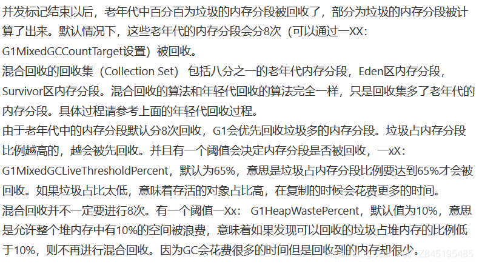

### ⑩①. Full GC

- ①. 堆内存过小,当G1在复制存活对象的时候没有空的内存分段可用，则会回退到full gc,这种情况可以通过增大内存解决
- ②. 暂停时间-XX:MaxGCPauseMillis设置短,回收频繁。由于用户线程和GC线程一起执行,可能用户线程产生的垃圾大于GC线程回收的垃圾,会导致内存不足,触发Full gc

### ⑩②. 优化建议

- ①. 年轻代发送GC频率高,避免使用-Xmn或-XX:NewRatio,让JVM自己设置
- ②. 暂停时间目标不要太过严苛

## ⑧. 详解-XX:+PrintGCDetails

- ①. Minor GC
  
- ②. Full GC
  
- ③. 举例补充

```java
/**
 * 在jdk7 和 jdk8中分别执行
 * -verbose:gc -Xms20M -Xmx20M -Xmn10M -XX:+PrintGCDetails -XX:SurvivorRatio=8 -XX:+UseSerialGC
 */
public class GCLogTest1 {
    private static final int _1MB = 1024 * 1024;

    public static void testAllocation() {
        byte[] allocation1, allocation2, allocation3, allocation4;
        allocation1 = new byte[2 * _1MB];
        allocation2 = new byte[2 * _1MB];
        allocation3 = new byte[2 * _1MB];
        allocation4 = new byte[4 * _1MB];
    }

    public static void main(String[] agrs) {
        testAllocation();
    }
}
12345678910111213141516171819
```


## ⑨. 其他垃圾回收器概述

- ①. Open JDK12的Shenandoah GC

1. 暂时时间短、吞吐量下降
2. red hot 团队

- ②. 革命性的ZGC(jdk11-oracle)
  ( 在尽可能对吞吐量影响不大的前提下.实现在任意堆内存大小都可以把垃圾收集的停顿时间控制在10毫秒之内)


总结：


------

# JVM_07 GC日志


```java
package com.xuan;

import java.util.ArrayList;

/**
 * -XX:+PrintCommandLineFlags
 * -XX:+UseSerialGC:表明新生代使用Serial GC ，同时老年代使用Serial Old GC
 * -XX:+UseParNewGC：标明新生代使用ParNew GC
 * -XX:+UseParallelGC:表明新生代使用Parallel GC
 * -XX:+UseParallelOldGC : 表明老年代使用 Parallel Old GC
 * 说明：二者可以相互激活
 * -XX:+UseConcMarkSweepGC：表明老年代使用CMS GC。同时，年轻代会触发对ParNew 的使用
 */
//设置：-Xms60m -Xmx60m -XX:+PrintGCDetails -XX:+PrintGCTimeStamps -XX:+PrintGCDateStamps
public class GCUseTest {
    public static void main(String[] args) {
        ArrayList<byte[]> list = new ArrayList<>();

        for (int i = 0; i < 500; i++) {

            byte[] arr = new byte[1024 * 100];
            list.add(arr);
           /* try {
                Thread.sleep(10);
            } catch (InterruptedException e) {
                e.printStackTrace();
            }*/
        }
    }
}
```

输出：

````
2020-12-02T18:19:02.006+0800: 0.323: [GC (Allocation Failure) [PSYoungGen: 15301K->2552K(17920K)] 15301K->13606K(58880K), 0.0056931 secs] [Times: user=0.00 sys=0.00, real=0.01 secs] 

2020-12-02T18:19:02.014+0800: 0.331: [GC (Allocation Failure) [PSYoungGen: 17849K->2504K(17920K)] 28902K->28760K(58880K), 0.0084809 secs] [Times: user=0.00 sys=0.05, real=0.01 secs] 

2020-12-02T18:19:02.023+0800: 0.340: [Full GC (Ergonomics) [PSYoungGen: 2504K->0K(17920K)] [ParOldGen: 26256K->28733K(40960K)] 28760K->28733K(58880K), [Metaspace: 3300K->3300K(1056768K)], 0.0134016 secs] [Times: user=0.03 sys=0.00, real=0.01 secs] 

2020-12-02T18:19:02.038+0800: 0.356: [Full GC (Ergonomics) [PSYoungGen: 15307K->3000K(17920K)] [ParOldGen: 28733K->40636K(40960K)] 44041K->43636K(58880K), [Metaspace: 3301K->3301K(1056768K)], 0.0111900 secs] [Times: user=0.00 sys=0.00, real=0.01 secs] 

Heap
 PSYoungGen      total 17920K, used 10251K [0x00000000fec00000, 0x0000000100000000, 0x0000000100000000)
  eden space 15360K, 66% used [0x00000000fec00000,0x00000000ff602eb0,0x00000000ffb00000)
  from space 2560K, 0% used [0x00000000ffd80000,0x00000000ffd80000,0x0000000100000000)
  to   space 2560K, 0% used [0x00000000ffb00000,0x00000000ffb00000,0x00000000ffd80000)
 ParOldGen       total 40960K, used 40636K [0x00000000fc400000, 0x00000000fec00000, 0x00000000fec00000)
  object space 40960K, 99% used [0x00000000fc400000,0x00000000febaf078,0x00000000fec00000)
 Metaspace       used 3307K, capacity 4496K, committed 4864K, reserved 1056768K
  class space    used 359K, capacity 388K, committed 512K, reserved 1048576K
````

GC日志中垃圾回收数据的分析


```java
package com.xuan;
//配置：-Xms20m -Xmx20m -Xmn10m -XX:+PrintGCDetails -XX:SurvivorRatio=8 -XX:+UseSerialGC
//-Xmn10m为新生代配置10m，则老年代为20m-10m,eden区为8m,s0和s1都是1m
public class testAllocation {
    private static final int _1MB = 1024 * 1024;

    public static void testAllocation() {
        byte[] allocation1, allocation2, allocation3, allocation4;
        allocation1 = new byte[2 * _1MB];
        allocation2 = new byte[2 * _1MB];
        allocation3 = new byte[2 * _1MB];
        allocation4 = new byte[4 * _1MB];
    }

    public static void main(String[] args) {
        testAllocation();
    }
}

```


### 日志分析工具的使用：

GCViewer、 GCEasy、 GCHisto、 GCLogViewer、Hpjmeter、garbagecat


```java
package com.xuan;

import java.util.ArrayList;

//配置：-Xms20m -Xmx20m -Xmn10m -XX:+PrintGCDetails -XX:SurvivorRatio=8 -XX:+UseSerialGC -Xloggc:./log/gc.log
public class GClogTest {
    public static void main(String[] args) {
        ArrayList<byte[]> list = new ArrayList<>();
        for (int i = 0; i < 500; i++) {
            byte[] arr = new byte[1024 * 100];
            list.add(arr);
            try {
                Thread.sleep(50);
            } catch (InterruptedException e) {
                e.printStackTrace();
            }
        }
    }
}
```


## 革命性的ZGC的性能介绍

ZGC与 Shenandoah目标高度相似，**在尽可能对吞吐量影响不大的前提下，实现在任意堆内存大小下都可以把垃圾收集的停顿时间限制在十毫秒以内的低延迟**

深入理解Java虚拟机》一书中这样定义zGC:zGC收集器是一款基于Region内存布局的，（暂时）不设分代的，使用了读屏障、染色指针和内存多重映射等技术来实现可并发的标记-压缩算法的，以低延迟为首要目标的一款垃圾收集器

ZGC的工作过程可以分为4个阶段:**并发标记-并发预备重分配-并发重分配-并发重映射**

ZGC几乎在所有地方并发执行的，除了初始标记的是STW的。所以停顿时间几乎就耗费在初始标记上，这部分的实际时间是非常少的

未来将在服务端、大内存、低延迟应用的首选垃圾收集器


# JVM_08 Class文件结构

## ①. 概述

1>.概述(了解)

### ①. 字节码文件的跨平台性(了解)

- ①. Java语言：跨平台的语言

1. 当Java源代码成功编译为字节码后，如果想在不同的平台上运行，则无须再次编译
2. 这个优势不再那么吸引人了。Python PHP perl ruby lisp等有强大的解释器
3. 跨平台似乎已经快成为一门语言必须的特征

- ②. Java虚拟机：跨语言的平台：
  (**`Java虚拟机不和包括java在内的任何语言绑定，它只与class文件这种二进制文件格式所关联`**。无论使用何种语言进行软件开发，只要将源文件编译为正确的Class文件，那么这种语言就可以在Java虚拟机上执行，可以说，统一而强大的Class文件结构，就是Java虚拟机的基石、桥梁)


- ③. 想要让一个Java程序正确地运行在JVM中,Java源码就必须要编译为符合JVM规范的字节码

1. **`前端编译器的主要任务`** 就是负责将符合Java语言规范的Java代码转换为符合JVM规范的字节码文件
2. javac是一种能够将Java源码编译为字节码的前端编译器
3. javac编译器在将Java源码编译为一个有效的字节码文件过程中经历了4个步骤：分别是词法解析、语法解析、语义解析以及生成字节码
   

### ②. Java的前端编译器(了解)

- ①. 前端编译器 vs 后端编译器
  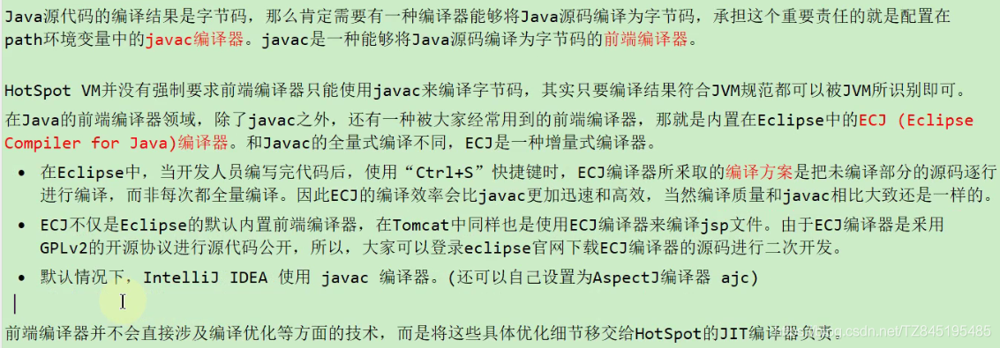
- ②. 图解：


### ③. 透过字节码指令看代码细节

- ①. Integer：透过字节码可以看出,当Integer的范围在-128 - +127 之间会在数组中直接拿取数值,超过这个范围会重新new对象

```java
public class IntegerTest {
    public static void main(String[] args) {

        /*
        * 透过字节码可以看出,当Integer的范围在-128 - +127 之间会在数组中直接拿取数值
        * 超过这个范围会重新new对象
        * */
        Integer x = 5;
        int y = 5;
        System.out.println(x == y);

        Integer i1 = 10;
        Integer i2 = 10;
        System.out.println(i1 == i2);//true

        Integer i3 = 128;
        Integer i4 = 128;
        System.out.println(i3 == i4);//false
    }
```

- ②. 在父类中调用方法,如果子类有重写,那么调用的是子类的方法,如代码中的this.print( )

```java
/*
成员变量（非静态的）的赋值过程：
 ① 默认初始化 -
 ② 显式初始化 /代码块中初始化 -
 ③ 构造器中初始化 -
 ④ 有了对象之后，可以“对象.属性”或"对象.方法"
 的方式对成员变量进行赋值。
 */
class Father {
    int x = 10;
    public Father() {
        this.print();
        x = 20;
    }
    public void print() {
        System.out.println("Father.x = " + x);
    }
}
class Son extends Father {
    int x = 30;
//    float x = 30.1F;
    public Son() {
        this.print();
        x = 40;
    }
    public void print() {
        System.out.println("Son.x = " + x);
    }
}

public class SonTest {
    public static void main(String[] args) {
        Father f = new Son();
        System.out.println(f.x);
    }
}
```

- ③. 静态变量随着类的加载就加载了,在链接(准备阶段)会为静态变量赋予默认的初始化值,在初始化阶段会显示的赋值

```java
/*
输出结果:
	父类的静态成员属性
	父类静态代码块
	子类的静态成员属性
	子类静态代码块
	父类构造方法
	子类构造方法
*/
public class People {
    private final static String parentStaitc = "父类的静态成员属性";
    public static void main(String[] args) {
        People people = new Child();
    }
    public People() {
        System.out.println("父类构造方法");
    }

    static{
        System.out.println(parentStaitc);
        System.out.println("父类静态代码块");
    }
}
 class Child extends People {
    private final static String childStaitc = "子类的静态成员属性";

    public Child() {
        System.out.println("子类构造方法");
    }

    static{
        System.out.println(childStaitc);
        System.out.println("子类静态代码块");
    }
}
```


```java
package com.xuan;

public class StringTest {
    public static void main(String[] args) {
        String a = new String("xuan") + new String("long");
        String b = "xuanlong";
        System.out.println(a == b);
    }
}
//4构造器的操作
//10复制一份
//11将一个常量（hello)加载到操作数栈
//16通过append添加
//31由于返回的是String，所以返回时调用了toString方法，其中toString方法返回的是new String 的对象
```


```
 0 new #2 <java/lang/StringBuilder>
 3 dup
 4 invokespecial #3 <java/lang/StringBuilder.<init>>
 7 new #4 <java/lang/String>
10 dup
11 ldc #5 <xuan>
13 invokespecial #6 <java/lang/String.<init>>
16 invokevirtual #7 <java/lang/StringBuilder.append>
19 new #4 <java/lang/String>
22 dup
23 ldc #8 <long>
25 invokespecial #6 <java/lang/String.<init>>
28 invokevirtual #7 <java/lang/StringBuilder.append>
31 invokevirtual #9 <java/lang/StringBuilder.toString>
34 astore_1
35 ldc #10 <xuanlong>
37 astore_2
38 getstatic #11 <java/lang/System.out>
41 aload_1
42 aload_2
43 if_acmpne 50 (+7)
46 iconst_1
47 goto 51 (+4)
50 iconst_0
51 invokevirtual #12 <java/io/PrintStream.println>
54 return

```

## class文件结构：


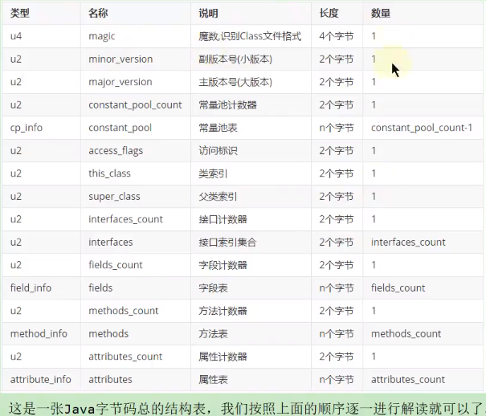


使用魔数而不是扩展名来进行识别主要是基于安全方面的考虑，因为文件扩展名可以随意地改动

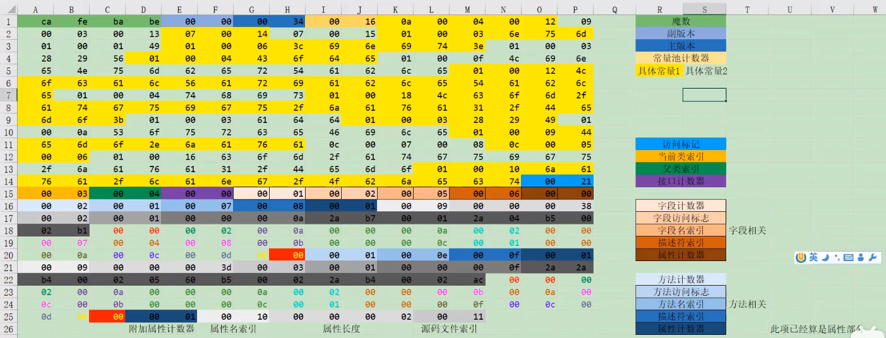


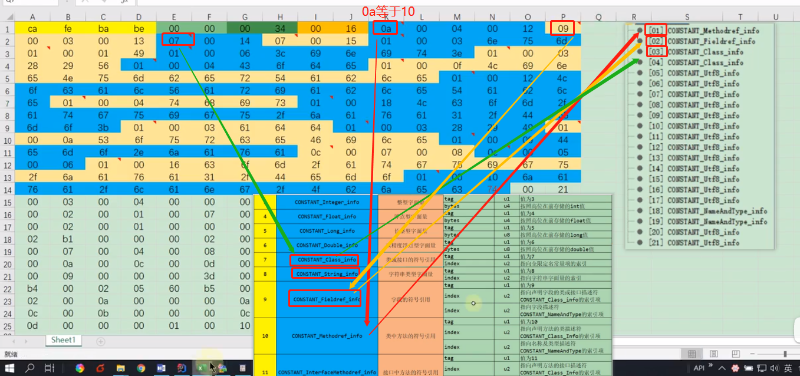

## **常量池 （Constant pool tags）**

| Constant Type                 | Value |
| ----------------------------- | ----- |
| `CONSTANT_Class`              | 7     |
| `CONSTANT_Fieldref`           | 9     |
| `CONSTANT_Methodref`          | 10    |
| `CONSTANT_InterfaceMethodref` | 11    |
| `CONSTANT_String`             | 8     |
| `CONSTANT_Integer`            | 3     |
| `CONSTANT_Float`              | 4     |
| `CONSTANT_Long`               | 5     |
| `CONSTANT_Double`             | 6     |
| `CONSTANT_NameAndType`        | 12    |
| `CONSTANT_Utf8`               | 1     |
| `CONSTANT_MethodHandle`       | 15    |
| `CONSTANT_MethodType`         | 16    |
| `CONSTANT_InvokeDynamic`      | 18    |


常量池表项中，用于存放编译时期生成的各种==字面量和符号引用==，这部分内容将在类加载后进入方法区的运行时常量池中存放

constant_pool是一种表结构，以1~ constant_ pool_count-1为索引。表明了后面有多少个常量项

常量池主要存放两大类常量:==:字面量（ Litera1）和符号引用(Symbolic References）==


包含了\ class文件结构及其子结构中引用的所有字符串常量、类或接口名、字段名和其他常量


描述符的作用是用来描述字段的数据类型、方法的参数列表(包括数量、类 型以及顺序)和返回值,基本数据类型(byte、char、double、 

float、int、long、short、boolean)以及代表无返回值的 void 类型都用一个大写字 符来表示，


```java
package com.xuan;

public class ArrayTest {
    public static void main(String[] args) {
        Object[] arr = new Object[10];
        System.out.println(arr);//输出：[Ljava.lang.Object;@1b6d3586

        String[] arr1 = new String[10];
        System.out.println(arr1);//输出：[Ljava.lang.String;@4554617c

        long[][] arr2 = new long[10][];
        System.out.println(arr2);//输出：[[J@74a14482
    }
}

```


虚拟机在加载 Class 文件时才会进行动态链接，也就是说，Class 文件中不 会保存各个方法和字段的最终内存布局信息，因此，这些字段和方法的符号引用 不经过转换是无法直接被虚拟机使用的。**当虚拟机运行时，需要从常量池中获得 对应的符号引用，再在类加载过程中的解析阶段将其替换为直接引用，并翻译到 具体的内存地址中**


### **常量类型和结构** 

**常量池中每一项常量都是一个表，****JDK 1.7** **之后共** **14** **种不同的表结构数据。如** 

**下表格所示：**


总结： 

 这 14 种表(或者常量项结构)的共同点是：表开始的第一位是一个 u1 类型的 

标志位(tag)，代表当前这个常量项使用的是哪种表结构，即哪种常量类型 

 在常量池列表中，CONSTANT_Utf8_info 常量项是一种使用改进过的 

UTF-8 编码格式来存储诸如文字字符串、类或者接口的全限定名、字段或者 

方法的简单名称以及描述符等常量字符串信息 

 这 14 种常量项结构还有一个特点是，其中 13 个常量项占用的字节固定，只 

有 CONSTANT_Utf8_info 占用字节不固定，其大小由 length 决定。为什 

么？

**因为从常量池存放的内容可知，其存放的是字面量和符号引用，最终 这些内容都会是一个字符串，这些字符串的大小是在编写程序时才确定** ,比如你定义一个类，类名可以取长去短，所以在没编译前，大小不固定，编 译后，通过 UTF-8 编码，就可以知道其长度 

 常量池：可以理解为 Class 文件之中的资源仓库，它是 Class 文件结构中与 其他项目关联最多的数据类型(后面的很多数据类型都会指向此处)，也是占 用 Class 文件空间最大的数据项目之一 

**常量池中为什么包含这些内容 **

Java 代码在进行 javac 编译的时候，并不像 C 和 C++ 那样有"连接"这一 步骤，而是在虚拟机加载 Class 文件的时候进行动态链接。也就是说，**在 Class 文件中不会保存各个方法、字段的最终内存布局信息，因此这些字段、方法的符 20号引用不经过运行期转换的话无法得到真正的内存入口地址，也就无法直接被虚 拟机使用。**当虚拟机运行时，需要从常量池获得对应的符号引用，再在类创建 时或运行时解析、翻译到具体的内存地址之中。


### **访问标识**

在常量池后，紧跟着访问标记。该标记使用两个字节表示，用于识别一些类 或者接口层次的访问信息，包括：这个 Class 是类还是接口；是否定义为 public 类型；是否定义为 abstract 类型；如果是类的话，是否被声明为 final


类的访问权限通常为 ACC_ 开头的常量

每一个种类型的表示都是通过设置访问标记的 32 位中的特定位来实现的。 比如，若是 public final 的类，则该标记为 ACC_PUBLIC | ACC_FINAL

使用 ACC_SUPER 可以让类更准确地定位到父类的方法 super.method()，现 代编译器都会设置并且使用这个标记 


1) 带有 ACC_INTERFACE 标志的 Class 文件表示的是接口而不是类，反之则 表示的是类而不是接口 

\1. 如果一个 Class 文件被设置了 ACC_INTERFACE 标志，那么同时也得 设置 ACC_ABSTRACT 标志。同时它不能再设置 ACC_FINAL、 

ACC_SUPER 或 ACC_ENUM 标志 

\2. 如果没有设置 ACC_INTERFACE 标志，那么这个 Class 问价可以具有 上表中除 ACC_ANNOTATION 外的其他所有标志。当然，ACC_FINAL 和 ACC_ABSTRACT 这类互斥的标志除外。这两个标志不能同时设置 

2) ACC_SUPER 标志用于确定类或接口里面的 invokespecial 指令使用的是哪 一种执行语义。**针对 Java 虚拟机指令集的编译器都应当设置这个标志。 **对于 Java SE 8 及后续版本来说，无论 Class 文件中这个标志的实际值是 什么，也不管 Class 文件的版本 

3) ACC_SYNTHETIC 标志意味着该类或接口是由编译器生成的，而不是由源 代码生成的 

4) 注 解 类 型 必 须 设 置 ACC_ANNOTATION 标 志 。 如 果 设 置 了 ACC_ANNOTATION 标志，那么也必须设置 ACC_INTERFACE 标志 

5) ACC_ENUM 标志标明该类或其父类为枚举类型 

**6)** 表中没有使用的 access_flags 标志是为未来扩充而预留的，这些预留的标志 在编译器中应该设置为 0，Java 虚拟机实现也应该忽略他们


### **类索引、父类索引、接口索引集合** 


\1. this_class(类索引) 

2 字 节 无符 号 整 数， 指 向 常量 池 的 索引 。 它 提供 了 类 的全 限 定 名， 如 com/atguigu/java1/Demo。this_class 的值必须是对常量池表中某项的一个有效索 引值。常量池在这个索引处的成员必须为 CONSTANT_Class_info 类型结构体， 该结构体表示这个 Class 文件所定义的类或接口 

\2. super_class(父类索引) 

 2 字节无符号整数，指向常量池的索引。它提供了当前类的父类的全限定名。 如果我们没有继承任何类，其默认继承的是 java/lang/Object 类。同时，由 于 Java 不支持多继承，所以其父类只有一个  superclass 指向的父类不能是 final 

\3. interfaces 

 指向常量池索引集合，它提供了一个符号引用到所有已实现的接口 

 由于一个类可以实现多个接口，因此需要以数组形式保存多个接口的索引， 表示接口的每个索引也是一个指向常量池的 CONSTANT_Class(当然这里就 必须是接口，而不是类) 

3.1 interfaces_count(接口计数器) 

interfaces_count 项的值表示当前类或接口的直接超接口数量 

3.2 interface[] (接口索引集合) 

interfaces[] 中每个成员的值必须是对常量池表中某项的有效索引值，它的长 度为 interfaces_count。每个成员 interfaces[i] 必须为 CONSTANT_Class_info 结 构，其中 0 <= i < interfaces_count。在 interfaces[] 中，各成员所表示的接口顺 序和对应的源代码中给定的接口顺序(从左至右)一样，即 interfaces[0] 对应的是 源代码中最左边的接口 


### **字段表集合** (field)

 用于描述接口或类中声明的变量。字段(field)包括==类级变量以及实例级变量==， 但是不包括方法内部、代码块内部声明的局部变量 

 字段叫什么名字、字段被定义为什么数据类型，这些都是无法固定的，只能 引用常量池中的常量来描述 

 它指向常量池索引集合，它描述了每个字段的完整信息。比如**字段的标识 符、访问修饰符(public、private 或 protected)、是类变量还是实例变量(static 修饰符)、是否是常量(final 修饰符)**等。 

1).**字段计数器** 

fields_count 的值表示当前 Class 文件 fields 表的成员个数。使用两个字节 来表示

fields 表中每个成员都是一个 field_info 结构，用于表示该类或接口所声明 的所有类字段或者实例字段，不包括方法内部声明的变量，也不包括从父类或父 接口继承的那些字段

2).**）字段表** 

fields 表中的每个成员都必须是一个 fields_info 结构的数据项，用于表示当 前类或接口中某个字段的完整描述 一个字段的信息包括如下这些信息，这些信息中，各个修饰符都是布尔值，要么 有，要么没有

作用域(public、private、protected 修饰符) 

 是实例变量还是类变量(static 修饰符) 

 可变性(final) 

 并发可见性(volatile 修饰符，是否强制从主内存读写) 

 可否序列化(transient 修饰符) 

 字段数据类型(基本数据类型、对象、数组) 

 字段名称

**字段表结构**:


字段表访问标识


字段名索引 :根据字段名索引的值，查询常量池中的指定索引项即可


描述符索引 :描述符的作用是用来描述字段的数据类型、方法的参数列表(包括数量、类型 以及顺序)和返回值。根据描述符规则，基本数据类型(byte、char、double、float、 int、long、short、boolean)及代表无返回值的 void 类型都用一个大写字符来表示， 而对象则用字符 L 加对象的全限定名来表示，


属性表集合:一个字段还可能拥有一些属性，用于存储更多的额外信息。比如初始化值、 一些注释信息等。属性个数存放在 attribute_count 中，属性具体内容存放在 attributes 数组中 以常量属性为例

### **方法表集合** 

methods: 指向常量池索引集合，它完整描述了每个方法的签名 

 在字节码文件中，每一个 method_info 项都对应着一个类或者接口中的方法 信息。比如方法的访问修饰符(public、private 或 protected)，方法的返回值 类型以及方法的参数信息等 

 如果这个方法不是抽象的或者不是 native 的，那么字节码中会体现出来 

 一方面，methods 表只描述当前类或接口中声明的方法，不包括从父类或父 接口继承的方法。另一方面，methods 表有可能会出现由编译器自动添加的 方法，最典型的便是编译器产生的方法信息(比如：类(接口)初始化方法 () 和 实例初始化方法 ()


**方法计数器** :methods_count 的值表示当前 Class 文件 methods 表的成员个数，使用两个 字节来表示 methods 表中每个成员都是一个 method_info 结构


**方法表** 

 methods 表中的每个成员都必须是一个 method_info 结构，用于表示当前类 或接口中某个方法的完整描述。如果某个 method_info 结构的 access_flags 项既没有设置 ACC_NATIVE 标志也没有设置 ACC_ABSTRACT 标志，那 么该结构中也应包含实现这个方法所有的 Java 虚拟机指令 

 method_info 结构可以表示类和接口中定义的所有方法，包括实例方法、类 方法、实例初始化方法和类或接口初始化方法

方法表结构


方法表访问标志:

